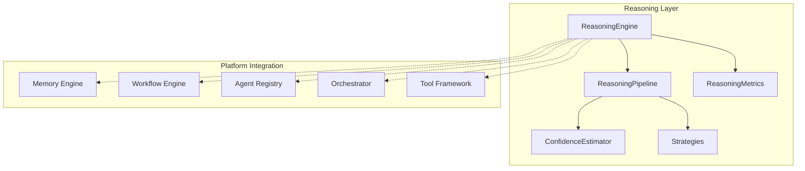

# Platform Reasoning Engine

> Sprint 4.1 — intelligence layer: agents think before acting

## Overview

The Platform Reasoning Engine provides a **reusable reasoning layer** that every AI agent uses to analyze requests before executing workflows. It produces structured intent, plans, confidence scores, and explainable traces — with no LLM dependency.

---

## Architecture



---

## Core Components

| Component | Role |
|-----------|------|
| `ReasoningEngine` | Central entry point |
| `ReasoningContext` | Input context (request, agent, memory, tools) |
| `ReasoningSession` | Tracked reasoning session |
| `ReasoningResult` | Structured output (intent, plan, confidence) |
| `ReasoningStep` | Individual reasoning step |
| `ReasoningStrategy` | Strategy enum |
| `ReasoningTrace` | Human + machine readable trace |

---

## Strategies

| Strategy | ID | Description |
|----------|-----|-------------|
| Rule-based | `rule_based` | Keyword and pattern matching |
| Chain-of-Thought | `chain_of_thought` | Sequential thought steps |
| Tree-of-Thought | `tree_of_thought` | Branch evaluation and selection |
| Reflective | `reflective` | CoT + gap analysis |
| Planning-first | `planning_first` | Plan generation before execution |
| Fast heuristic | `fast_heuristic` | Low-latency quick match (default) |

---

## Pipeline

1. **Understand request** — parse and summarize input
2. **Extract intent** — identify user goal
3. **Identify constraints** — budget, urgency, requirements
4. **Identify missing information** — gaps before execution
5. **Generate reasoning plan** — ordered action steps
6. **Estimate confidence** — multi-dimensional scoring
7. **Produce structured result** — intent + plan + trace

---

## Confidence Model (0–100%)

| Dimension | Weight | Source |
|-----------|--------|--------|
| Reasoning confidence | 35% | Step quality, depth, strategy boost |
| Data confidence | 25% | Request detail, constraints, user ID |
| Memory confidence | 20% | Memory context availability |
| Tool confidence | 20% | Matching tools for intent |
| **Overall** | 100% | Weighted composite |

---

## Usage

```python
from platform_reasoning import (
    ReasoningContext, ReasoningStrategy, reasoning_engine,
)

# Basic reasoning
ctx = ReasoningContext(
    request="I want to buy a Toyota SUV under $30,000",
    agent_id="auto_agent",
    capabilities=["buy_car", "vin_lookup"],
    available_tools=["crm_lookup"],
)
result = await reasoning_engine.reason(ctx, strategy=ReasoningStrategy.PLANNING_FIRST)

print(result.intent)           # "buy_car"
print(result.confidence.overall)  # 72.5
print(result.plan)             # ["understand_request", "clarify_...", ...]
print(result.explanation())    # Human-readable trace

# Agent shortcut
result = await reasoning_engine.reason_for_agent("auto_agent", "Buy SUV", user_id="u1")
```

---

## Explainability

```python
# Human-readable
print(result.explanation())

# Machine-readable trace
trace = result.trace.to_dict()

# Debug mode
engine = ReasoningEngine(config=ReasoningEngineConfig(debug_mode=True))
```

Every `ReasoningStep` records: phase, description, input/output summary, confidence, duration.

---

## Events

| Event | When |
|-------|------|
| `ReasoningStartedEvent` | Session begins |
| `ReasoningCompletedEvent` | Success with intent + confidence |
| `ReasoningFailedEvent` | Pipeline error |

---

## Integration

```python
from platform_reasoning.integrations import reasoning_integrations

# Build context from agent registry + tools
ctx = reasoning_integrations.context_from_agent("auto_agent", "Buy car")
ctx = reasoning_integrations.enrich_with_memory(ctx, user_id="u1")
ctx = reasoning_integrations.enrich_with_workflow(ctx, workflow_id="wf-123")

result = await reasoning_engine.reason(ctx)

# Orchestrator routing hints
hints = reasoning_integrations.apply_to_orchestrator(result.to_dict())
# → { "capability": "buy_car", "confidence": 72.5, "plan": [...], ... }
```

---

## Metrics

```python
summary = reasoning_engine.metrics_summary()
# sessions, avg_reasoning_time_ms, avg_confidence,
# strategy_usage, avg_depth, confidence_distribution
```

---

## Examples

### Auto vertical

```python
result = await reasoning_engine.reason_for_agent(
    "auto_agent", "Find me a diesel SUV under $25000", user_id="u42"
)
# intent=buy_car, missing=["budget_detail"], confidence.overall≈70
```

### Legal review

```python
result = await reasoning_engine.reason(
    ReasoningContext(request="Review NDA for compliance issues"),
    strategy=ReasoningStrategy.REFLECTIVE,
)
# intent=legal_contract, plan includes clarify + execute steps
```

### Fast routing (orchestrator pre-check)

```python
result = await reasoning_engine.reason(
    ReasoningContext(request="Track shipment SH-991"),
    strategy=ReasoningStrategy.FAST_HEURISTIC,
)
# intent=shipment_tracking, low latency
```

---

## Compatibility

| Layer | Package | Integration |
|-------|---------|-------------|
| Memory | `platform_memory/` | via `enrich_with_memory()` |
| Workflow | `platform_workflow/` | via `enrich_with_workflow()` |
| Agents | `platform_agents/` | via `context_from_agent()` |
| Orchestrator | `platform_orchestrator/` | via `apply_to_orchestrator()` |
| Tools | `platform_tools/` | via agent tool lists in context |
| Sprint 1–3 | All | Unmodified |

---

## Developer Guide

1. Build `ReasoningContext` with request + platform metadata
2. Choose strategy based on latency vs depth tradeoff
3. Check `result.confidence.overall` before executing workflows
4. Use `result.missing_information` to prompt user clarification
5. Pass `result.recommended_capability` to orchestrator
6. Subscribe to reasoning events for observability
