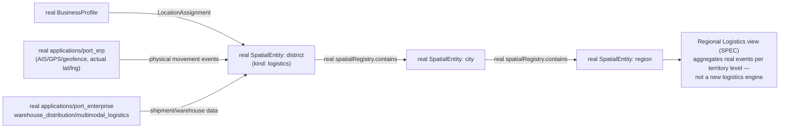

# Regional Digital Twin — Regional Economy

**Sprint:** CQ-16 — Architecture Research. Documentation only, `src` not modified.

**Do not duplicate:** `docs/ENTERPRISE_ECONOMY.md` (CQ-13) already designed the seven-economy model and
Trust Economy propagation over real `BusinessProfile`/`Relationship`; this document does not repeat
that, it adds the *spatial* dimension — which territory a trade, supply chain, or project physically
touches. `docs/CROSS_COMPANY_OPERATIONS.md` (CQ-15) already modeled Branch Offices and Franchises; this
document cross-references rather than redesigning them.

## 1. Per-item mapping (brief's seven)

| Brief item | Real/SPEC source |
|---|---|
| Trade | Real `Relationship.type: "partner"` (Sprint 29.0) + `ENTERPRISE_ECONOMY.md`'s Trade Economy (CQ-13) — this document's addition is only that a trade edge can now carry two `LocationAssignment`s (origin/destination territory), sourced from real Spatial Runtime once both companies are spatially anchored |
| Supply Chains | Same `Relationship` graph, chained (A supplies B supplies C) — a query over existing edges, not a new chain entity; `applications/port_enterprise`'s real `multimodal_logistics`/`container_management` (per CQ-13/prior research) is the real physical-movement backend once a chain crosses a Port Area (`REGIONAL_DIGITAL_TWIN.md` §1) |
| Regional Logistics | Real `applications/port_erp` (AIS/GPS/geofence, real lat/lng tracking) is the correct real engine — Regional Logistics is that engine's data read through the territory hierarchy (§2 below), not a new logistics system |
| Inter-city Projects | Real `LocationAssignment.subjectKind: "project"` **already exists** in `spatialTypes.ts:132` — a project assigned to one territory today; this document's only addition is allowing a project's assignments to span more than one `city` entity once §2 (Multi-City, `REGIONAL_DIGITAL_TWIN.md`) is seeded with more than Odessa |
| Business Expansion | Real `BusinessProfile.category`/`trust_level` (Sprint 29.0) plus the real `BusinessTier` visual-prominence mechanism (`CITY_LIVING_ECONOMY.md` §1.3, CQ-10) — "expansion" is a company acquiring a second real `LocationAssignment` (a second territory), not a new lifecycle state |
| Branch Offices | Real `multi_company.Branch` (`country`, `region`, `shared_inventory` fields, `database/models/multi_company.py:82-98`) — already the correct real entity, per `CROSS_COMPANY_OPERATIONS.md` (CQ-15). **New, this sprint**: `Branch` has no `city`/spatial-entity binding field today — recommend an additive `spatial_city_entity_id` column so a real Branch can resolve to a real Spatial Runtime `city`, closing the one gap between the two real systems |
| Distribution Networks | Real `applications/port_enterprise/warehouse_distribution/` (per prior FREIGHT_EXCHANGE.md research) — a distribution network is that engine's real warehouse graph, overlaid on the territory hierarchy for regional reporting, not reimplemented |

## 2. Regional logistics through the territory lens (SPEC composition)

## 3. Non-goals

- No new trade/supply-chain entity — both are queries over the real `Relationship` graph.
- No new logistics engine — `applications/port_erp` and `applications/port_enterprise` remain the real
  backends; this document only routes their output through the territory hierarchy for regional
  rollups.
- No change to `LocationAssignment`'s real shape — Inter-city Projects reuses the existing
  `subjectKind: "project"` value as-is.

## Related documents

`docs/ENTERPRISE_ECONOMY.md` (CQ-13, the seven-economy model this extends spatially),
`docs/CROSS_COMPANY_OPERATIONS.md` (CQ-15, real `Branch`/Franchise foundation),
`docs/SPATIAL_RUNTIME.md` (real, Sprint 29.4, `LocationAssignment`),
`docs/REGIONAL_DIGITAL_TWIN.md`, `docs/SMART_INFRASTRUCTURE.md`, `docs/TERRITORIAL_ANALYTICS.md`
(CQ-16 siblings).
