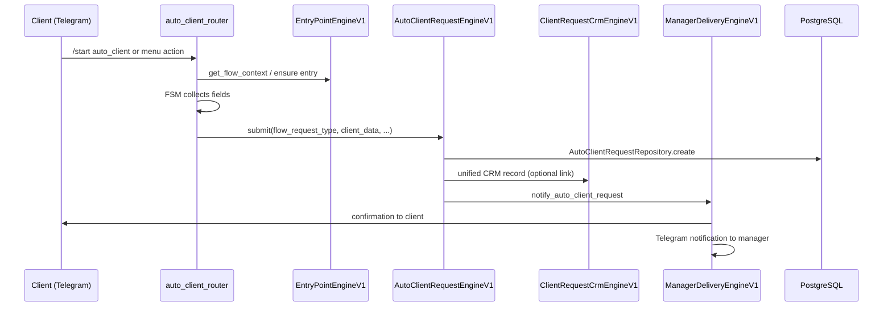

# Request Lifecycle

End-to-end flow for client requests and leads from Telegram entry to manager resolution.

## Auto client request (production path)



## Status transitions

### AutoClientRequestStatus

| Status | Meaning |
|--------|---------|
| `NEW` | Created, awaiting manager |
| `ASSIGNED` | Manager assigned |
| `IN_PROGRESS` | Active work |
| `WAITING_CLIENT` | Blocked on client input |
| `DONE` / `COMPLETED` | Finished |
| `CANCELLED` | Closed without deal |

### ClientRequestStatus (unified CRM)

Managed by `ClientRequestCrmEngineV1` with funnel stages (`CrmFunnelStage`):

`NEW_LEAD` → `CONTACTED` → `NEGOTIATION` → `PROPOSAL` → `DEAL` → `CLOSED` / `LOST`

## Manager actions

Manager CRM router (`routers/manager_crm_router.py`) supports:

- View new leads / my leads
- Take lead (`mgr:take:<number>`)
- Update status (`mgr:status:<number>:<STATUS>`)
- Open request card (`mgr:req:<number>`)

Business logic: `ClientRequestCrmEngineV1`, `ManagerDeliveryEngineV1`.

## Universal lead engine (multi-vertical)

For agro/realty/legal/logistics deep links:

```
/start <link_code>
  → LeadEngineV1.ingest_from_deep_link()
  → AntiLossLayerV1 duplicate check
  → LeadEngineRepository.create
  → optional manager assignment
```

## Pipeline boards

Kanban-style boards for auto and agro:

```
CrmPipelineBoardsEngineV1.get_board(vertical, entity_type)
CrmPipelineBoardsEngineV1.move_entity(...)
```

## Events and audit

Side effects on status changes:

- `services/crm_event_bus.py` — domain events
- `PlatformAuditEngineV1.log()` — audit trail
- `SlaTrackingV1` — SLA on pipeline stage changes

## Anti-loss layer

Duplicate lead prevention: `AntiLossLayerV1.check_lead_duplicate()` before creating new leads for the same Telegram user within a vertical.

## Data model references

| Entity | Table / model |
|--------|---------------|
| Auto client request | `auto_client_requests_v1` / `AutoClientRequest` |
| Unified CRM request | `client_requests` / `ClientRequest` |
| Lead engine lead | `lead_engine_leads_v1` / `LeadEngineLead` |
| Pipeline lead/deal | `crm_pipeline_*` models |

See [DATABASE_SCHEMA.md](DATABASE_SCHEMA.md) for full schema map.
