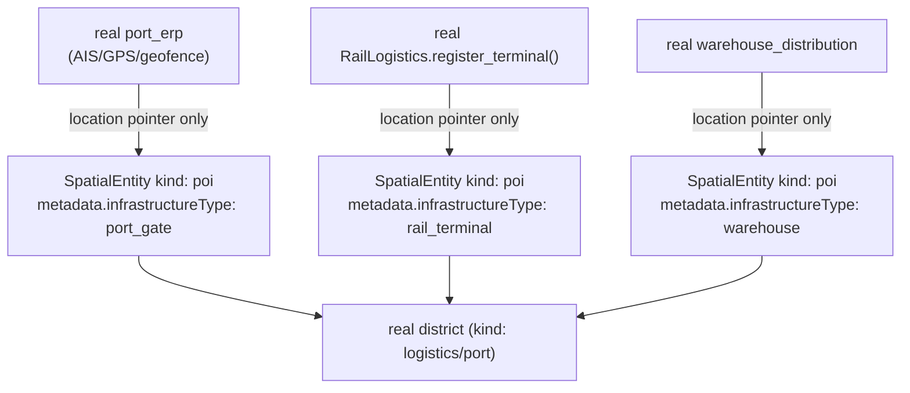

# Regional Digital Twin — Smart Infrastructure

**Sprint:** CQ-16 — Architecture Research. Documentation only, `src` not modified.

**Do not duplicate:** Real routing already exists (`routingEngine.ts`, Sprint 29.4) — this document
does not propose a second one. Real port/rail logistics already exist in `applications/port_erp` and
`applications/port_enterprise` — this document routes infrastructure data through those, not around
them.

## 1. Per-item mapping (brief's eight) — the honest split

| Brief item | Status | Real/SPEC source |
|---|---|---|
| Road Networks | **Real** | `streetGraph()` (`cityDistricts.ts`) + real Dijkstra `routingEngine.ts` (haversine distance, walk/vehicle/transit/virtual modes) |
| Warehouses | **Real** | `applications/port_enterprise/warehouse_distribution/` (per prior FREIGHT_EXCHANGE.md research) |
| Ports | **Real** | `applications/port_erp` (real AIS/GPS/geofence, real lat/lng, `applications/port_erp/geofence/engine.py`, `applications/port_erp/maps/service.py`) + `applications/port_erp/enterprise/models.py`'s real `NetworkPartner`/`TradeLane`/`NetworkRoute`/`PartnerType.RAILWAY` |
| Rail Connections | **Real, found this sprint** | `applications/port_enterprise/multimodal_logistics/rail_truck.py`'s `RailLogistics.register_network(name, region)`/`register_terminal()` — a real, if lightweight, rail network/terminal registry, previously uncited in this engagement |
| Utilities | **Absent** | No real model found; flagged as SPEC, not designed in depth this sprint |
| Airports | **Absent** | No real model found anywhere in the repo (searched code + docs) |
| Telecommunications | **Absent** | No real model found |
| Energy Infrastructure | **Absent** | No real model found |

**Net finding:** 4 of 8 infrastructure categories have real, if partial, backing (Roads, Warehouses,
Ports, Rail); 4 have none. This document does not invent placeholder models for the missing four —
they're named as open design space for a future sprint, consistent with this engagement's discipline of
marking SPEC rather than fabricating false grounding.

## 2. Infrastructure as `SpatialEntity`, not a sixth model

Rather than giving each infrastructure category its own entity type, this document proposes every
infrastructure asset (a road segment, a rail terminal, a warehouse, a port gate) be represented as a
real `SpatialEntity` of `kind: "poi"` (already real, `spatialTypes.ts:34`) with a `metadata.infrastructureType`
discriminator (`"road" | "rail_terminal" | "warehouse" | "port_gate" | "utility" | "airport" |
"telecom_node" | "energy_node"`) — reusing the real `poi` kind exactly as `spo_port` ("Odessa Port
Gate") already does (`spatialSeed.ts:193-200`), rather than growing `SpatialEntityKind` for every new
category. Real backends (`port_erp`, `port_enterprise`) remain the source of truth for the four real
categories; the `SpatialEntity` record is a location pointer into the territory hierarchy, not a
duplicate data store.

## 3. Non-goals

- No new infrastructure data model for Roads/Warehouses/Ports/Rail — real `port_erp`/
  `port_enterprise`/`routingEngine` remain authoritative; Spatial Runtime only anchors their location.
- No fabricated Utilities/Airports/Telecommunications/Energy models — named as absent, not designed
  around.
- No growth of `SpatialEntityKind` for infrastructure — reuses the real `poi` kind with a metadata
  discriminator, per §2.

## Related documents

`docs/SPATIAL_RUNTIME.md` (real, Sprint 29.4, real `poi`/routing), `docs/REGIONAL_ECONOMY.md` (CQ-16
sibling, Regional Logistics), `docs/REGIONAL_DIGITAL_TWIN.md` §1 (Port Area zone-kind promotion),
`docs/TERRITORIAL_ANALYTICS.md` (CQ-16 sibling, Infrastructure Utilization).
