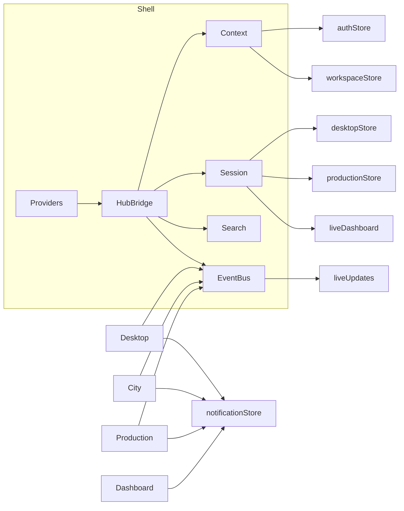

# Sprint 28.0 — Enterprise Integration Hub

**Phase:** Enterprise Platform v9  
**App:** `src/web` · sprint `28.0`  
**Constraint:** Integrate & extend only — no redesign / rewrite.

## Goal

One seamless Enterprise Operating System: shared context, search, notifications, events, deep links, session restore, runtime health across all shipped surfaces.

## Implemented

1. **Unified Navigation** — Quick Switch + deep links for Desktop, Dashboard, Workspace, City, Production, Command Center, CRM, Settings, DevTools (SPA)  
2. **Shared Context** — `useIntegrationContext` / `useSharedContext` (workspace, user, org, project, module, AI session, runtime, profile)  
3. **Universal Search** — `registerIntegrationSearch` extends `searchIndex` (projects, CRM, knowledge, production, documents, agents, city buildings, settings, recent activity)  
4. **Cross-module Notifications** — single `notificationStore` (already shared); hub helpers + identical unread on Desktop/Production/City/CC  
5. **Global Event Bus** — `enterpriseEventBus` over `liveUpdates`  
6. **Deep Linking** — `buildDeepLink` / `parseDeepLink`; City `?building=`; Production `?studio=` / `?tab=`  
7. **Session Restore** — `sessionCoordinator.restoreAll()` hydrates tabs, desktop, dashboard, production, city viewport/focus, last module  
8. **Runtime Health** — `useIntegrationRuntimeHealth` (shared 45s poll) on Desktop + Production  

## Existing services used

authStore · workspaceStore · workspaceManager · desktopStore · liveDashboardStore · productionStore · notificationStore · liveUpdates · searchIndex/searchProvider · contextEngine · useRuntimeHealth · useEnterpriseStatus · Telemetry · WorkspaceLayout · Design System

## Extended

- `Providers.tsx` — IntegrationHubBridge  
- `FullLayout.tsx` — integration search registration  
- `DesktopShell` / `desktopStore` — context, health, events  
- `EnterpriseCityPage` — building deep link + events  
- `AIProductionCenterPage` — shared health/context + events  
- `GLOBAL_QUICK_SWITCH` — Desktop / Production / Command Center  

## Architecture summary

Thin **integration-hub** package orchestrates existing surface stores. No second auth, search, queue, or notification system.

## Integration diagram



## Tests

| Check | Result |
|-------|--------|
| lint (`tsc -b`) | OK |
| test | **115 passed** |
| build | OK |

## Remaining work before Enterprise City Runtime

- Live occupancy / presence on City buildings from real job queues  
- City URL sync of camera (`?x=&y=&zoom=`)  
- WebSocket-backed notification push into `notificationStore`  
- Single health poller singleton (today shared interval, still N hook instances)  
- Cross-window postMessage for Desktop iframe embeds  
- Backend integration-hub status endpoint  

## Verify

```bash
cd src/web && npm run lint && npm test && npm run build && npm run dev
```

Open `/desktop` → City → Production · ⌘K search “reels” · refresh (session restores).
