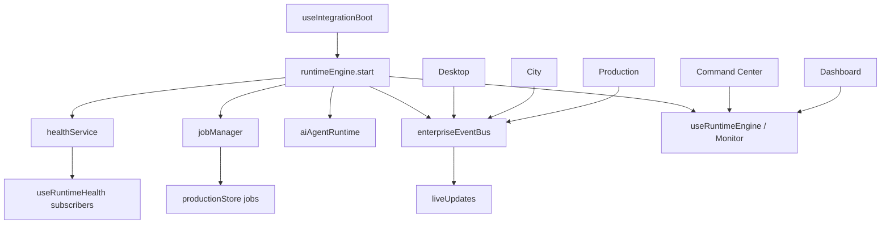

# Sprint 28.1 — Enterprise Runtime Engine

**Phase:** Enterprise Platform v9  
**App:** `src/web` · sprint `28.1`  
**Constraint:** Integrate & extend only — no UI redesign / no architecture rewrite.

## Goal

Transform the Enterprise Platform from a mostly static interface into a live runtime-driven operating system.

## Implemented

1. **Runtime Engine** — `src/web/src/enterprise-runtime/runtimeEngine.ts` publishes status, heartbeat, CPU, memory, workers, jobs, providers, GPU, sessions, AI agents  
2. **Live Event Stream** — reuses `enterpriseEventBus`; stream kinds: runtime, notification, AI, production, queue, provider, workflow, desktop, city  
3. **Job Manager** — running / waiting / completed / failed / cancelled / retrying + progress & ETA; syncs Production automation jobs  
4. **AI Runtime** — agents as entities (status, task, queue, memory, workflow, health)  
5. **Enterprise Runtime Monitor** — live widgets on Desktop, Dashboard/Mission Control, Command Center, Production Studio, City  
6. **Health Service singleton** — one probe loop; `shell/enterprise/useRuntimeHealth` re-exports (removes duplicated polling)  
7. **Performance** — ref-counted health, stable snapshots, shared subscriptions  

## Existing services used

enterpriseEventBus · liveUpdates · Integration Hub boot · productionStore · workspaceManager · statusCatalog probes · notificationStore · Desktop / City / Production / Command Center shells

## Architecture summary

Thin **enterprise-runtime** package owns the OS clock. Integration Hub still boots navigation/context/search; Runtime Engine owns continuous state.

## Event flow

## Tests

| Check | Result |
|-------|--------|
| lint (`tsc -b`) | OK |
| test | **123 passed** (includes `enterpriseRuntime.test.ts`) |
| build | OK |

## Remaining work before Enterprise City Live Runtime

- Live occupancy / presence on City buildings from Job Manager + real queues  
- City camera URL sync (`?x=&y=&zoom=`)  
- WebSocket → `notificationStore` push  
- Host-level CPU/GPU (today browser estimates)  
- Deeper City district heatmaps from `runtime_update` / `city_update` streams  
- Cross-window postMessage for Desktop iframe embeds  

## Modified / added paths (primary)

- `src/web/src/enterprise-runtime/**` (new)
- `src/web/src/shell/enterprise/useRuntimeHealth.ts` (re-export)
- `src/web/src/integration-hub/useIntegrationHub.ts` + event types
- Desktop / City / Production / Mission Control / Metrics Strip
- `docs/RUNTIME_ENGINE.md`, `docs/SPRINT_28_1_RESULT.md`, `docs/ARCHITECTURE_MAP.md`
- `webConfig.sprint` → `28.1`
