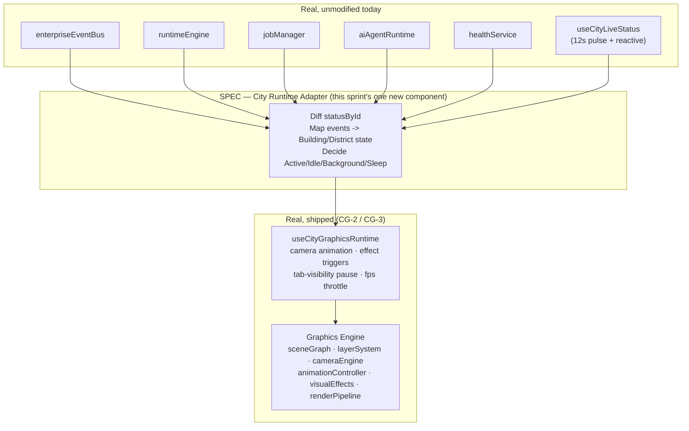
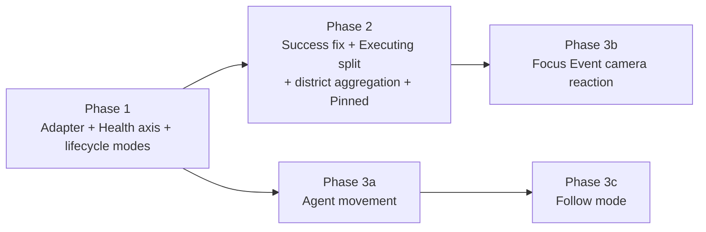

# Sprint CG-4 Result — Enterprise City Runtime & Simulation Bible

**Mode:** Architecture Research + Runtime Specification. **No production code was written or
modified in this sprint** — every file touched is documentation. This report is the summary Cursor
should read first before the five companion documents.

## 1. What this sprint produced

| Document | Covers (brief §) | New or updated |
|---|---|---|
| [`CITY_RUNTIME.md`](./CITY_RUNTIME.md) | §1 City Runtime — lifecycle, update loop, event propagation, idle/sleep/background | New |
| [`CITY_BUILDING_STATES.md`](./CITY_BUILDING_STATES.md) | §2 Building States — all 19 requested states + transitions | New |
| [`CITY_EVENTS.md`](./CITY_EVENTS.md) | §4 Live Events (+ §3's district-communication mechanism) | New |
| [`CITY_CAMERA.md`](./CITY_CAMERA.md) | §5 Camera Runtime — follow, focus event, multi-monitor, 3D compatibility | **Updated** (CG-2's real §1–§5 preserved verbatim; new §6 appended) |
| [`CITY_SIMULATION.md`](./CITY_SIMULATION.md) | §3 District Runtime, §6 AI Visualization, §7 Performance | New |
| `SPRINT_CG_4_RESULT.md` | §8 Implementation Roadmap + this summary | New (this document) |

`CITY_CAMERA.md` already existed from CG-2 (the real, shipped `cameraEngine.ts` spec) — it was
extended, not overwritten, per this repo's standing "never duplicate documentation" instruction. The
other four are net-new because no runtime/state/event/simulation spec existed before this sprint.

## 2. Architecture summary

Every document in this sprint enforces one rule, stated once here and cross-referenced everywhere
else: **City Runtime is an adapter, not a second Runtime.** The platform already has a real Runtime
Engine (`enterprise-runtime/`: `runtimeEngine`, `healthService`, `jobManager`, `aiAgentRuntime`) and a
real cross-surface event bus (`enterpriseEventBus`, 14 real event types including `"city_update"`, and
`RuntimeStreamKind` already including `"city"` as a first-class stream). Every runtime behavior
specified this sprint — building states, live events, camera reactions, district aggregation, AI
visualization — is designed as a **read/subscribe/react layer on top of those real systems**, never a
parallel data model. The one new architectural component proposed across all five documents is the
**City Runtime Adapter** (`CITY_RUNTIME.md` §2): a thin, City-scoped translation layer between the real
data/event systems and the real, shipped CG-2/CG-3 Graphics Engine. It has no state of its own beyond
what it derives, on each render, from sources that already exist.

## 3. Runtime model (one-page reference)

Three independent loops (full detail in `CITY_RUNTIME.md` §4): **Simulation tick** (real data
cadence — 12s poll + reactive, unchanged), **Effect tick** (the Adapter enqueuing transient visual
reactions), **Render tick** (`requestAnimationFrame`, CG-2/CG-3, only active while something is
actually animating). Building state is modeled on three independent axes, not one flat enum
(`CITY_BUILDING_STATES.md` §3): **Lifecycle** (Idle→Loading→Waiting→Executing→Success, plus Busy/
Updating), **Health** (Healthy→Warning→Critical→Offline, plus Maintenance), and **Interaction**
(Hovered/Focused/Selected/Pinned — a multi-select overlay, independent of the other two).

## 4. Implementation roadmap (brief §8)

### Phase 1 — City Runtime Adapter foundation
- Build the Adapter (`CITY_RUNTIME.md` §2) as a new hook alongside `useCityGraphicsRuntime`, not
  inside it — keeps CG-3's camera/effect concerns separate from event-subscription concerns.
- Wire `enterpriseEventBus.subscribeType("job_update" | "runtime_update" | "notification", ...)` into
  the existing `triggerBuildingEffect`/`triggerDistrictEffect` calls CG-3 already exposes — no new
  effect primitives needed for Phase 1.
- Implement the Health axis split (`CITY_BUILDING_STATES.md` §3.2) — join `healthService` per
  building, replacing zero existing behavior (it's additive: `attention`'s notification-count trigger
  stays exactly as-is).
- Implement Idle/Background/Sleep lifecycle modes (`CITY_RUNTIME.md` §3) — Background's
  `data-tab-hidden` mechanism already exists (CG-3); Idle and Sleep are the two genuinely new pieces.

### Phase 2 — Building state completeness + district aggregation
- Fix the `Success` state's real-signal grounding (`JobLifecycle: "completed"` instead of the
  `processLabel` regex heuristic) — flagged as a real fragility in `CITY_BUILDING_STATES.md` §5,
  prioritize this even if the rest of Phase 2 slips, since it's a latent bug, not just a gap.
- Executing vs. Busy split (`CITY_BUILDING_STATES.md` §3.1) — requires joining `jobManager` records to
  buildings, same join mechanism Phase 1's Adapter already builds for health.
- District aggregation (`CITY_SIMULATION.md` §1.2) — a pure `filter()`/`reduce()` over the same
  `statusById` map `cityGlance()` already reduces citywide; no new data source.
- Pinned tile marker (`CITY_BUILDING_STATES.md` §3.4) — smallest item in this sprint's whole roadmap
  (one new CSS class read of `cityNavigation.favorites()`, already real); good Phase 2 warm-up task.

### Phase 3 — AI visualization + camera reactions
- Agent movement / traveling marker (`CITY_SIMULATION.md` §2.2) — the one genuinely new rendering
  primitive across all of CG-4; depends on Phase 1's event wiring and CG-2's scene graph (add an
  `agent` node kind, additive to `SceneNodeKind`).
- Focus Event camera reaction (`CITY_CAMERA.md` §6.2) — depends on Phase 1 (event severity routing)
  and must ship with its anti-disruption guards (input-recency check, 20s global cooldown) from day
  one, not as a follow-up hardening pass.
- Follow mode (`CITY_CAMERA.md` §6.1) — depends on Phase 3's agent movement existing as something
  worth following.
- Knowledge flow (`CITY_SIMULATION.md` §2.5) — explicitly deferred until a real knowledge-graph event
  source exists elsewhere in the platform; not blocking for the rest of Phase 3.

### Dependencies

### Risks

1. **Success-state regex fragility** (`CITY_BUILDING_STATES.md` §5) is a live bug risk today, not a
   future one — any real backend `processLabel` that doesn't happen to contain "done/stable/quiet"
   silently never shows Success. Recommend fixing in Phase 2 regardless of what else slips.
2. **Focus Event camera reaction is the highest UX-risk item in this whole spec** — an unwanted camera
   jump is one of the few things that can make a monitoring surface actively worse than static. The
   three guards in `CITY_CAMERA.md` §6.2 (severity-only, input-recency suppression, global cooldown)
   are not optional hardening — they are the feature's correctness condition and should be built and
   tested before the reaction itself ships to any user.
3. **`workflow_update`/`desktop_update` have no real publisher yet** (`CITY_EVENTS.md` §5) — Phase 1/2
   work that assumes these fire will sit inert until whatever sprint adds real workflow-completion/
   deployment tracking. Not a blocker (the Adapter subscribing to a type nothing publishes yet is
   harmless), but should not be treated as "done" just because the subscription code exists.
4. **Event-storm coalescing** (`CITY_SIMULATION.md` §3, "20 events/sec → 250ms coalesce window") is
   specified but unvalidated against real event volume — recommend instrumenting actual event
   frequency in Phase 1 before hand-tuning the coalesce window further in Phase 3.

### Validation checklist (for whichever sprint implements each phase)

- [ ] Adapter introduces zero new polling loops (only subscriptions to existing real sources)
- [ ] No new Zustand/store — Adapter state is derived-on-render or `useRef`, matching CG-3's pattern
- [ ] Health axis join does not alter `attention`'s existing notification-count behavior
- [ ] Success transitions on `JobLifecycle: "completed"`, regex heuristic removed, not left as a
      fallback that could silently reactivate
- [ ] Focus Event reaction has automated tests for all three guards (severity, input-recency, cooldown)
      before it ships, not just a manual QA pass
- [ ] District aggregation has zero additional `statusById` reads beyond what `cityGlance()` already
      performs (same map, filtered)
- [ ] Agent movement respects the CG-2 confinement rule (never a whole-map ambient effect) and the
      "one sanctioned traveling object" rule from `ENTERPRISE_CITY_ANIMATIONS.md` §3
- [ ] Every new effect trigger path re-uses `triggerBuildingEffect`/`triggerDistrictEffect` (CG-3) —
      no second effect-dispatch mechanism introduced anywhere in Phase 1–3

## 5. Implementation priorities (ranked)

1. City Runtime Adapter skeleton + Health axis (Phase 1) — everything else depends on this existing.
2. Success-state fix (Phase 2) — small, fixes a real latent bug, no dependencies beyond Phase 1's join.
3. Idle/Background/Sleep lifecycle modes (Phase 1) — meaningful perf/battery win, low risk, CG-3
   already proved the pattern for Background.
4. District aggregation + Pinned marker (Phase 2) — cheap, additive, good early wins.
5. Executing/Busy split (Phase 2) — moderate effort, meaningfully richer building detail.
6. Agent movement (Phase 3) — the most visually significant addition, but the most new rendering work.
7. Focus Event camera reaction (Phase 3) — high value, but must not ship without its guards (Risk #2).
8. Follow mode, Knowledge flow, multi-monitor sync, 3D compatibility — explicitly vision-stage; no
   near-term scheduling recommended (per the brief's own framing of these as future items).

## 6. Recommendations for Cursor

- Read `CITY_RUNTIME.md` first — it is the frame every other document assumes.
- Do not build the City Runtime Adapter as part of `useCityGraphicsRuntime.ts` — keep camera/effect
  mechanics (CG-3, already correct and tested) separate from event-subscription/state-derivation
  concerns (this sprint's new Adapter). Two hooks composed in the page, not one hook doing both.
- Treat every "SPEC" marker in these five documents as a proposal, not a mandate — where an
  implementation sprint finds a better approach, update the relevant document with a "Reality update"
  section (the pattern already used throughout `CITY_CAMERA.md`, `ENTERPRISE_CITY_BIBLE.md`, etc.)
  rather than silently diverging from what's written.
- The Success-state regex fragility (§4 Risk #1) is the one item in this entire sprint worth treating
  as a bug-fix priority independent of the broader roadmap sequencing.
- Before building Focus Event (§4 Risk #2), write its three guard conditions as unit tests first —
  this is the one feature in the whole spec where getting the restraint right matters more than
  getting the feature built.
