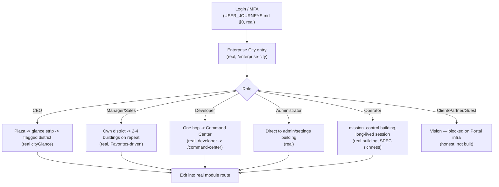
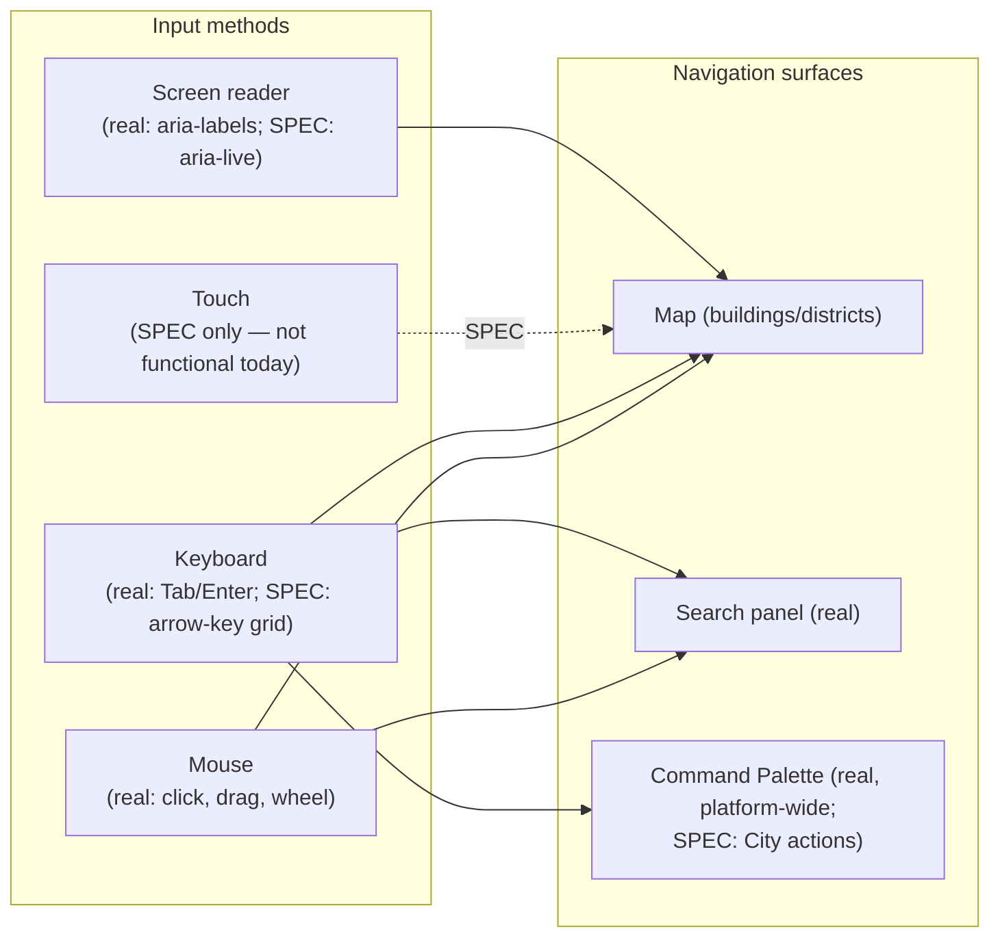
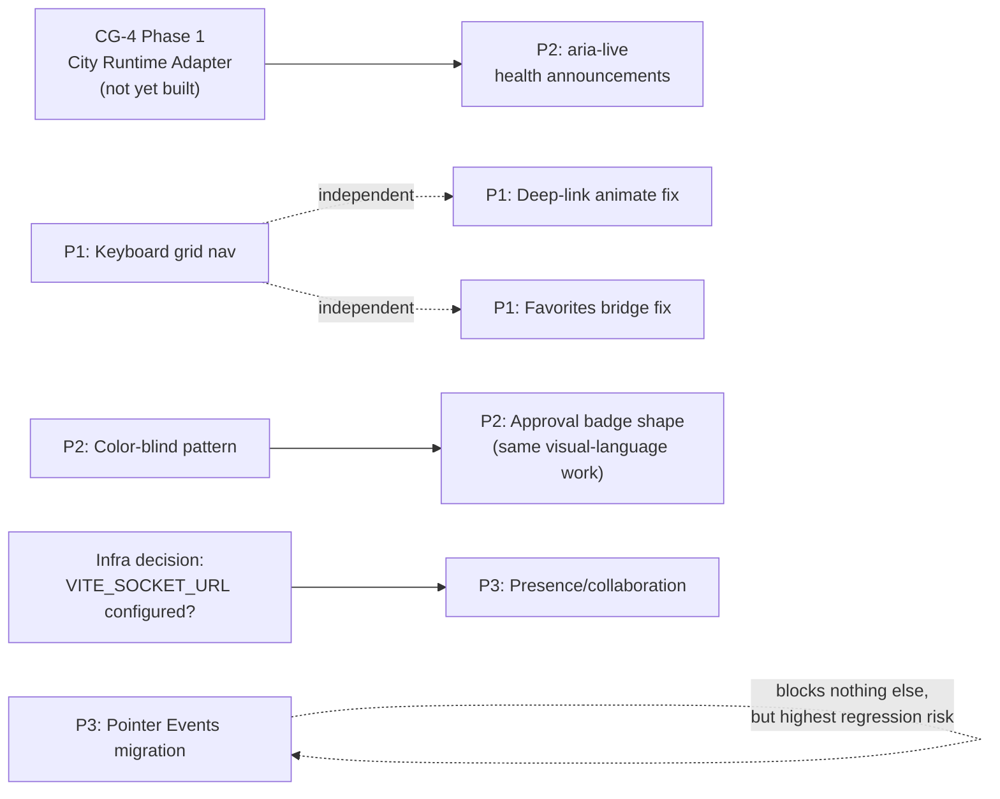

# Sprint CG-5 Result — Enterprise City User Experience Bible

**Mode:** Architecture Research + UX Research + Product Research. **No production code was written or
modified in this sprint** — every file touched is documentation.

## 1. What this sprint produced

| Document | Covers (brief §) | Status |
|---|---|---|
| [`CITY_USER_EXPERIENCE.md`](./CITY_USER_EXPERIENCE.md) | Master index + §3 Workflow Visualization + §5 Mobile + §7 User Feedback | New |
| [`CITY_USER_JOURNEYS.md`](./CITY_USER_JOURNEYS.md) | §1 — nine roles, City-scoped only | New |
| [`CITY_NAVIGATION_GUIDE.md`](./CITY_NAVIGATION_GUIDE.md) | §2 — selection, districts, keyboard, search, palette, Desktop, breadcrumbs, deep links, history, favorites, pinned | New |
| [`CITY_COLLABORATION.md`](./CITY_COLLABORATION.md) | §4 — multi-user, presence, cursor sharing, occupancy, agent visibility | New |
| [`CITY_ACCESSIBILITY.md`](./CITY_ACCESSIBILITY.md) | §6 — keyboard, screen reader, contrast, color blindness, font scaling | New |
| `SPRINT_CG_5_RESULT.md` | §8 Implementation Roadmap + this summary | New (this document) |

No existing document was duplicated: platform-wide journeys stay in `USER_JOURNEYS.md`, navigation
philosophy stays in `ENTERPRISE_NAVIGATION.md`, AI-agent collaboration stays in `COLLABORATION.md` —
every CG-5 document either cross-references these by section/ID or explicitly narrows its own scope to
what those documents do not already cover.

## 2. UX architecture summary

Every document this sprint produced follows the same discipline established since CG-2: **grounded in
real code first, marked SPEC second.** The headline finding across all five: **City's foundational UX
mechanics are more real and more correct than expected** — building selection, search, breadcrumbs,
favorites, and history all work today, favorites/history even persist to `localStorage` (unlike two of
the three platform-wide equivalents `ENTERPRISE_NAVIGATION.md` already flagged as not persisting,
`TD-41`). The genuine gaps cluster into three categories:

1. **Interaction gaps** — no keyboard spatial navigation, no touch/gesture support at all (not
   "suboptimal," genuinely non-functional on a touchscreen today), no color-blind-safe state
   distinction beyond one existing dashed-border precedent.
2. **Consistency gaps** — City's favorites bridge to the shared `favoritesManager` is one-directional
   (a real, precise bug, not a design choice); City's breadcrumbs are a second parallel implementation
   to the platform's `breadcrumbEngine.ts` (documented as justified, but flagged for future audit).
3. **Unbuilt-by-design gaps** — multi-user presence/collaboration has zero real backing anywhere
   (though real, currently-dormant Socket.IO infrastructure could carry it); Client/Partner/Guest City
   journeys are honestly vision, blocked on Portal infrastructure this sprint has no authority to build.

## 3. User journey model (reference diagram)

## 4. Interaction model (reference diagram)

## 5. Implementation roadmap (brief §8)

### Priority 1 — small, high-value, no external dependency

- **Keyboard grid navigation** (`CITY_NAVIGATION_GUIDE.md` §3, `CITY_ACCESSIBILITY.md` §1) — arrow
  keys between buildings using real `x`/`y` coordinates, no new data.
- **Deep-link building focus uses the real animated `focusBuildingAnimated`** instead of the one
  remaining instant `panToBuilding` call site (`CITY_NAVIGATION_GUIDE.md` §8) — CG-3 already exists;
  this is a one-line call-site fix.
- **Favorites bridge fix** (`CITY_NAVIGATION_GUIDE.md` §10) — `isFavorite()` reads from the shared
  `favoritesManager` instead of a second, one-directionally-synced boolean. Real correctness fix, small
  surface area.
- **Search-empty inline message** (`CITY_USER_EXPERIENCE.md` §3.1) — one conditional render in the
  existing search panel.

### Priority 2 — moderate effort, depends on CG-4's Phase 1 Adapter existing

- **`aria-live` health-state announcements** (`CITY_ACCESSIBILITY.md` §2) — depends on
  `CITY_RUNTIME.md` §2's City Runtime Adapter (from Sprint CG-4's own Phase 1, not yet built) to have a
  structured health-transition signal to announce from.
- **Command Palette City actions** (`CITY_NAVIGATION_GUIDE.md` §5) — `registerCityPaletteActions()`
  alongside the existing `registerCitySearchDocs()`.
- **`?district=` deep link** (`CITY_NAVIGATION_GUIDE.md` §8) — direct analog of the real `?building=`.
- **High-contrast state-color verification + overrides if needed** (`CITY_ACCESSIBILITY.md` §3).
- **Color-blind state pattern/icon** (`CITY_ACCESSIBILITY.md` §4) — extends the real existing
  `waiting` dashed-border precedent to the other five states; needs a design pass, not just code.
- **Mobile responsive sidebar collapse + toolbar compaction** (`CITY_USER_EXPERIENCE.md` §2.2) —
  layout-only, reuses the real Dock collapse pattern.
- **City-scoped error boundary** (`CITY_USER_EXPERIENCE.md` §3.1) — wraps `.ec-stage` only.
- **Approval badge shape distinct from color** (`CITY_USER_EXPERIENCE.md` §1) — one new visual
  treatment, ties into the color-blindness work above (do together, not separately).

### Priority 3 — large effort, external dependency, or explicitly deferred

- **Pointer Events touch/pan migration + pinch-to-zoom** (`CITY_USER_EXPERIENCE.md` §2.2–2.3) — the
  one item in this whole roadmap that touches real, shipped drag logic as a refactor, not an addition.
  Flagged as needing careful desktop-regression verification, not just touch-device testing.
- **Presence/collaboration** (`CITY_COLLABORATION.md`, entire document) — depends on the real
  Socket.IO layer (`liveUpdates.ts`) being actually configured (`VITE_SOCKET_URL` set) in the target
  environment, which is not guaranteed — recommend confirming that infrastructure decision before
  scoping any implementation sprint around it.
- **Onboarding overlay** (`CITY_USER_EXPERIENCE.md` §3.2) — no urgency identified; existing legend/
  tooltips already cover the highest-value orientation need.
- **Font-scale tile-overflow verification** (`CITY_ACCESSIBILITY.md` §6) — needs real browser QA
  (125%/150% OS font scale) before any fix is designed; this environment cannot perform that
  verification (no browser automation available, same limitation noted in `SPRINT_CG_3_RESULT.md` §6).
- **Client/Partner/Guest City-specific UX** — entirely blocked on Portal/`FUTURE_RUNTIME.md`
  infrastructure outside City's scope; not schedulable until that exists.

### Dependencies

### Risks

1. **Mobile Pointer Events migration is the highest technical risk in this sprint's roadmap** — it
   modifies real, shipped desktop drag behavior (`onMapPointerDown`) rather than only adding new touch
   code. Recommend a dedicated regression pass (desktop drag bit-for-bit unchanged) before shipping,
   not just new-device testing.
2. **Presence/collaboration's real dependency (Socket.IO configuration) is an infrastructure decision,
   not a City decision** — building `CITY_COLLABORATION.md`'s spec against a transport that may be
   permanently unconfigured in production would produce dead code, the same failure mode
   `ENTERPRISE_NAVIGATION.md` already found once (`TD-40`'s orphaned Command Palette). Recommend
   confirming the transport will actually be live before scheduling implementation.
3. **Accessibility claims in this sprint cannot be verified against a real screen reader or browser
   zoom in this environment** — every recommendation in `CITY_ACCESSIBILITY.md` is grounded in real
   code inspection (aria-labels, token usage) but not confirmed by an actual assistive-technology test
   pass. Treat as well-researched specification, not as a completed audit.
4. **Color-blind and high-contrast work (§3–4 of `CITY_ACCESSIBILITY.md`) needs design input, not just
   engineering** — flagged so a future sprint doesn't scope this as pure implementation work and get
   surprised by needing a design decision mid-sprint.

### Validation checklist

- [ ] Keyboard grid navigation reuses real `CityBuilding.x/y` — no new spatial index introduced
- [ ] Deep-link fix calls the real, existing `focusBuildingAnimated` — no new camera code
- [ ] Favorites fix removes the second boolean store rather than adding a third synchronization path
- [ ] `aria-live` announcements fire only on health-axis transitions (Critical/Offline), not every
      minor tone change — verified against `CITY_BUILDING_STATES.md` §3.2's axis boundaries
- [ ] Command Palette City actions register through the real palette (`UniversalCommandPalette.tsx`),
      never the orphaned copy (`TD-40`)
- [ ] Pointer Events migration ships with an explicit desktop-drag regression test, not only touch
      device manual QA
- [ ] Presence (if scheduled) is confirmed to run over a genuinely connected Socket.IO instance in the
      target environment before implementation starts, not assumed
- [ ] No new event type added to `enterpriseEventBus` for presence — a separate, narrow channel only
- [ ] Color-blind pattern work extends the real `waiting` dashed-border precedent rather than inventing
      an unrelated new visual language

## 6. Recommendations for Cursor

- Start with Priority 1 — all four items are small, independent, and immediately verifiable without
  waiting on CG-4's Adapter or any infrastructure decision.
- Do not schedule `CITY_COLLABORATION.md` implementation before confirming the Socket.IO transport
  question (Risk #2) — this is the one item in this whole sprint most likely to become dead code if
  built on assumption.
- Pair the color-blindness and approval-badge-shape work together (`CITY_ACCESSIBILITY.md` §4 +
  `CITY_USER_EXPERIENCE.md` §1) — they're the same underlying "state needs a non-color signal" problem
  and should ship as one coherent visual-language pass, not two unrelated tickets.
- Treat `CITY_USER_JOURNEYS.md`'s Client/Partner/Guest sections as read-only context, not a backlog —
  there is nothing to implement there until Portal infrastructure exists elsewhere in the platform.
- The Pointer Events migration (Priority 3) deserves its own isolated sprint with a regression-test-first
  approach, not a bundled addition to another sprint's scope, given Risk #1.
