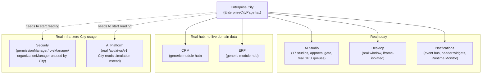
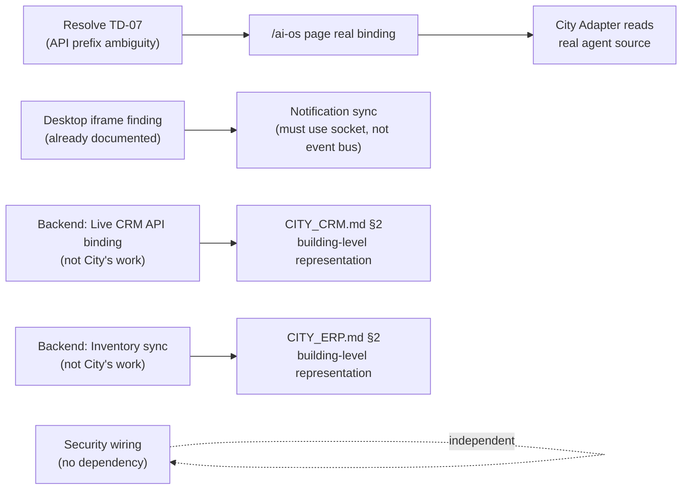

# Sprint CG-6 Result — Enterprise City Platform Integration Bible

**Mode:** Architecture Research + Enterprise Integration Research. **No production code was written or
modified in this sprint** — every file touched is documentation.

## 1. What this sprint produced

| Document | Covers (brief §) | Status |
|---|---|---|
| [`CITY_CRM.md`](./CITY_CRM.md) | §1 CRM Integration | New |
| [`CITY_ERP.md`](./CITY_ERP.md) | §2 ERP Integration | New |
| [`CITY_AI_PLATFORM.md`](./CITY_AI_PLATFORM.md) | §3 AI Platform | New |
| [`CITY_DESKTOP.md`](./CITY_DESKTOP.md) | §4 Enterprise Desktop | New — also **corrects** `CITY_NAVIGATION_GUIDE.md` §6 (CG-5), see §3 below |
| [`CITY_INTEGRATIONS.md`](./CITY_INTEGRATIONS.md) | §5 AI Studio + §6 Notifications + §7 Security (no dedicated filenames, same allocation pattern as `CITY_USER_EXPERIENCE.md` in CG-5) | New |
| `SPRINT_CG_6_RESULT.md` | §8 Implementation Roadmap + this summary | New (this document) |

## 2. Architecture summary

This sprint's research produced one uneven, important finding: **the six integration domains the
brief asked about are at wildly different real-readiness levels, and treating them uniformly would be
dishonest.**

| Domain | Real readiness |
|---|---|
| AI Studio (Production Center) | **Most real** — genuine 17-studio UI, real approval gate, real GPU-queue data already joined into City's live status. Blocked only by `TD-45` (no actual generation backend), not by anything City-side. |
| Enterprise Desktop | **Fully real, but architecturally consequential** — City already opens as a real Desktop window via `<iframe src="/enterprise-city?embed=1">`. This sprint's single most important discovery: that iframe boundary means every "shared singleton" (`enterpriseEventBus`, `runtimeEngine`, `jobManager`, `aiAgentRuntime`) is **not actually shared** across a Desktop-windowed City and any other open instance — each gets its own JS realm. |
| Notifications | **Mostly already specified** (CG-4's `CITY_EVENTS.md`, CG-5's `CITY_COLLABORATION.md`) — this sprint added only the synchronization answer and one positive finding (`EnterpriseRuntimeMonitorCompact` already embedded in City's header). |
| Security | **The most urgent real gap found this sprint** — City has zero permission/role/tenant enforcement today, despite the platform having a substantial, real RBAC-adjacent frontend layer (`permissionManager`/`roleManager`/`organizationManager`) and a proven filtering precedent (`menuEngine.forTenant()`) City simply doesn't use yet. |
| CRM | **Thin** — real building routes, real generic module-hub page, but the module's own roadmap explicitly lists "Live CRM API binding" as future work. Every Client/Lead/Deal/Task representation is necessarily SPEC. |
| ERP | **Thin, same shape as CRM** — "Inventory sync"/"Procurement workflows" are the module's own stated future work, not shipped. |

## 3. Correction to a prior sprint's document

`CITY_NAVIGATION_GUIDE.md` §6 (CG-5) stated City "is not observed to be openable as a literal Desktop
window." This sprint's deeper research (`CITY_DESKTOP.md` §1) found that claim was wrong — City has a
real `desktopCatalog.ts` entry and does open as a Desktop window via `WindowFrame`'s iframe rendering.
`CITY_NAVIGATION_GUIDE.md` §6 has been updated in place with an explicit correction note (not silently
edited), per this engagement's standing practice of correcting documents transparently rather than
rewriting history.

## 4. Integration diagram (all six domains, one view)

## 5. Implementation roadmap (brief §8)

### Integration order

1. **Security wiring** (`CITY_INTEGRATIONS.md` §3) — highest-priority, no external dependency, all
   three real inputs (`permissionManager`, `roleManager`, `organizationManager`) already exist, and
   the filtering pattern (`menuEngine.forTenant()`) is already proven elsewhere.
2. **Audit verification** (`CITY_INTEGRATIONS.md` §3.2) — cheap, one research task: confirm whether
   `telemetry.userActivity()` already feeds `activityCenter`, before assuming City's audit trail is
   complete or building a second one.
3. **AI Platform migration step 1** (`CITY_AI_PLATFORM.md` §4) — fix the real `/ai-os` page's dormant
   API binding, independent of City, as the validation step before City touches the real backend at
   all. Blocked on resolving `TD-07`'s API-prefix ambiguity first.
4. **AI Platform migration step 2** (`CITY_AI_PLATFORM.md` §4) — City Runtime Adapter adds the real
   `/api/ai-os/v1` source alongside the existing `aiAgentRuntime` fallback.
5. **Notifications synchronization** (`CITY_INTEGRATIONS.md` §2.2) — a City-specific push event over
   the real `liveUpdates`/Socket.IO layer, only after confirming (per `CITY_DESKTOP.md` §2) that any
   cross-window feature must use that transport, never the in-process `enterpriseEventBus`.
6. **CRM/ERP live binding** — entirely blocked on the backend work each module's own roadmap already
   names ("Live CRM API binding," "Inventory sync"); not schedulable by any City-side sprint.

### Dependencies

### Migration strategy

- **Security**: additive-only — buildings a user lacks permission for move to the already-specified
  `Disabled` state (`CITY_BUILDING_STATES.md` §3.3), never removed from the DOM (spatial constancy
  principle, `CITY_BUILDING_STATES.md` §4) — no existing behavior for permitted users changes.
- **AI Platform**: dual-source with fallback (`CITY_AI_PLATFORM.md` §4 step 2) before any removal —
  `aiAgentRuntime` stays as the resilience fallback, never a hard cutover.
- **CRM/ERP**: no City-side migration needed until the respective backend roadmap items land; when
  they do, the join pattern is identical to Production's already-real
  `productionRuntime.monitor()` → `CityLiveStatus` join in `useCityLiveStatus.ts` — reuse that exact
  shape, don't invent a new one.

### Risk analysis

1. **The iframe-isolation finding (`CITY_DESKTOP.md` §2) is the most consequential architectural risk
   in this entire sprint.** Any future feature — this sprint's own `CITY_INTEGRATIONS.md` §2.2 sync
   proposal, CG-5's `CITY_COLLABORATION.md` presence proposal — that assumes real-time consistency
   across a Desktop-windowed City and any other open instance will silently misbehave unless built on
   the real Socket.IO layer specifically, never the in-process event bus. This should be treated as a
   standing architectural constraint for every future City sprint, not a one-time note.
2. **The security gap is real and present, not hypothetical** — today, every user sees every building
   regardless of permission. This is the one finding in this sprint that reads as an actual current
   gap rather than a future integration opportunity, and should be weighted accordingly in
   prioritization.
3. **AI Studio's visualization currently shows real plumbing with nothing real flowing through it**
   (`TD-45`) — a UX-honesty risk: the pipeline can look "alive" (queue depths, job states) while no
   studio can actually produce anything. Any City-facing copy/demo should not imply otherwise.
4. **`TD-07`'s unresolved API-prefix ambiguity blocks AI Platform migration correctly starting** —
   binding to the wrong one of three possible backend owners would be a real regression risk.
5. **CRM/ERP are structurally tempting to "fake alive"** with plausible-looking mock data before the
   real backend binding lands — the same failure mode `TD-45`/`TD-46` already warn about for AI Studio
   provider work. This document explicitly recommends against it: an honestly-thin building beats a
   dishonestly-animated one.

### Validation checklist

- [ ] Security filter (`buildingsForTenant`) reuses `menuEngine.forTenant()`'s real signature shape,
      not a new convention
- [ ] Permission-gated buildings use the real `Disabled` state (`CITY_BUILDING_STATES.md` §3.3) —
      dimmed, not removed
- [ ] Audit verification task completed and documented before any new audit mechanism is built
- [ ] `TD-07` resolved (or explicitly assigned) before AI Platform migration step 1 begins
- [ ] AI Platform migration ships with `aiAgentRuntime` fallback intact through step 2, no hard cutover
- [ ] Any cross-window synchronization feature is confirmed built on the real Socket.IO layer, verified
      against `CITY_DESKTOP.md` §2's iframe-isolation finding with an actual two-window manual test
- [ ] No mock/placeholder CRM or ERP data is added to make either module "look" live before real
      backend binding lands

## 6. Recommendations for Cursor

- Read `CITY_DESKTOP.md` §2 before touching any feature that assumes shared runtime state across
  multiple open City instances — it is the one finding in this sprint that changes how several other
  documents' SPEC proposals (this sprint's own and CG-5's) must actually be implemented.
- Start implementation with Security wiring (§5's integration order item 1) — it is the only item in
  this entire roadmap that is both high-value and has zero external dependency.
- Do not begin AI Platform migration before `TD-07` is resolved — sequencing this out of order risks
  binding to the wrong backend owner.
- Treat CRM/ERP documents as reference material for *when* their backend roadmap items land, not as a
  near-term backlog — there is nothing to build in City today for either domain.
- The audit-trail question (`telemetry.userActivity` → `activityCenter`, or not) is a fast, valuable
  research task that should happen before any sprint claims City has (or lacks) proper audit coverage.
