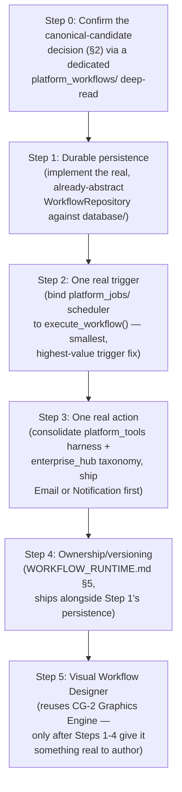
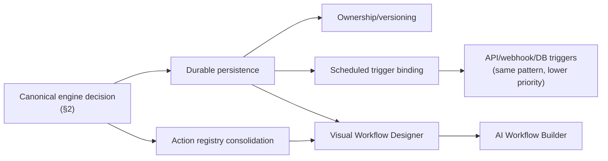

# Sprint CG-7 Result — Enterprise Automation & Workflow Bible

**Mode:** Architecture Research + Product Research. **No production code was written or modified —
`src/` was not touched.** Every file this sprint produced is documentation.

## 1. What this sprint produced

| Document | Covers (brief §) |
|---|---|
| [`AUTOMATION_ENGINE.md`](./AUTOMATION_ENGINE.md) | §1 Workflow Engine — the central duplication finding, canonical-candidate recommendation, node/edge/condition/loop/retry/delay/schedule model |
| [`WORKFLOW_RUNTIME.md`](./WORKFLOW_RUNTIME.md) | §2 Automation Runtime, §7 Workflow Permissions, §9 Runtime Performance |
| [`TRIGGER_SYSTEM.md`](./TRIGGER_SYSTEM.md) | §4 Trigger System, §3 Enterprise Events (source map) |
| [`ACTION_LIBRARY.md`](./ACTION_LIBRARY.md) | §5 Action Library |
| [`VISUAL_WORKFLOW.md`](./VISUAL_WORKFLOW.md) | §6 Visual Workflow Designer, §8 AI Workflow Builder |
| `SPRINT_CG_7_RESULT.md` | §10/roadmap + this summary (this document) |

Also updated: [`ARCHITECTURE_MAP.md`](./ARCHITECTURE_MAP.md) — see §7 below.

## 2. Architecture summary — the one finding that reframes the whole brief

**This platform does not need a new Enterprise Automation Engine. It has six.** `platform_workflow/`,
`platform_workflows/`, `platform_ai/workflows/`, `platform_workflow_intelligence/`,
`src/kernel/workflow/`, and `applications/enterprise_hub/workflow/` are six independent, largely
disconnected implementations of the same concept — already tracked in part by `TECH_DEBT.md` `TD-22`/
`TD-37` before this sprint, and found by this sprint's deeper research to be a larger duplication than
those entries currently record (plus two disconnected agent registries and two disconnected
schedulers, `AUTOMATION_ENGINE.md` §1.1). The single most consequential decision available to a future
implementation sprint is **not** "design the automation engine" — it is **"pick one of the six, and
build the ~20% it's missing."**

This sprint's research found `platform_workflow/` (singular) to be the strongest real candidate by
actual code inspection — not by name (`platform_workflows`, plural, sounds more canonical but wasn't
found to be more complete). It already has: a real `WorkflowEngine`, real dependency-ordered
execution, a real priority queue, real retry with exponential backoff, real timeouts, real lifecycle
event publishing through the canonical `PlatformEventBus`, and real human-in-the-loop pause/resume.
What it's missing, precisely: durable persistence (only an in-memory repository is implemented behind
an already-correct abstract interface), branching/looping, any trigger surface at all (every workflow
starts from a direct programmatic call), and any ownership/permission/versioning model.

**Architectural Decision (recorded per `CLAUDE.md`'s requirement that decisions be written down where
made, not reconstructed later):**
- **Decision**: recommend `platform_workflow/` (singular) as the canonical workflow engine candidate,
  pending independent verification by whichever sprint acts on this.
- **Why**: file-level code inspection found it materially more complete against this brief's own §1/§2
  requirements than any sibling implementation, despite `platform_workflows/`'s more canonical-sounding
  name and self-description.
- **Alternative considered and rejected**: designing a seventh, new engine — rejected outright as the
  worst possible outcome given `TD-22`'s existing debt and `CLAUDE.md`'s "prefer extension over
  replacement" principle.
- **Alternative considered, not rejected but deferred**: `platform_workflows/` (plural) — not
  independently confirmed incomplete by exhaustive code reading in this pass (only `platform_workflow/`
  received that depth of review); a future sprint should verify both before finalizing.

## 3. Migration plan

This order is deliberate: **persistence first, because every other gap (triggers, permissions,
versioning, even a meaningful visual editor) is more valuable once a workflow run durably exists** than
built against an in-memory engine that loses all state on process restart.

## 4. Implementation priorities (ranked)

1. **Durable `WorkflowRepository`** (`WORKFLOW_RUNTIME.md` §3) — highest value, lowest risk (extends
   an already-correct abstract interface, reuses the real `database/` package and `repositories/`
   pattern already used 111 times elsewhere in the codebase).
2. **Fix the `TaskRequest` signature-mismatch bug** (`TRIGGER_SYSTEM.md` §3) — small, concrete, already
   shipping, currently silently swallowed. Should not wait for the rest of this roadmap.
3. **One real scheduled trigger** — bind `platform_jobs/` to `execute_workflow()` (`TRIGGER_SYSTEM.md`
   §2's Schedule row) — smallest infrastructure change with the highest unlock (every other trigger
   type in §2 follows the same "bind an existing real thing" pattern once this one proves it out).
4. **Consolidate the two action registries** (`ACTION_LIBRARY.md` §3) — adopt `enterprise_hub`'s
   naming into `platform_tools`'s real execution harness; ship one real action handler (Notification
   or Email) as the proof of concept.
5. **Ownership/versioning on `Workflow`** (`WORKFLOW_RUNTIME.md` §5) — ships alongside item 1's
   persistence work, not as a separate effort.
6. **Visual Workflow Designer canvas** (`VISUAL_WORKFLOW.md` §2) — deliberately sequenced last among
   the concrete build items: reusing the real CG-2 Graphics Engine is low-risk, but building an editor
   for an engine with no persistence/triggers/real actions yet would produce a demo, not a product.
7. **AI Workflow Builder** (`VISUAL_WORKFLOW.md` §7) — the one genuinely net-new component in this
   whole Bible; sequenced last because it depends on a real, canonical, validated `WorkflowDefinition`
   shape existing first (items 1–6).

## 5. Dependencies

## 6. Risks

1. **The canonical-candidate recommendation (§2) is based on one research pass's code reading, not an
   exhaustive audit** — explicitly flagged in `AUTOMATION_ENGINE.md` §1 as needing independent
   verification, especially of `platform_workflows/` (plural), which did not receive the same depth of
   review. Committing to `platform_workflow/` without that verification risks locking in the wrong
   choice.
2. **The `TaskRequest` signature-mismatch bug (`TRIGGER_SYSTEM.md` §3) demonstrates a repeatable
   failure pattern** — a caller and a real dataclass silently drifting apart, hidden by blanket
   exception handling. Any new trigger/action integration built per this Bible's recommendations should
   explicitly test the failure path (a malformed call should raise loudly in development, not be
   swallowed), or it risks reproducing the exact bug this sprint found.
3. **`TECH_DEBT.md` `TD-22` currently undercounts the duplication** (four named implementations vs. the
   six-plus this sprint found, plus two agent registries and two schedulers) — if not updated, future
   research could re-discover the same duplication piecemeal instead of working from one accurate count.
4. **Persistence-first sequencing (§3) delays the most demo-visible item (the Visual Workflow
   Designer) the longest** — a stakeholder expecting a visible UI early should be told explicitly that
   this roadmap prioritizes durability over visibility, and why (§3's own reasoning).
5. **The Visual Workflow Designer's CG-2 reuse (`VISUAL_WORKFLOW.md` §2) is architecturally sound but
   unverified in practice** — CG-2's Graphics Engine was built and tested for Enterprise City
   specifically; extending it to a structurally different domain (workflow graphs vs. a city map) is a
   reasonable bet, not a proven one, and should be validated with a small spike before committing the
   whole editor to this approach.

## 7. Architecture Map update

`ARCHITECTURE_MAP.md` §13's "Workflow engines" bullet and §9 (Kernel) have been extended (not
rewritten) with: (a) `src/execution/`'s real, previously-undocumented DAG/queue/scheduler mechanics —
a genuine implementation detail that document's own text named the package but didn't describe; and
(b) a pointer to this Bible's six documents as the detailed spec now sitting underneath
`ARCHITECTURE_MAP.md`'s high-level narrative finding. `TECH_DEBT.md` `TD-22` should also be updated by
a future pass to reflect the fuller six-implementation count (§6 risk 3) — not done in this sprint to
avoid scope creep beyond what was explicitly requested, but flagged here as the clear next step.

## 8. Recommendations for Cursor

- Read `AUTOMATION_ENGINE.md` §0 first — the duplication finding is the premise every other document
  in this Bible depends on.
- Do the Step 0 verification (§3) — confirm `platform_workflow/` vs. `platform_workflows/` — before
  writing any implementation code against either.
- Fix the `TaskRequest` bug (`TRIGGER_SYSTEM.md` §3) independently and immediately; it doesn't need to
  wait for any architectural decision.
- Sequence persistence before the visual editor, even though the editor is more demo-visible (§4/§6
  risk 4) — this is the one sequencing choice in this roadmap most likely to be pressured out of order.
- Treat the CG-2 Graphics Engine reuse (`VISUAL_WORKFLOW.md` §2) as this sprint's most valuable
  "don't build it twice" insight — validate it with a small spike, not a full commitment, per risk 5.
