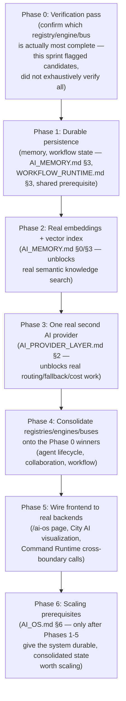
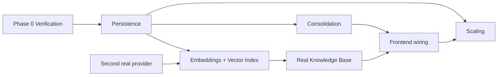

# Sprint CG-8 Result — Enterprise AI Operating System Bible

**Mode:** Architecture Research + Product Research. **No production code was written or modified —
`src/` was not touched.** Every file this sprint produced or changed is documentation.

## 1. What this sprint produced

| Document | Covers (brief §) |
|---|---|
| [`AI_OS.md`](./AI_OS.md) | §1 AI Operating System (subsystem inventory, Knowledge Base), §6 Enterprise Permissions, §7 Runtime Communication, §8 Future Scaling |
| [`AI_AGENT_LIFECYCLE.md`](./AI_AGENT_LIFECYCLE.md) | §2 AI Agent Lifecycle |
| [`AI_COLLABORATION.md`](./AI_COLLABORATION.md) | §3 Agent Collaboration |
| [`AI_MEMORY.md`](./AI_MEMORY.md) | §4 Memory Architecture |
| [`AI_PROVIDER_LAYER.md`](./AI_PROVIDER_LAYER.md) | §5 AI Provider Layer |
| `SPRINT_CG_8_RESULT.md` | This summary |

Also updated: [`ARCHITECTURE_MAP.md`](./ARCHITECTURE_MAP.md) (see §7). Two pre-existing thin stub
files (`AI_OS.md`, Sprint 12.4; `AI_MEMORY.md`) were found already occupying these exact filenames —
both preserved verbatim in an "Implementation reference" section per this engagement's standing
practice, not overwritten.

## 2. Architecture summary — the pattern this sprint confirms is platform-wide, not incidental

Every prior CG-sprint in this engagement found *one* duplicated concept (CG-7: six-plus workflow
engines; CG-6: two agent models for City specifically). This sprint's research shows the same
duplication shape recurring at **every layer of the AI stack independently**:

| Concept | Independent real implementations found |
|---|---|
| Agent registries | At least 3 (`platform_agents`, `platform_orchestrator.agent_registry`, `platform_ai_os`'s Agent Registry 2.0) — `AI_AGENT_LIFECYCLE.md` §0 |
| Collaboration engines | At least 3 (`platform_collaboration`, `platform_ai_os`'s `/collaborate`, TS `src/orchestrator/collaboration`) — `AI_COLLABORATION.md` §0 |
| Memory surfaces | At least 4 (`platform_memory`, `platform_ai/memory`, `platform_ai_os`'s 6-layer Memory Manager, `platform_enterprise_knowledge_graph/memory`) — `AI_MEMORY.md` implementation reference |
| Task/workflow orchestrators | At least 6 named "workflow" (CG-7) **plus** `platform_ai_os`'s own Task Orchestrator, likely a further overlap — `AI_OS.md` §0 |
| Message/event buses | At least 5 (canonical `PlatformEventBus`, `platform_ai_os`'s Communication Bus, `applications/ai_os`'s System Bus, frontend `enterpriseEventBus`, `dashboardEventBus`) plus 6 further duplicate `EventBus` classes (`TD-20`) |
| Provider layers | 1 real (OpenRouter) + at least 2 mock registries (`platform_ai.provider_manager`, `platform_integrations.provider_manager`) — `AI_PROVIDER_LAYER.md` §0 |

**This is the single most important finding of this sprint, more important than any individual
subsystem detail**: the platform did not fail to build AI infrastructure — it built the same AI
infrastructure concept **three to six times independently**, at every layer, across what appear to be
different sprints/teams/timeframes that didn't discover each other's work. The correct response,
repeated at every layer in this Bible's five documents, is the same: **consolidate onto the most
complete real candidate; do not add a fourth/seventh/sixth.**

## 3. Migration roadmap

This order is deliberate, matching CG-7's own reasoning: **persistence and consolidation before
visibility or scale.** Wiring the frontend to real backends (Phase 5) before the backends themselves
are consolidated (Phase 4) would mean wiring to whichever candidate happens to be convenient, not the
one a Phase 0 verification pass confirms is actually most complete.

## 4. Implementation priorities (ranked)

1. **Phase 0 verification** — cheapest, highest-leverage: confirm (a) whether the OpenRouter registry
   entry is the same code as the real module (`AI_PROVIDER_LAYER.md` §0), (b) whether `platform_ai_os`'s
   Task Orchestrator overlaps with `platform_workflow` (`AI_OS.md` §0), (c) which of the four memory
   surfaces is most complete (`AI_MEMORY.md` §3 item 4).
2. **Real embeddings** (`AI_MEMORY.md` §0/§3) — the single most concrete, most surprising gap this
   sprint found (fake hash-based "embeddings" masquerading as real ones); unblocks the Knowledge Base
   subsystem the brief specifically asked about.
3. **Durable persistence** (memory + workflow, shared prerequisite) — same reasoning as CG-7.
4. **Agent permission model** (`AI_AGENT_LIFECYCLE.md` §2) — extends the real `Tool.required_permissions`
   pattern (CG-7), smallest net-new design in this whole Bible.
5. **Approval-gate the real collaboration protocol** (`AI_COLLABORATION.md` §3) — the smallest gap in
   the collaboration domain: the protocol already exists end-to-end, it just isn't confirmed to route
   through the real human-approval pause before acting externally.
6. **Consolidation passes** (registries, engines, buses) — larger effort, sequenced after the above
   because consolidating onto an unverified "winner" (Phase 0) would risk redoing the work.

## 5. Risks

1. **This sprint's `platform_ai_os` vs. `platform_workflow`/agent-registry overlap claims are based on
   reading `ENTERPRISE_AI_OS.md`'s prior research plus this sprint's own targeted reads — not a fresh,
   exhaustive line-by-line comparison of both codebases side by side.** Explicitly flagged in `AI_OS.md`
   §0 and `AI_AGENT_LIFECYCLE.md` §0 as needing verification, not asserted as confirmed fact.
2. **The fake-embeddings finding (`AI_MEMORY.md` §0) could be mistaken for "close enough" if not read
   carefully** — a hash-based fake vector will *appear* to work in casual testing (it deterministically
   returns *something*), making this exactly the kind of gap that could ship unnoticed if a future
   sprint doesn't specifically test semantic similarity (not just "does the function return a vector").
3. **Six-plus duplicated implementations across five different AI-OS layers means any consolidation
   effort touches a very large surface area** — this Bible recommends verification-first specifically
   to avoid a consolidation sprint discovering, mid-effort, that its assumed "winner" wasn't actually
   the more complete candidate.
4. **Redis is real, working infrastructure already load-bearing in production** (FSM state,
   `REDIS_REQUIRED` fails hard) — any future scaling work must treat it as an existing dependency to
   preserve, not a component to redesign around.
5. **No scaling prerequisite work should begin before Phases 1-4** (`AI_OS.md` §6) — the temptation to
   "just add more bot processes" without durable, consolidated state underneath would produce
   inconsistent behavior across instances, not real horizontal scaling.

## 6. Dependency graph

## 7. Architecture Map update

`ARCHITECTURE_MAP.md` §5 (AI runtime) and §8 (Memory) have been extended with this sprint's sharper
findings — the precise `platform_ai_os` vs. Sprint-12.4 `applications/ai_os` prefix collision (naming
exactly which two things `TD-07` refers to, evidenced by this sprint's reading of `AI_KERNEL.md`/
`SYSTEM_BUS.md`/`AI_RUNTIME.md`), the fourth memory-surface candidate
(`platform_enterprise_knowledge_graph/memory`), and a pointer to this sprint's five-document Bible.

## 8. Recommendations for Cursor

- Read `SPRINT_CG_8_RESULT.md` §2 (this document) first — the six-way-duplication pattern is the
  premise every one of this sprint's five documents was written against.
- Do not start any consolidation work before Phase 0's verification pass — every "which candidate is
  canonical" question in this Bible is flagged as unverified by design, not decided.
- The fake-embeddings finding (`AI_MEMORY.md` §0) deserves immediate attention independent of the rest
  of this roadmap — it's a correctness bug hiding behind a plausible-looking abstraction, the same
  class of risk as CG-7's `TaskRequest` signature-mismatch bug.
- Treat this sprint's `platform_ai_os` overlap flags (§0 items across `AI_OS.md`/`AI_AGENT_LIFECYCLE.md`/
  `AI_COLLABORATION.md`) as the single highest-value research task for whichever sprint comes next —
  resolving them could substantially simplify every other recommendation in this Bible.
