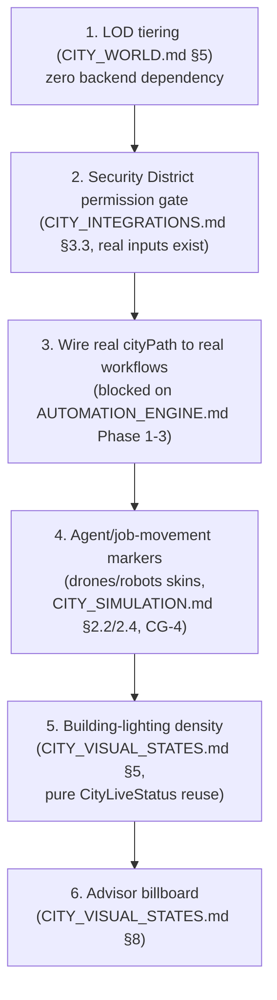

# Sprint CG-9 Result — Enterprise City Districts & Dynamic World

**Mode:** Architecture Research + UI Research + Game Design Research + Product Research.
**No production code was written or modified — `src` was not touched.** Every file this sprint
produced or extended is documentation.

## 1. What this sprint produced

| Document | Status | Covers |
|---|---|---|
| [`CITY_DISTRICTS.md`](./CITY_DISTRICTS.md) | **Extended** (real Sprint-27.8 content preserved) | Complete 15-district hierarchy (12 real + 3 SPEC), full per-district spec (purpose/buildings/services/actions/connected systems/visual style/traffic/animations/live indicators/night mode/expansion) |
| [`CITY_SIMULATION.md`](./CITY_SIMULATION.md) | **Extended** (CG-4 content preserved) | World Simulation drivers — ten brief-requested drivers mapped to real/partial/SPEC data sources |
| [`CITY_VISUAL_STATES.md`](./CITY_VISUAL_STATES.md) | New | Ten living-world visual elements, each tested against "does this represent a real event" |
| [`CITY_NAVIGATION.md`](./CITY_NAVIGATION.md) | New (deliberately short) | Named zoom levels only — six of seven brief asks already covered by `CITY_NAVIGATION_GUIDE.md` (CG-5), cross-referenced not repeated |
| [`CITY_WORLD.md`](./CITY_WORLD.md) | New | Synthesis of six already-specified "Live City" concerns + new LOD strategy |
| `SPRINT_CG_9_RESULT.md` | New | This document |

Also updated: `ARCHITECTURE_MAP.md` (see §6).

**Two of six target filenames already existed** before this sprint (`CITY_DISTRICTS.md`, real
Sprint-27.8 content; `CITY_SIMULATION.md`, this engagement's own CG-4 document) — both were read in
full and extended, never overwritten, per this engagement's standing practice.

## 2. Architecture summary

This sprint's honest headline: **Enterprise City's district hierarchy is more complete than the brief
assumed, and its "living world" is more disciplined than typical city-builder game conventions would
suggest.** Twelve of the fifteen requested districts already exist, are real, and are well-specified
by prior CG-sprint documents this sprint could extend rather than invent from scratch. The three that
don't exist (Communication, Partner, Infrastructure) each have a specific, named reason they don't —
not oversight, but either an architectural mismatch (Communication is a cross-cutting service, not a
place) or a real product-readiness gap (Partner blocked on Portal infrastructure, Infrastructure's real
content already lives in the header). This sprint declined to recommend building any of the three,
applying the exact same "12 is deliberately held" discipline `CITY_SIMULATION.md` (CG-4) already
established for "Automation."

The "Game Design Research" mode's most important output is negative, not additive: **two requested
visual elements (Smoke, literal Weather) are explicitly recommended against**, because neither maps to
a real signal — and this document's own governing test (§0 of `CITY_VISUAL_STATES.md`) is itself a
reusable finding: city-builder-genre conventions optimized for *simulated* liveliness are the wrong
model for a City whose liveliness is *real*. Every other new element (drones, robots, energy,
billboards) was specified as a reskin of an already-real or already-specified mechanism, never a new
system.

## 3. Key discoveries

1. **`CITY_SIMULATION.md` §5's ten-driver scorecard is the clearest "how alive is the City really"
   summary this engagement has produced**: 2 drivers fully real and wired (AI activity, Production
   jobs), 3 partially real (Notifications, CRM activity, Errors), 5 fully SPEC (CPU load, Running
   workflows, Orders, Online users, Maintenance). Worth citing directly in any stakeholder conversation
   about City's current state.
2. **The Security District is not gated by security** — the sharpest single irony surfaced in the
   per-district research (`CITY_DISTRICTS.md` D10): the district that visually represents the
   platform's RBAC layer is not itself access-controlled, restating `CITY_INTEGRATIONS.md` §3's (CG-6)
   real gap in a new, concrete location.
3. **The Administration District's `admin` building is shared with the Business District's table
   entry** in the original Sprint-27.8 document — a small, real documentation inconsistency (not a code
   bug) surfaced by this sprint's district-by-district research, flagged for a future maintainer pass
   rather than silently corrected.
4. **A workflow's real `cityPath` field already exists** (`enterprise-workflow/workflowTemplates.ts`,
   each of the 9 real templates) but currently only feeds the *simulated* `deriveWorkflowAutomation()`
   (`AUTOMATION_ENGINE.md` §0, CG-7) — meaning the data shape for "visualize a running workflow's path
   through the city" already exists and is real, only its data *source* is fake. This is one of the
   cheapest possible wins in this whole engagement once `AUTOMATION_ENGINE.md`'s Phase 1/2 land.
5. **LOD tiering (`CITY_WORLD.md` §5) is a pure render-cost win with zero new state** — keying detail
   level off the already-real `viewport.zoom` value means the cheapest render state (zoomed-out
   Overview) aligns with the most common interaction (glancing at the whole city), rather than the two
   being independent, accidentally-misaligned concerns.

## 4. Priority recommendations for Cursor

1. **Wire the real `cityPath` field to a real running workflow** (discovery #4) — highest ratio of
   value to effort in this sprint's findings; blocked only on `AUTOMATION_ENGINE.md`'s own Phase 1
   (durable persistence) and Phase 2/3 (a real trigger + real action) landing first.
2. **Implement LOD tiering** (`CITY_WORLD.md` §5) — independent of any backend work, pure frontend
   render-cost win, no new data.
3. **Do not build Communication, Partner, or Infrastructure districts** near-term — each has a specific
   documented reason (`CITY_DISTRICTS.md` D13–D15); revisit only if the named blocking condition
   changes (Portal infra for Partner, a `platform_ai_os` consolidation decision for Infrastructure).
4. **Do not build Smoke or literal Weather** — explicitly tested against real signals and found wanting
   (`CITY_VISUAL_STATES.md` §6/§9); revisit only if a genuinely new real signal emerges that either
   would represent.
5. **Fix the Security District permission gap** (discovery #2) — this is the highest-priority *real*
   gap this sprint's research touched, restating `CITY_INTEGRATIONS.md` §3.3's already-specified
   `buildingsForTenant()` SPEC as this district's own top expansion priority.

## 5. Implementation order

This order front-loads the two items with zero cross-sprint dependency (LOD, Security gate), then
follows the same "persistence/consolidation before visibility" sequencing `AUTOMATION_ENGINE.md`/
`AI_OS.md` already established for their own domains — visual richness (drones, lighting, billboards)
comes after the real data paths (workflow paths, permission gates) they'd otherwise be decorating
without substance.

## 6. Architecture Map update

`ARCHITECTURE_MAP.md` §13 ("Duplicate modules") is extended with a small, precise note: the real
`enterprise-workflow/workflowTemplates.ts`'s per-template `cityPath` field is confirmed unused by any
real (non-simulated) workflow execution today — a concrete instance of the platform-wide
"real-shaped data feeding simulated, not real, execution" pattern that document's own research already
established for several other subsystems.

## 7. Validation checklist

- [ ] Every new element in `CITY_VISUAL_STATES.md` names the specific real event it represents before
      implementation begins — no element ships as "just looks nice"
- [ ] LOD tiering introduces zero new camera/viewport state — verified against `cityEngine.ts`'s real
      `CityViewport` shape remaining unchanged
- [ ] Security District's `buildingsForTenant()` filter (once built) uses the real `menuEngine.
      forTenant()` signature shape, per `CITY_INTEGRATIONS.md` §3.2/§3.3 — not a new convention
- [ ] No new district is added to `CITY_DISTRICTS` without the same "real product surface first"
      justification this sprint applied to Communication/Partner/Infrastructure
- [ ] Workflow-path visualization (once built) reads the real `cityPath` field already present in
      `workflowTemplates.ts` rather than deriving a new path-resolution mechanism
- [ ] Drone/robot markers reuse the one real traveling-object mechanism (`CITY_SIMULATION.md` §2.2) —
      no second implementation, confirmed via code review before merge
- [ ] Weather, if ever built, shares its exact trigger/timing with the real health-ambient signal —
      never an independently-clocked decorative system

## 8. Risks

1. **The three SPEC-only districts (Communication/Partner/Infrastructure) could be built anyway under
   schedule pressure**, given their names are explicitly requested by product briefs repeatedly — this
   sprint's recommendation against building them is a judgment call based on absence of real product
   surface, not a hard technical blocker, and should be revisited by a human decision-maker if business
   priorities genuinely require them sooner than their blocking conditions resolve.
2. **LOD tiering's named zoom-level boundaries (`CITY_NAVIGATION.md` §2) are proposed round numbers**,
   not derived from real usage data — should be tuned against actual pan/zoom telemetry once available,
   not treated as final.
3. **The `cityPath`-to-real-workflow wiring (discovery #4) is entirely blocked on `AUTOMATION_ENGINE.md`
   Phase 1-3 landing** — this sprint's recommendation to prioritize it (§4 item 1) is only actionable
   once that cross-sprint dependency clears; flagged so it isn't mistaken for an independently-startable
   task.
