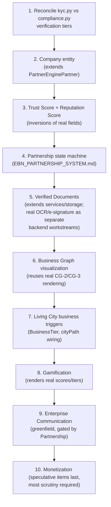

# Sprint CQ-10 Result — Enterprise Business Network Architecture

**Mode:** Architecture Research + Product Research + UX Research + Game Design Research. **No
production code was written or modified — `src` was not touched.** Every file this sprint produced or
extended is documentation.

## 1. What this sprint produced

| Document | Covers (brief §) |
|---|---|
| [`ENTERPRISE_BUSINESS_NETWORK.md`](./ENTERPRISE_BUSINESS_NETWORK.md) | Mission/philosophy, §1 Business Profile/Passport/Card/Trust/Reputation/Verification/Timeline/Status/Visibility |
| [`EBN_PARTNERSHIP_SYSTEM.md`](./EBN_PARTNERSHIP_SYSTEM.md) | §2 Digital Partnership System |
| [`EBN_COMMUNICATION.md`](./EBN_COMMUNICATION.md) | §3 Enterprise Communication |
| [`EBN_VERIFIED_DOCUMENTS.md`](./EBN_VERIFIED_DOCUMENTS.md) | §4 Verified Business Documents |
| [`EBN_BUSINESS_GRAPH.md`](./EBN_BUSINESS_GRAPH.md) | §5 Business Graph |
| [`CITY_LIVING_ECONOMY.md`](./CITY_LIVING_ECONOMY.md) | §6 Living Enterprise City, §7 Digital Odessa |
| [`EBN_GAMIFICATION_MONETIZATION.md`](./EBN_GAMIFICATION_MONETIZATION.md) | §8 Business Gamification, §9 Future Monetization |
| `SPRINT_CQ_10_RESULT.md` | This document |

Also updated: `ARCHITECTURE_MAP.md` (§8 below). One real, pre-existing thin stub
(`docs/CORPORATE_CHAT.md`) was found, read, preserved, and cited rather than overwritten
(`EBN_COMMUNICATION.md`).

## 2. Architecture summary

This sprint's honest headline reverses the assumption a purely-greenfield brief like this invites:
**Enterprise Business Network is not designed on a blank slate.** Targeted backend research found real,
usable foundations for exactly the concepts that most needed one — `PartnerEnginePartner` (company
identity + KYC/AML fields), two real (if unreconciled) verification-tier enums, a real 0–100 risk
score invertible into Trust Score, a real reputation-rating field, and a real, wired document-storage
abstraction (`services/storage`, genuine S3/local backing). Three other requested capabilities
(Enterprise Communication's chat/video/meetings, real OCR, real e-signature) are confirmed genuinely
absent, with two adjacent-sounding real systems (`platform_contracts`, `platform_communications_hub`)
identified as **false friends** — named precisely so no future implementation sprint mistakes either
for the real foundation it isn't.

The design discipline threading every document in this Bible is the same one CG-2 through CG-9
established for Enterprise City's technical/AI layer, extended to the *business* domain: **every
visual or scored signal traces to a real, verifiable fact, and nothing is ever removed, only
re-rendered.** This is not a slogan restated for a new domain — it is a literal test this sprint
applied to reject two brief-requested elements outright when researching the adjacent CG-9 visual
work (Smoke, literal Weather) and to flag Premium Districts/Digital Real Estate/City Branding as the
most speculative, least-ready monetization items in this document set specifically because they are
the hardest to keep tied to real signals without careful design.

## 3. Key discoveries

1. **`PartnerEnginePartner` + `kyc.py`/`compliance.py`'s risk/verification fields are a real, usable
   foundation for `Company`/`TrustScore`/`VerificationLevel`** — this sprint's single most valuable
   grounding discovery, reversing this Bible's own first-draft assumption that the entity model would
   be pure greenfield.
2. **Two real verification-tier enums already exist and disagree** (`kyc.py`'s four tiers vs.
   `compliance.py`'s five `L0`–`L4` tiers) — reconciling them is a prerequisite for EBN's own
   four-tier ladder, not a parallel concern.
3. **`platform_contracts` is a false friend for "business contract"** — a real, working API
   schema-registry, unrelated to legal agreements between companies. Building document/contract
   features on it would be a real, avoidable mistake this sprint's research specifically heads off.
4. **OCR and e-signature both have real code paths that are simulated, not functional** —
   `DocumentIngest.run_ocr()` echoes input text with a hardcoded confidence score;
   `DocumentManagement.digital_signature()` records metadata with no real cryptographic signing. Both
   are the correct shape to extend, neither does real work today.
5. **Enterprise Communication (chat/meetings/video) is entirely absent**, and the two adjacent real
   systems (`src/chat_bridge`, `platform_communications_hub`) are both false friends for different
   reasons (dev-tooling; outbound-only broadcast) — this is the single largest genuinely-greenfield
   subsystem in this whole Bible.
6. **A real workflow-path field already exists and is unused for real workflows**
   (`enterprise-workflow/workflowTemplates.ts`'s `cityPath`, `SPRINT_CG_9_RESULT.md` discovery #4) —
   directly relevant to `CITY_LIVING_ECONOMY.md`'s "workflow flows become visible" business-activity
   driver, now doubly relevant given `AUTOMATION_ENGINE.md`'s workflow runtime is confirmed **real**
   as of the platform's own Sprint 28.9 (observed during this sprint via a live document update).

## 4. Priority recommendations for Cursor

1. **Reconcile the two real verification-tier enums (discovery #2) before building EBN's own ladder**
   — the cheapest, highest-leverage fix in this entire Bible, with zero new design required.
2. **Do not build on `platform_contracts` for documents/agreements** (discovery #3) — extend
   `services/storage` instead (`EBN_VERIFIED_DOCUMENTS.md` §0).
3. **Treat Trust Score and Reputation Score as inversions/generalizations of real existing fields**
   (`risk_score`, `Partner.rating`), not new scoring pipelines — smallest possible net-new surface for
   the two most central EBN metrics.
4. **Sequence Enterprise Communication last among the core subsystems** — it is the one subsystem with
   zero real backend to extend, and depends on `EBN_PARTNERSHIP_SYSTEM.md`'s real state machine
   existing first (Business Chat's partnership gate, `EBN_COMMUNICATION.md` §1).
5. **Wire the real `cityPath` field to the now-real Automation Engine (Sprint 28.9) as the very first
   "workflow flows become visible" business-activity visualization** — this was already this
   engagement's top CG-9 recommendation and is now unblocked by Cursor's own real implementation
   progress since that sprint.

## 5. Implementation order

This order front-loads the items with the strongest real backend foundation (1–3), builds the
relationship/document layer that gates everything social (4–5), then visualizes (6–7), then layers
motivation and communication on top (8–9), and puts the most speculative, least-grounded items last
(10) — consistent with every prior sprint's "ground and consolidate before visibility, visibility
before speculation" sequencing discipline.

## 6. Entity model index (cross-reference)

| Entity | Defined in | Extends (real) |
|---|---|---|
| `Company` | `ENTERPRISE_BUSINESS_NETWORK.md` §3 | `PartnerEnginePartner`, `kyc.py`/`compliance.py` |
| `CompanyPassport` / `CompanyCard` | `ENTERPRISE_BUSINESS_NETWORK.md` §2 | `Company` (view, not separate storage) |
| `CompanyTimelineEvent` | `ENTERPRISE_BUSINESS_NETWORK.md` §3.4 | New, but the one shared audit mechanism every other entity uses |
| `Partnership` | `EBN_PARTNERSHIP_SYSTEM.md` §2 | New — no real two-company relationship entity exists today |
| `OwnershipEdge` | `EBN_BUSINESS_GRAPH.md` §2 | New — distinct from `Partnership` |
| `VerifiedDocument` / `DocumentSignature` | `EBN_VERIFIED_DOCUMENTS.md` §1 | `services/storage`'s real `StorageProvider` |
| `MeetingRoom` | `EBN_COMMUNICATION.md` §2 | New, greenfield |
| `BusinessTier` | `CITY_LIVING_ECONOMY.md` §1.3 | New, but reuses real `CityBuilding.w/h` for rendering |

## 7. Future API recommendations

- **Do not extend `/api/ai-os/v1` or `platform_contracts`'s existing route surface** for any EBN
  entity — both are already-collision-prone prefixes (`TD-07`, `AI_OS.md` §0) or a false friend (§3
  discovery 3); EBN warrants its own versioned prefix (e.g. `/api/ebn/v1`), decided by whichever sprint
  implements it, not this document.
- **Reuse `/api/enterprise-comms/v1`** (`CORPORATE_CHAT.md`'s real, pre-named prefix) for Enterprise
  Communication rather than inventing a second communications prefix.
- Every new endpoint should follow the real `platform_management`/`/management/v1` authenticated-REST
  pattern already established platform-wide, not a new auth convention.

## 8. Integration notes for Cursor

- This Bible assumes `EBN_PARTNERSHIP_SYSTEM.md`'s `Partnership` and `EBN_VERIFIED_DOCUMENTS.md`'s
  `VerifiedDocument` are new tables/models — confirm no naming collision with `database/models/
  partners.py`'s existing `Partner` model before implementation (similar name, different concept —
  `Partner` there is closer to `PartnerEnginePartner`, this Bible's `Company`).
- The real `services/storage` abstraction is scoped to Telegram bot media today
  (`MEDIA_STORAGE_PROVIDER`) — extending it for business documents should use a distinct bucket/prefix
  convention, not commingle with bot media in the same namespace.
- `AUTOMATION_ENGINE.md`'s real Sprint 28.9 implementation (`src/web/src/runtime/automation/`) is the
  concrete, current target for wiring real business workflows (§4 recommendation 5) — check that
  document's real API (`automationEngine.registerAutomation`, etc.) directly before building the
  `cityPath` integration, since it may have evolved further since this sprint's research.

## 9. Validation checklist

- [ ] `Company` entity implementation reuses `PartnerEnginePartner`'s real fields rather than
      duplicating them in a new table
- [ ] `kyc.py`/`compliance.py` verification-tier reconciliation happens before EBN's four-tier ladder
      is implemented, not after
- [ ] No document/contract feature imports from or extends `platform_contracts`
- [ ] Trust Score computation cites `risk_score`'s real inversion, not an independently-tuned formula
- [ ] Every gamification badge/achievement decomposes into a named real signal, verified in code
      review before merge (`EBN_GAMIFICATION_MONETIZATION.md` §1's test, applied literally)
- [ ] Business Chat is gated by real `Partnership.status`, confirmed via a test that a non-partnered
      company cannot open a Business Chat thread
- [ ] No monetized feature (`EBN_GAMIFICATION_MONETIZATION.md` §4) gates core partnership/verification/
      graph functionality behind payment
- [ ] Business Graph edges reuse the real `.ec-link-line` rendering — no second edge-rendering
      implementation introduced

## 10. Risks

1. **The `Company` entity's grounding in `PartnerEnginePartner` was based on one research pass's
   reading, not an exhaustive schema audit** — same caveat this engagement has applied to every
   "canonical candidate" finding since CG-7; verify before deep implementation.
2. **Premium Districts / Digital Real Estate / City Branding (`EBN_GAMIFICATION_MONETIZATION.md` §4)
   are the least-designed items in this whole Bible** — building them without further design work
   risks violating the "must never reduce enterprise usability" constraint the brief itself states.
3. **Enterprise Communication's total absence of real backend means its implementation cost is
   likely underestimated by any team reading only this Bible's architecture-level treatment** — flagged
   explicitly so it is scheduled with realistic effort, not treated as "just another EBN feature."
4. **This Bible's compatibility with "all previous CQ architecture sprints"** (per the brief's closing
   line) is asserted based on this engagement's own CG-2 through CG-9 documents, since no separately-
   labeled "CQ" sprint series exists prior to this one in this repo's history — treated as a continuity
   of the same effort under a new label, not a distinct prior series this document failed to find.
