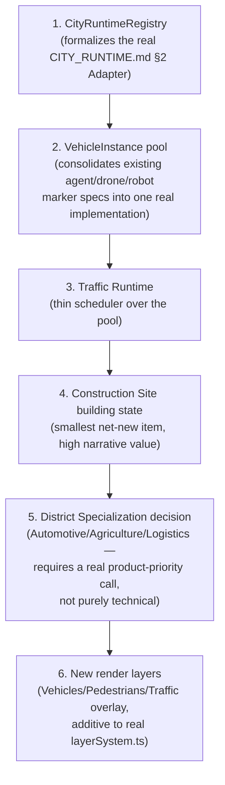

# Sprint CQ-11 Result — Enterprise City Runtime & Living Odessa

**Mode:** Architecture Research + UX Research + Game Design Research. **No production code was written
or modified — `src` was not touched.** Every file this sprint produced or extended is documentation.

## 1. What this sprint produced

| Document | Status | Covers (brief §) |
|---|---|---|
| [`CITY_RUNTIME_ARCHITECTURE.md`](./CITY_RUNTIME_ARCHITECTURE.md) | New | §2 City Runtime (all nine named runtimes), §10 rendering layers/data sources |
| [`CITY_OBJECT_MODEL.md`](./CITY_OBJECT_MODEL.md) | New | §3 City Object Model, §6 Enterprise Transport |
| `CITY_DISTRICTS.md` | Extended (CG-9 doc) | §7 District Specialization — grounded in real backend verticals, §1 Living Odessa cross-reference |
| `CITY_EVENTS.md` | Extended (CG-4 doc) | §8 City Events — new business-flavored event mapping |
| `EBN_GAMIFICATION_MONETIZATION.md` | Extended (CQ-10 doc) | §9 Monetization Visual Layer — three new items |
| `SPRINT_CQ_11_RESULT.md` | New | This document, plus §4 Business Visualization (no dedicated file — see §3 below) |

Also updated: `ARCHITECTURE_MAP.md` (§7 below).

**Five of six documents this sprint touched already existed** (`CITY_DISTRICTS.md`,
`CITY_EVENTS.md`, `EBN_GAMIFICATION_MONETIZATION.md` from prior CG/CQ sprints) — all extended, none
overwritten, per this engagement's standing practice.

## 2. Architecture summary

This sprint's brief asked for a Runtime Architecture, but its true contribution turned out to be
**decomposition and reconciliation, not net-new construction.** Of the brief's ten sections, six
(Living Odessa, Business Visualization, AI Agents, District Specialization's real-district portions,
City Events, Monetization) were already substantially specified across CG-4 through CQ-10 — this
sprint's job there was cross-referencing precisely and adding only the genuine deltas. The two
sections with real new architectural content — City Runtime (§2) and City Object Model (§3/§6) —
turned out to formalize patterns this engagement had already been using informally (one traveling-
object mechanism reused as skins, one real layer system reused for new layers) into an explicit,
named structure a future implementation sprint can build against directly.

**The single most consequential discovery this sprint made** was not architectural but factual: cross-
checking District Specialization against `ARCHITECTURE_MAP.md`'s real backend vertical inventory
revealed that **the platform's largest real vertical application (`auto_marketplace`, 420 files, GA
production) has no corresponding City district at all** — a bigger, more surprising gap than any of
CG-9's original three speculative districts (Communication/Partner/Infrastructure), and one with
dramatically stronger real-world justification for eventually being built.

## 3. Business Visualization (brief §4 — full reconciliation, no dedicated file needed)

| Brief item | Already specified in | New this sprint |
|---|---|---|
| Workflow traffic | `CITY_VISUAL_STATES.md` §1 (CG-9), `CITY_RUNTIME_ARCHITECTURE.md` §1.7 Traffic Runtime | Formalized as Traffic Runtime |
| Business growth | `CITY_LIVING_ECONOMY.md` §1.3 `BusinessTier` (CQ-10) | — |
| Construction | — | New: Construction Site as a transient building state (`CITY_OBJECT_MODEL.md` §2.1), not a new object |
| Headquarters expansion | `CITY_LIVING_ECONOMY.md` §1.3 | — |
| Company branding | `EBN_GAMIFICATION_MONETIZATION.md` §4 (CQ-10) | — |
| Partner links | `EBN_BUSINESS_GRAPH.md` (CQ-10) | — |
| Business reputation / Trust indicators | `ENTERPRISE_BUSINESS_NETWORK.md` §3.1–3.2 (CQ-10) | — |
| Advertising | `CITY_VISUAL_STATES.md` §8 (CG-9), `EBN_GAMIFICATION_MONETIZATION.md` §2 (CQ-10) | — |

Only **Construction** was a genuine gap — closed this sprint by treating it as a building state
(`CITY_OBJECT_MODEL.md` §2.1), not a new visualization system, keeping the CG-4 three-axis building
model (Lifecycle/Health/Interaction) intact rather than adding a fourth axis for one narrow case.

## 4. Runtime diagrams, interaction diagrams, object hierarchy, state diagrams (deliverable index)

- **Runtime diagrams**: `CITY_RUNTIME_ARCHITECTURE.md` §0 (the nine-runtime registry) and §1's
  per-runtime detail.
- **Interaction diagrams**: `CITY_RUNTIME_ARCHITECTURE.md` §0's flowchart (registry→runtimes) and the
  real per-subsystem sequence diagrams already in `CITY_EVENTS.md`/`EBN_PARTNERSHIP_SYSTEM.md`
  (CG-4/CQ-10) — not re-drawn here.
- **Object hierarchy**: `CITY_OBJECT_MODEL.md` §1's flowchart (WorldObject → Static/Dynamic →
  concrete kinds).
- **State diagrams**: Construction Site's transient-state model (`CITY_OBJECT_MODEL.md` §2.1) is new
  this sprint; every other state diagram this brief implies (`Partnership`, `VerificationLevel`,
  building Lifecycle/Health) already exists in its respective CG-4/CQ-10 document.

## 5. Rendering layers and data sources (deliverable index)

Both fully specified in `CITY_RUNTIME_ARCHITECTURE.md` §2–§3 — three new layer entries (Vehicles,
Pedestrians, Traffic overlay) additive to the real 8-layer system (CG-2), and a consolidated
real/SPEC data-source table across all nine runtimes.

## 6. API recommendations

- **`VehicleInstance` and its real-event-binding requirement (`representsEventId`,
  `CITY_RUNTIME_ARCHITECTURE.md` §1.3) should be enforced at the API layer**, not just convention — a
  future backend endpoint for spawning a vehicle marker should require a valid event reference, making
  decorative spawning a validation error, not a code-review-time judgment call.
- **District Specialization's three grounded candidates (Automotive, Agriculture, Logistics,
  `CITY_DISTRICTS.md` D17–D19) should, if built, expose their district-level aggregate through the
  same real `DistrictRuntimeSummary` shape** (`CITY_SIMULATION.md` §1.2, CG-4) every other district
  already uses — no per-vertical district API convention.
- **Construction Site's `constructionUntil` field** (`CITY_OBJECT_MODEL.md` §2.1) should be sourced
  from whatever real timeline event triggered it (a `Company` formation, a `BusinessTier` change,
  `ENTERPRISE_BUSINESS_NETWORK.md` §3.4) — never a client-side-only timer.

## 7. Architecture Map update

`ARCHITECTURE_MAP.md` §2.6 (the real `applications/` vertical table) is extended with a pointer to
this sprint's District Specialization reconciliation (`CITY_DISTRICTS.md` D16's finding that
`auto_marketplace` — the largest real vertical — has no City representation) — see the edit applied
alongside this result document.

## 8. Cursor implementation roadmap

This order builds the consolidating infrastructure (Registry, Vehicle pool) before anything that
depends on it (Traffic, Construction), and puts the one item requiring a business decision rather than
just engineering (§5, which real vertical to prioritize) after the purely technical work is available
to support whichever choice is made.

## 9. Risks

1. **`VehicleInstance`'s consolidation of agent/drone/robot markers into one pool is a refactor
   relative to how CG-4/CG-9 originally specified each independently** — implementing it requires
   revisiting those documents' individual specs, not just building something new; flagged so it isn't
   scheduled as if it were purely additive.
2. **District Specialization's three grounded candidates (D17–D19) are evidence-based, not
   product-approved** — real backend size is a strong signal, not a substitute for an actual product
   decision about which vertical the City should represent next; this document recommends, it does not
   decide.
3. **Construction Site's trigger conditions are not exhaustively defined** — `CITY_OBJECT_MODEL.md`
   §2.1 names `BusinessTier` change and headquarters claiming as examples, not a complete, final list;
   a future implementation sprint should confirm the full trigger set before building the visual.

## 10. Validation checklist

- [ ] Every `VehicleInstance` spawned in implementation carries a real `representsEventId` — verified
      via a test that rejects a spawn call with no event reference
- [ ] No fourth axis added to the real Building state model for Construction — confirmed it ships as
      a transient overlay state, not a new `BuildingState` enum value
- [ ] New render layers (Vehicles/Pedestrians/Traffic overlay) are added to the real `layerSystem.ts`
      registry, not a parallel layer list
- [ ] District Specialization's real-vertical grounding (D16's table) is presented to whoever makes
      the product priority call — not silently skipped in favor of the original CG-9 speculative
      three (Communication/Partner/Infrastructure)
- [ ] Pedestrian Runtime renders zero pedestrians until real presence (`CITY_COLLABORATION.md`) exists
      — no placeholder/demo pedestrians introduced in the interim
