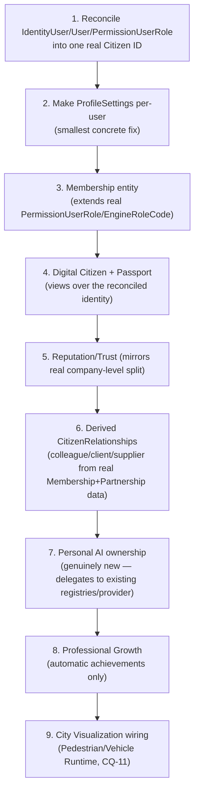

# Sprint CQ-12 Result — Enterprise Digital Citizens & Human Layer

**Mode:** Architecture Research + UX Research + Product Research + Game Design Research. **No
production code was written or modified — `src` was not touched.** Every file this sprint produced is
documentation.

## 1. What this sprint produced

| Document | Covers (brief §) |
|---|---|
| [`DIGITAL_CITIZEN.md`](./DIGITAL_CITIZEN.md) | §1 Digital Citizen, §10 Digital Passport |
| [`CITIZEN_ORGANIZATION_MEMBERSHIP.md`](./CITIZEN_ORGANIZATION_MEMBERSHIP.md) | §2 Organization Membership |
| [`DIGITAL_LIFE.md`](./DIGITAL_LIFE.md) | §3 Digital Workplace, §4 Digital Life, §9 City Visualization |
| [`PERSONAL_AI.md`](./PERSONAL_AI.md) | §5 Personal AI |
| [`CITIZEN_REPUTATION_GROWTH.md`](./CITIZEN_REPUTATION_GROWTH.md) | §6 Social Business Layer, §7 Reputation System, §8 Professional Growth |
| `SPRINT_CQ_12_RESULT.md` | §11 Implementation Package + this summary |

Also updated: `ARCHITECTURE_MAP.md` (§7 below).

## 2. Architecture summary

This sprint's headline finding mirrors CQ-10's pattern exactly, one layer down: **the Human Layer is
not greenfield either.** Targeted research found a real, if three-ways-fragmented, foundation —
`identityManager.ts`'s `IdentityUser` (frontend identity), `database/models/audit_log.py`'s real
per-user `AuditLog` (the single strongest grounding finding this sprint), and
`database/models/role.py`'s `PermissionRole`/`EngineRoleCode` (a real RBAC role table that,
remarkably, already includes `ACCOUNTANT`, `LAWYER`, `PARTNER`, and `OPERATOR` — four of the brief's
eighteen requested membership roles, verbatim). Three separate ID/role systems currently represent
"a person" (`IdentityUser.userId`, `User.telegram_id`, `PermissionUserRole.user_id`) — reconciling
them is this sprint's single highest-priority prerequisite, the human-layer instance of the exact
duplication pattern this engagement has now found at every layer of the platform (workflows, agents,
memory, event buses, verification tiers, and now personal identity).

The two subsystems with **no real precedent at all** — human Skills/Competencies/Certifications, and
Personal AI ownership — are named as genuinely new architecture, not dressed up as extensions of
something that doesn't exist. And one brief-requested item (Friends, §6) was explicitly declined and
reframed (Trusted Colleague) as being in direct tension with the brief's own "must remain
business-oriented" constraint — consistent with this engagement's now-established pattern of pushing
back on entertainment-flavored requests (CG-9's Smoke/Weather, CQ-11's Pedestrian Runtime restraint).

## 3. Navigation (brief §11 deliverable, not given its own document)

Citizen discovery reuses the real search infrastructure `CITY_NAVIGATION_GUIDE.md` §4 (CG-5) already
specifies — a citizen's Digital Passport (`DIGITAL_CITIZEN.md` §3) is proposed as a new searchable
document type registered into the same real `searchIndex`/`searchProvider` City buildings already use
(`registerCitySearchDocs()`, real, CG-5), not a second search system. Navigating *to* a citizen from
inside City is proposed as a Pedestrian Runtime marker click (`CITY_RUNTIME_ARCHITECTURE.md` §1.4,
CQ-11) once real presence exists — no new navigation primitive.

## 4. Entity model index

| Entity | Defined in | Extends (real) |
|---|---|---|
| `DigitalCitizen` | `DIGITAL_CITIZEN.md` §1 | `IdentityUser` (frontend), reconciles `User.telegram_id` |
| `Membership` | `CITIZEN_ORGANIZATION_MEMBERSHIP.md` §2 | Real `PermissionUserRole` + `EngineRoleCode` |
| `PersonalAiAssistant` | `PERSONAL_AI.md` §1 | New — no real precedent, delegates to real agent registries/provider |
| `CitizenRelationship` | `CITIZEN_REPUTATION_GROWTH.md` §1.2 | Derived from `Membership`/`Partnership`, not independently stored for most types |
| `CitizenSkill` / `CitizenCertification` | `DIGITAL_CITIZEN.md` §1 | New — confirmed no real precedent |

## 5. Permission model (consolidated)

Every document in this sprint routes permission decisions through **one real chain**: a citizen's
`Membership.role` (extending real `EngineRoleCode`) resolves through the real `permissionManager`/
`roleManager` (`CITY_INTEGRATIONS.md` §3, CG-6) — no new permission system is proposed anywhere in
this Bible. `PersonalAiAssistant` kind-gating (`PERSONAL_AI.md` §2), Passport field visibility
(`DIGITAL_CITIZEN.md` §3), and relationship visibility (`CITIZEN_REPUTATION_GROWTH.md` §1.2) all
reduce to the same real chain plus the same real `Visibility` enum pattern CQ-10 established.

## 6. API recommendations

- **Reconcile `IdentityUser.userId`/`User.telegram_id`/`PermissionUserRole.user_id` before any new
  Digital Citizen endpoint is built** — the single highest-leverage fix in this entire sprint, same
  shape as CQ-10's verification-tier reconciliation recommendation.
- **Extend `EngineRoleCode`, don't replace it** — four of the brief's eighteen roles are already real
  values; a new `/api/citizens/v1` surface should read/write this real enum, not a parallel one.
- **Make `ProfileSettings` per-user before building `PrivacySettings`** (`DIGITAL_CITIZEN.md` §2) — a
  concrete, small, high-value backend fix this sprint's research surfaced.

## 7. Architecture Map update

`ARCHITECTURE_MAP.md` is extended with this sprint's ID/role fragmentation finding (three
representations of "a person": `IdentityUser`, `User`, `PermissionUserRole`) alongside its existing
duplicate-modules catalog (`TD-20` EventBus, `TD-21` Memory, `TD-22` Workflow engines,
`ENTERPRISE_BUSINESS_NETWORK.md`'s verification-tier finding) — see the edit applied alongside this
document.

## 8. Cursor implementation roadmap

This order front-loads the identity reconciliation (1–2) because every other entity in this Bible
(Membership, Passport, Reputation, Personal AI) depends on citizens having one coherent ID — the same
"reconcile before you extend" sequencing this engagement applied to workflow engines (CG-7) and
verification tiers (CQ-10).

## 9. Risks

1. **The `IdentityUser`/`User`/`PermissionUserRole` reconciliation is a real, non-trivial migration**,
   not a documentation exercise — three currently-independent real records (one frontend demo store,
   two backend tables with different primary keys — `telegram_id` vs. a role-table `user_id`) need a
   single source of truth. Flagged as the largest real engineering risk in this sprint's roadmap.
2. **Deriving most `CitizenRelationship` types from `Membership`/`Partnership` data (§1.2 of
   `CITIZEN_REPUTATION_GROWTH.md`) assumes those two entities are implemented first** — this document's
   relationship model has no independent data path if Membership/Partnership slip.
3. **"Trusted Colleague" (the Friends replacement) needs its own abuse-resistance thought** before
   implementation — any peer-vouching mechanism (this one, or Recommendations in §2 of the reputation
   document) carries a real gaming risk this documentation-only sprint flags but does not solve.
4. **Personal AI's `underlyingAgentId` is designed to point at "whichever registry becomes canonical"**
   (`AI_OS.md` §0, CG-8) — if that consolidation question stays open indefinitely, Personal AI has no
   real backend to actually delegate to, only a well-designed ownership wrapper around nothing yet.

## 10. Validation checklist

- [ ] A single reconciled Citizen ID exists before any Membership/Passport/Reputation table is created
      — not three parallel ID fields
- [ ] `Membership` reuses the real `PermissionUserRole` table shape (extended with `companyId`/
      `isPrimary`), confirmed via schema review before a new table is created
- [ ] `ProfileSettings` is verified per-user (not a singleton) before `PrivacySettings` is built on top
      of it
- [ ] No "Friends" graph is implemented — only "Trusted Colleague," derived from real collaboration
      history
- [ ] Every Professional Growth achievement is verified automatic (no manual-award code path exists)
      before merge
- [ ] `PersonalAiAssistant.provider` is confirmed to route through the real OpenRouter call path
      (`openrouter.py`), not a new LLM integration
- [ ] Citizen search registers into the real `searchIndex`, not a second search mechanism
