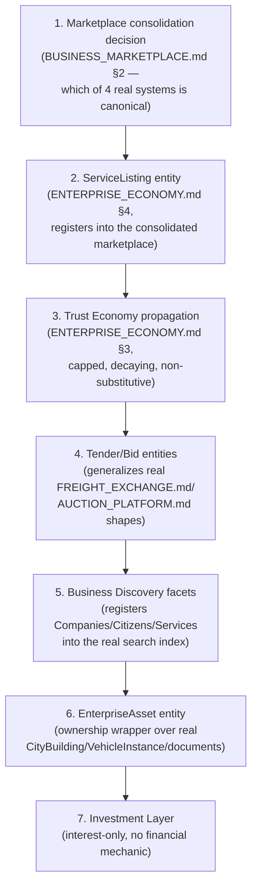

# Sprint CQ-13 Result — Enterprise Economy & Living Business Society

**Mode:** Architecture Research + Economic Modeling + UX Research + Product Research. **No production
code was written or modified — `src` was not touched.** Every file this sprint produced is
documentation.

## 1. What this sprint produced

| Document | Status | Covers (brief §) |
|---|---|---|
| [`ENTERPRISE_ECONOMY.md`](./ENTERPRISE_ECONOMY.md) | New | §1 Enterprise Economy, §7 Enterprise Reputation |
| [`BUSINESS_MARKETPLACE.md`](./BUSINESS_MARKETPLACE.md) | New | §2 Business Marketplace |
| [`TENDERS_PROCUREMENT.md`](./TENDERS_PROCUREMENT.md) | New | §3 Tenders & Procurement |
| [`PROFESSIONAL_NETWORK_DISCOVERY.md`](./PROFESSIONAL_NETWORK_DISCOVERY.md) | New | §4 Professional Network, §9 Business Discovery |
| [`INVESTMENT_LAYER.md`](./INVESTMENT_LAYER.md) | New | §5 Investment Layer |
| [`DIGITAL_ASSETS.md`](./DIGITAL_ASSETS.md) | New | §8 Digital Assets |
| `CITY_LIVING_ECONOMY.md` | Extended (CQ-10 doc) | §6 City Economy |
| `SPRINT_CQ_13_RESULT.md` | New | This document |

Also updated: `ARCHITECTURE_MAP.md` (§7 below).

## 2. Architecture summary — the biggest "already real" finding of this whole engagement

This sprint's research crossed a threshold the prior twelve sprints only approached: **the platform
already has, in production-real form, a substantial fraction of the "living business economy" this
brief asked for designed.** Confirmed by direct code read:

- `applications/enterprise_hub/business_network/facade.py` (Sprint 29.0) — real `BusinessProfile`
  (`trust_level: int`, `verification_status`, `visibility`) and `Relationship` (`type`, `state`,
  `history`) dataclasses, directly implementing this engagement's own CQ-10 research.
- `applications/enterprise_hub/digital_citizen/facade.py` (Sprint 29.1) — real `Citizen` and
  `Membership` dataclasses, directly implementing CQ-12's research.
- At least **four independent real marketplace systems** (`MARKETPLACE.md` Sprint 12.1,
  `EES_MARKETPLACE_API.md` Sprint 25.0, `ENTERPRISE_MARKETPLACE_32_9.md` Sprint 32.9, plus the City's
  own marketplace district), none consolidated — the marketplace-domain instance of the exact
  duplication pattern CG-7 found for workflow engines.
- A **real, substantial financial digital-asset system** (`DIGITAL_ASSET_TREASURY.md`/
  `DIGITAL_ASSET_RISK.md`, Sprint 18.4) that the brief's "Digital Assets" section could easily have
  been confused with, were it not scoped correctly (crypto/fiat instruments, not buildings/equipment/
  brands) — a genuine near-miss this sprint's research caught before any design work compounded it.
- Real, narrowly-scoped tender/bid/auction systems (`FREIGHT_EXCHANGE.md` Sprint 15.6,
  `AUCTION_PLATFORM.md`) that the brief's general Tenders & Procurement ask should generalize, not
  duplicate a fifth time.

**The correct framing for this entire Bible, as a result, is consolidation-and-composition, not
greenfield design** — mirroring `AUTOMATION_ENGINE.md`'s (CG-7) governing insight one domain later:
most of what looked like a request to invent an economy was actually a request to notice, name, and
connect an economy that already exists in pieces.

## 3. Economic flows and business scenarios (deliverable index)

- **Trust propagation**: `ENTERPRISE_ECONOMY.md` §3 — the one genuinely new economic mechanism this
  sprint designs, capped and decaying, never substituting for real verification.
- **Tender → Bid → Award → Contract → Project**: `TENDERS_PROCUREMENT.md` §1's state diagram — the
  fullest business scenario in this Bible, chaining four prior sprints' real/SPEC entities together.
- **Investment interest → real relationship**: `INVESTMENT_LAYER.md` §3 — deliberately stops short of
  any financial mechanic, per the brief's own constraint.

## 4. Sequence diagrams, interaction models (deliverable index)

All embedded in their respective documents: `ENTERPRISE_ECONOMY.md` §3, `TENDERS_PROCUREMENT.md` §1,
`INVESTMENT_LAYER.md` §3, `BUSINESS_MARKETPLACE.md` §2, `PROFESSIONAL_NETWORK_DISCOVERY.md` §2.1 —
not re-drawn here.

## 5. Permission model (consolidated)

No new permission system is introduced anywhere in this Bible. Every entity's visibility resolves
through the real `Visibility` enum pattern (`ENTERPRISE_BUSINESS_NETWORK.md` §3.5, CQ-10) and the real
permission chain (`permissionManager`/`roleManager`, `CITY_INTEGRATIONS.md` §3, CG-6) — Tenders,
Investment Opportunities, and Digital Assets all gate through the same real `BusinessProfile`/
`Membership`-derived chain this engagement has used consistently since CQ-10.

## 6. API recommendations

- **Do not build a fifth marketplace API** — `BUSINESS_MARKETPLACE.md` §2's consolidation
  recommendation should be resolved (which of the four real systems becomes canonical) before any new
  `/api/*` route is added for Companies/Professionals/Services-as-listings.
- **Do not extend `/api/finance-da/v1`** (the real Digital Asset Treasury) for enterprise
  (non-financial) assets — a new, separate prefix is warranted precisely because the domains differ
  (`DIGITAL_ASSETS.md` §0).
- **Generalize, don't duplicate, `/api/port-freight/v1`'s tender/bid shape** for a cross-vertical
  Tenders & Procurement API (`TENDERS_PROCUREMENT.md` §0).

## 7. Architecture Map update

`ARCHITECTURE_MAP.md` §13 is extended with this sprint's marketplace-duplication finding (four real
systems, none consolidated) alongside its existing duplicate-modules catalog — see the edit applied
alongside this document.

## 8. Cursor implementation roadmap

This order resolves the one real architectural ambiguity (marketplace consolidation) before building
anything that would need to register into whichever system wins, then sequences the genuinely new
mechanism (Trust propagation) before the composite features (Tenders, Discovery, Assets) that would
otherwise need to guess at trust semantics independently, and puts Investment last since it has the
fewest real dependents.

## 9. Risks

1. **Four real marketplace systems already exist and none are consolidated** — the single largest
   architectural risk this sprint surfaced. Building `ServiceListing` or any new discovery facet
   against the wrong one (or against a fifth, new one) would deepen a duplication problem this
   engagement has now found at nearly every layer of the platform.
2. **`DIGITAL_ASSET_TREASURY.md`'s real financial system is a genuine confusion risk for "Digital
   Assets"** — this sprint's research caught it before compounding the mistake, but a future sprint
   reading only the brief (not this document) could easily conflate the two domains.
3. **Trust propagation (`ENTERPRISE_ECONOMY.md` §3) is the one genuinely novel economic mechanism in
   this Bible** — it has no real precedent to ground it, unlike almost everything else in this sprint;
   its cap/decay constraints are architectural requirements, not suggestions, and should be enforced in
   code, not left to convention.
4. **Tenders & Procurement's real precedents are vertical-scoped** (freight, auto-marketplace auctions)
   — generalizing them risks either over-fitting to freight's specific shape or under-specifying for
   verticals with different real procurement norms; flagged for product review before implementation.

## 10. Validation checklist

- [ ] No new marketplace API route is added before `BUSINESS_MARKETPLACE.md` §2's consolidation
      decision is made
- [ ] `ServiceListing`/Tender/Bid/InvestmentOpportunity all resolve visibility through the real
      `Visibility` enum, not a new access-control field
- [ ] Trust propagation is verified capped and decaying in code review — a trust value that can grow
      unbounded or never decay is a design-violation, not a tuning issue
- [ ] No integration is added between `EnterpriseAsset` and `DIGITAL_ASSET_TREASURY.md`'s real
      financial APIs
- [ ] Business Discovery facets query the one real search index — no second discovery/search backend
      introduced
- [ ] Investment Layer ships with zero financial/transaction fields, confirmed via schema review
