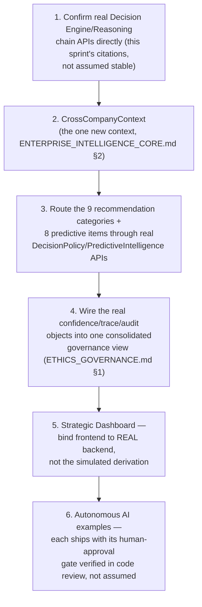

# Sprint CQ-14 Result — Enterprise Intelligence & Autonomous Business Ecosystem

**Mode:** Architecture Research + AI Orchestration + Decision Modeling + Governance Design. **No
production code was written or modified — `src` was not touched.** Every file this sprint produced is
documentation.

## 1. What this sprint produced

| Document | Covers (brief §) |
|---|---|
| [`ENTERPRISE_INTELLIGENCE_CORE.md`](./ENTERPRISE_INTELLIGENCE_CORE.md) | §1 Intelligence Core, §7 Knowledge Evolution |
| [`BUSINESS_OBSERVATORY.md`](./BUSINESS_OBSERVATORY.md) | §2 Business Observatory, §6 City Intelligence |
| [`RECOMMENDATION_PREDICTIVE_ENGINE.md`](./RECOMMENDATION_PREDICTIVE_ENGINE.md) | §3 Recommendation Engine, §4 Predictive Analytics |
| [`AUTONOMOUS_AI.md`](./AUTONOMOUS_AI.md) | §5 Autonomous AI |
| [`STRATEGIC_DASHBOARD.md`](./STRATEGIC_DASHBOARD.md) | §8 Strategic Dashboard |
| [`ETHICS_GOVERNANCE.md`](./ETHICS_GOVERNANCE.md) | §9 Ethics & Governance |
| `SPRINT_CQ_14_RESULT.md` | §10 Implementation Package + this summary |

Also updated: `ARCHITECTURE_MAP.md` (§7 below).

## 2. Architecture summary — the largest "already real" finding of this entire engagement

This sprint's research found something more consequential than any prior sprint's individual
duplication findings: **the platform already has a real, wired, tested cognition chain** —
`platform_reasoning` → `platform_planning` → `platform_decision` → `platform_learning`, called by real
application code (`auto_marketplace`'s AI assistant, `platform_collaboration`, `platform_observability`'s
metrics manager) — plus a real, tested **Collective Intelligence / Collaborative AI** system (Sprint
28.8, `applications/platform_builder/collaborative_ai/`) with a genuine Decision Engine (alternatives,
pros/cons, risk notes, recommendation, business impact) and a real Decision Chain UX pattern (EP-06)
already threading through Dashboard, Control Tower, Mission Control, Concierge, Builder, Marketplace,
CRM, Knowledge, AI Team, City, and Twin.

**The equally important honest finding**: every one of these real systems is **deterministic
heuristic/rule logic — keyword matching, fixed-weight scoring, hardcoded arithmetic formulas — not
statistical or ML-based intelligence.** `platform_predictive_intelligence`'s own bootstrap code
explicitly sets `ai_may_act: False`; `platform_learning`'s recommendations require manual human
acceptance; confidence scores are fixed weighted sums, not calibrated probabilities. This sprint's
Bible is designed throughout to **compose these real systems honestly** — never overstating what
"AI Confidence" or "Predictive Analytics" actually means, and never routing any autonomous behavior
around the real, already-enforced human-approval gate.

## 3. Decision flows, AI interaction models, sequence diagrams, knowledge graph models (deliverable index)

- **Decision flows**: `ENTERPRISE_INTELLIGENCE_CORE.md` §0 (the real Decision Engine + EP-06 Decision
  Chain composition), `AUTONOMOUS_AI.md` §2 (the one sequence every autonomous example collapses to).
- **AI interaction models**: `RECOMMENDATION_PREDICTIVE_ENGINE.md` §1.1 (real `DecisionPolicy`
  routing), `ETHICS_GOVERNANCE.md` §1 (the consolidated governance flowchart).
- **Sequence diagrams**: embedded in `ENTERPRISE_INTELLIGENCE_CORE.md`, `AUTONOMOUS_AI.md`.
- **Knowledge graph models**: `ENTERPRISE_INTELLIGENCE_CORE.md` §1's context table — still gated on
  `AI_MEMORY.md`'s (CG-8) unresolved four-way memory-surface reconciliation, restated as a
  prerequisite, not re-solved.

## 4. Recommendation models, UX concepts (deliverable index)

`RECOMMENDATION_PREDICTIVE_ENGINE.md` §1 (the nine-category-to-four-real-policy mapping) is the
recommendation model in full. UX concepts reuse the real EP-06 Decision Chain
(`Observation → Understanding → Recommendation → Decision → Action → Result`) throughout — no new
interaction pattern is proposed anywhere in this Bible.

## 5. API recommendations

- **Extend `AI_AGENT_GOVERNANCE.md`'s real `/api/enterprise-agents/v1/governance`** for Intelligence
  Layer-wide audit, rather than a new governance API.
- **Extend `EXECUTIVE_DASHBOARD.md`'s real `/api/executive/v1/dashboard`** for Strategic Dashboard,
  rather than a new dashboard API.
- **Bind the frontend to `platform_predictive_intelligence`/`platform_learning` directly** —
  `STRATEGIC_DASHBOARD.md` §3's explicit warning against inheriting the confirmed frontend/backend
  disconnect this sprint found for predictive intelligence specifically.
- **Do not add a new `/api/*` prefix for the Decision Engine** — extend
  `/api/platform-builder/v1/collaborative-ai/`'s real routes.

## 6. Architecture Map update

`ARCHITECTURE_MAP.md` §5 (AI runtime) is extended with this sprint's confirmation that the intended
reasoning→planning→decision→learning cognition chain is real and wired (not merely intended, as the
document's prior text left ambiguous), alongside the honest characterization that it is
heuristic/deterministic, not ML-based — see the edit applied alongside this document.

## 7. Cursor implementation roadmap

This order confirms the real foundation (step 1) before building anything on it, adds the one
genuinely new context (step 2), then composes rather than invents (steps 3–4), and puts frontend
wiring and autonomous-behavior verification last, since both depend on everything above being correct.

## 8. Risks

1. **This entire Bible's grounding depends on the reasoning/planning/decision/learning packages'
   real behavior matching this sprint's research** — a single research pass, not an exhaustive audit;
   flagged the same way every prior "real foundation" finding in this engagement has been (CQ-10's
   `PartnerEnginePartner`, CQ-13's marketplace survey).
2. **Confidence scores being fixed heuristic formulas, not calibrated probabilities, is an easy fact to
   lose in translation** by the time a UI designer or product stakeholder sees "87% confidence" —
   `ETHICS_GOVERNANCE.md` §2's labeling requirement is the mitigation, and should be treated as
   non-negotiable, not a nice-to-have.
3. **The real Collaborative AI Decision Engine is scoped to Platform Builder sessions today** — this
   Bible's extension of it to City/Economy/Citizen data (`ENTERPRISE_INTELLIGENCE_CORE.md` §0) is an
   architectural proposal, not a confirmed-compatible integration; a spike should validate this before
   broad implementation, the same caution `CG-9`'s CG-2-reuse-for-workflow-canvas risk already modeled.
4. **Every "detects duplicated work"/semantic-matching capability in this Bible is blocked on real
   embeddings** (`AI_MEMORY.md` §0, CG-8) — none of this sprint's documents work around that gap; they
   inherit it, correctly, rather than papering over it with a heuristic substitute presented as
   equivalent.

## 9. Validation checklist

- [ ] Every recommendation surfaced to a user carries a real `ReasoningTrace`/`DecisionTrace`
      reference, not just a bare suggestion
- [ ] Every confidence figure shown in a UI is labeled as heuristic, not statistical/ML certainty
- [ ] No autonomous example (`AUTONOMOUS_AI.md`) reaches a real system action without a logged human
      `accept()`
- [ ] `CrossCompanyContext` reasoning sessions are verified to respect both companies' independent
      permission boundaries, tested with a case where one company's data should NOT be visible to the
      other
- [ ] Strategic Dashboard's Growth/Risk/Opportunity widgets call the real backend APIs, confirmed via
      network inspection, not the simulated frontend derivation
- [ ] No second Decision Engine, metrics observatory, or dashboard API is introduced anywhere in this
      Bible's implementation
