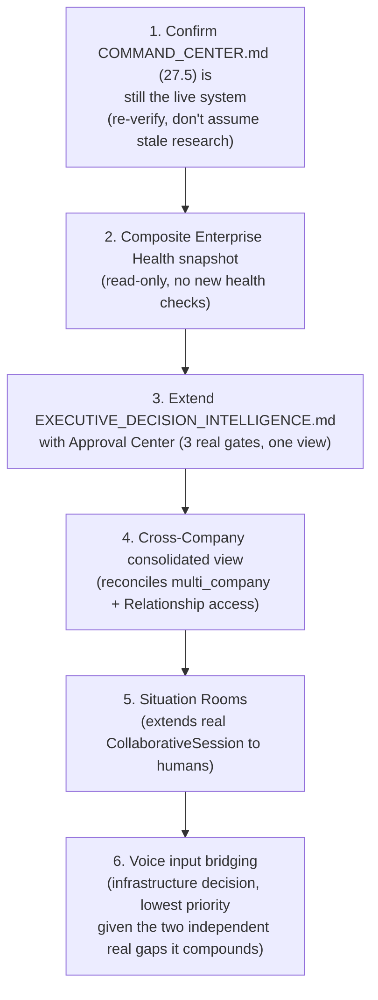

# Sprint CQ-15 Result — Enterprise Command Center & Executive Operations

**Mode:** Architecture Research + UX Research + Operational Architecture + Decision Modeling. **No
production code was written or modified — `src` was not touched.** Every file this sprint produced is
documentation.

## 1. What this sprint produced

| Document | Covers (brief §) |
|---|---|
| [`EXECUTIVE_OPERATING_SYSTEM.md`](./EXECUTIVE_OPERATING_SYSTEM.md) | §1 Executive Command Center, §2 Live Enterprise Map |
| [`GLOBAL_COMMAND_BAR.md`](./GLOBAL_COMMAND_BAR.md) | §3 Global Command Bar, §9 Voice Operations |
| [`EXECUTIVE_DECISION_CENTER.md`](./EXECUTIVE_DECISION_CENTER.md) | §4 Executive Decision Center, §7 Command Timeline |
| [`ENTERPRISE_HEALTH.md`](./ENTERPRISE_HEALTH.md) | §5 Enterprise Health |
| [`CROSS_COMPANY_OPERATIONS.md`](./CROSS_COMPANY_OPERATIONS.md) | §6 Cross-Company Operations |
| [`ENTERPRISE_WAR_ROOM.md`](./ENTERPRISE_WAR_ROOM.md) | §8 Enterprise War Room |
| `SPRINT_CQ_15_RESULT.md` | §10 Implementation Package + this summary |

Also updated: `ARCHITECTURE_MAP.md` (§7 below).

**This document's master file was deliberately named `EXECUTIVE_OPERATING_SYSTEM.md`, not "Executive
Command Center"** — the brief's own working title — because this sprint found **four** real,
pre-existing, differently-scoped documents already claiming a variant of that name (see §2).

## 2. Architecture summary — the largest naming-collision finding in this engagement

Every prior sprint found duplication at increasing scale (workflow engines, CG-7; marketplaces,
CQ-13; intelligence/decision engines, CQ-14). This sprint's research found the largest yet: **four
real, substantial, independently-shipped "Command Center" systems** — `ENTERPRISE_COMMAND_CENTER.md`
(Sprint 26.6), `COMMAND_CENTER.md` (Sprint 27.5, confirmed the actually-live one per this engagement's
own CG-6/CG-7 research), `COMMAND_CENTER_OS.md` (Sprint 29.13), and `ENTERPRISE_COMMAND_CENTER_32_3_2.md`
(Sprint 32.3.2). This sprint's response is the same discipline every prior consolidation finding has
established: **identify the confirmed-live real system, and design every brief-requested executive
capability as an extension of it**, never a fifth implementation.

The second most consequential finding: `EXECUTIVE_DECISION_INTELLIGENCE.md` (real, Sprint 29.18 — the
highest sprint number encountered in this entire engagement, meaning very recent, ongoing Cursor work)
already ships almost exactly the brief's §4 Executive Decision Center, with the identical
"analytical and advisory only" constraint this engagement's own CQ-14 governance research
independently arrived at. This is a strong, convergent confirmation that the governance discipline
this documentation set has been building sprint over sprint matches the platform's own real,
independently-evolving design instincts.

The one deliberately-declined design in this sprint: **no per-citizen Wellbeing score is proposed**
(`ENTERPRISE_HEALTH.md` §2) — extending `RECOMMENDATION_PREDICTIVE_ENGINE.md`'s (CQ-14) already-stated
caution against surveillance-shaped productivity scoring to this brief's explicit "Citizen Wellbeing
Indicators" ask, on the same grounds.

## 3. Executive workflows, sequence diagrams, state machines (deliverable index)

- **Executive workflows**: `EXECUTIVE_OPERATING_SYSTEM.md` §1's dashboard-to-real-data mapping,
  `CROSS_COMPANY_OPERATIONS.md` §2's consolidated ownership/partnership view.
- **Sequence/state diagrams**: `EXECUTIVE_DECISION_CENTER.md` §2 (Approval Center composition),
  `ENTERPRISE_WAR_ROOM.md` §2 (Situation Room lifecycle).
- **Navigation models**: `GLOBAL_COMMAND_BAR.md` §1–2 (command-to-real-entity resolution, voice as an
  additional input modality onto the same commands).

## 4. Permission models (consolidated)

No new permission system anywhere in this Bible. `CROSS_COMPANY_OPERATIONS.md` §2 is the one
genuinely novel permission-composition case this sprint adds: reconciling two different real access
models (intra-tenant `multi_company` ownership vs. inter-tenant `Relationship` partnership) in a single
consolidated view — every other document routes through the same real `Membership.role`/
`permissionManager` chain used since CQ-10.

## 5. API recommendations

- **Do not add a fifth Command Center API** — extend Sprint 27.5's confirmed-live `COMMAND_CENTER.md`
  surface.
- **Do not add a new Executive Decision API** — extend the real, very-recently-shipped
  `EXECUTIVE_DECISION_INTELLIGENCE.md` (Sprint 29.18).
- **Voice input should target real browser Web Speech API or bridge the isolated `src/voice` pipeline**
  (`GLOBAL_COMMAND_BAR.md` §2.2) — this is an infrastructure decision, not a new command API.

## 6. Architecture Map update

`ARCHITECTURE_MAP.md` §13 is extended with this sprint's Command Center duplication finding (four real
systems) alongside the existing catalog (workflow engines `TD-22`, marketplaces CQ-13, memory `TD-21`,
event buses `TD-20`) — see the edit applied alongside this document.

## 7. Cursor implementation roadmap

## 8. Risks

1. **Four real Command Center systems is the largest consolidation debt this engagement has found** —
   this sprint's recommendation to build on Sprint 27.5 specifically should be re-verified, not
   assumed permanently correct, given how fast this platform's real implementation has moved even
   within this engagement's own session (Sprint 28.9 through 29.18 all shipped during this
   conversation).
2. **The intra-tenant (`multi_company`) vs. inter-tenant (`Relationship`) access-model composition**
   (`CROSS_COMPANY_OPERATIONS.md` §2) is the one place in this whole Bible mixing two structurally
   different trust assumptions in one view — the highest-care implementation item in this sprint.
3. **Voice Operations inherits two independent real gaps simultaneously** (no mic-to-web bridge, no
   real Meeting Room for the one example command that needs it) — a future sprint should not treat
   "add voice" as a single ticket; it is at least two separate infrastructure problems.
4. **Citizen Wellbeing's explicit non-design** (`ENTERPRISE_HEALTH.md` §2) may face product pressure to
   be built anyway — this sprint's recommendation against it should be revisited by a human
   decision-maker with a real ethics review, not silently reversed by a future implementation sprint
   under schedule pressure.

## 9. Validation checklist

- [ ] No fifth Command Center implementation is created — confirmed via a search for new `/api/*`
      command-center-shaped routes before merge
- [ ] Approval Center reads from the three real gates (`platform_learning`, `platform_workflow`,
      `EBN_PARTNERSHIP_SYSTEM.md`) — no new approval-state field added to any entity
- [ ] Enterprise Health ships with zero per-citizen wellbeing fields, confirmed via schema review
- [ ] Cross-Company views correctly deny inter-tenant partners the intra-tenant detail an
      intra-tenant subsidiary would see — tested explicitly, not assumed from the design doc alone
- [ ] Situation Rooms reuse the real `CollaborativeSession`/Decision Engine — no second session model
- [ ] Voice input resolves to the exact same Command Runtime actions text input produces — verified by
      testing one command through both paths and confirming identical resulting action
