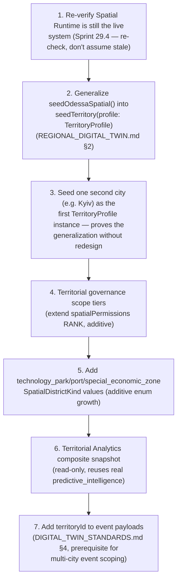

# Sprint CQ-16 Result — Regional Digital Twin & Smart Territory Architecture

**Mode:** Architecture Research + Geospatial Modeling + Governance Design + Intelligence Design.
**No production code was written or modified — `src` was not touched.** Every file this sprint
produced is documentation.

## 1. What this sprint produced

| Document | Covers (brief §) |
|---|---|
| [`REGIONAL_DIGITAL_TWIN.md`](./REGIONAL_DIGITAL_TWIN.md) | §1 Territory Model, §2 Multi-City Architecture, §8 Expansion Framework, the "Digital Twin" naming disambiguation |
| [`TERRITORIAL_GOVERNANCE.md`](./TERRITORIAL_GOVERNANCE.md) | §3 Territorial Governance |
| [`REGIONAL_ECONOMY.md`](./REGIONAL_ECONOMY.md) | §4 Regional Economy |
| [`SMART_INFRASTRUCTURE.md`](./SMART_INFRASTRUCTURE.md) | §5 Smart Infrastructure |
| [`TERRITORIAL_ANALYTICS.md`](./TERRITORIAL_ANALYTICS.md) | §6 Territorial Analytics |
| [`DIGITAL_TWIN_STANDARDS.md`](./DIGITAL_TWIN_STANDARDS.md) | §7 Public & Private Layers, §9 Digital Twin Standards |
| `SPRINT_CQ_16_RESULT.md` | §10 Implementation Package + this summary |

Also updated: `docs/ARCHITECTURE_MAP.md` §13 (fifth "Digital Twin" collision entry).

## 2. Architecture summary — this was not a greenfield brief

The single most consequential finding of this sprint: **the Territory Model this brief asks for
already exists, real, in production code.** `docs/SPATIAL_RUNTIME.md` (Sprint 29.4,
`src/web/src/runtime/spatialRuntime`) implements a real `SpatialEntity` hierarchy — Country → Region →
City → District → Street → Building → Floor → Room → Workspace, plus Zone/POI/Virtual Space — with real
WGS84-approximate coordinates seeded for Ukraine → Odesa Oblast → Odessa, real routing (Dijkstra +
haversine), real ranked permission scopes, and a real EventBus integration already wired to Business
Network, Digital Citizen, Life Engine, and Asset Runtime. Of the brief's 11 Territory Model concepts,
7 map onto real code exactly, 1 is real-but-misnamed (Technology Park is modeled as `"construction"`),
1 is real-but-under-modeled (Port Area exists only as a point, not a zone), and only 1 (Special
Economic Zone) is genuinely new — and even that is one additive enum value, not a new subsystem.

This corrects this engagement's own prior finding: `CITY_LIVING_ECONOMY.md` §2.1 (CQ-10) concluded "the
real system today has no actual Odessa geography encoded in it." That was true when written; Sprint
29.4 has since shipped real geography. This sprint's documents state that correction plainly rather
than silently building around the stale claim.

The one genuine gap: the Spatial Runtime's **data model is multi-city-ready, but its seed data is
not** — `seedOdessaSpatial()` is a single hardcoded function with no second call anywhere.
`REGIONAL_DIGITAL_TWIN.md` §2 designs the `TerritoryProfile` generalization that closes this without
touching the real registry/routing/permission internals.

## 3. The second finding: a fifth "Digital Twin" naming collision, narrowly avoided

This brief's own title ("Regional Digital Twin") would have deepened an already-real four-way
collision on the term "Digital Twin" (`platform_enterprise_digital_twin/`, legacy EDT,
`executive_center/twins.py`, `platform_builder/digital_twin/` — all confirmed this sprint to be
organizational/process twins with zero geospatial concept). This sprint's documents use "Territory" as
the technical term throughout and reserve "Digital Twin" for the narrative/brand sense Sprint 29.4
already established, recorded as a fifth `ARCHITECTURE_MAP.md` §13 entry with an explicit
disambiguation rule so a future sprint doesn't have to re-derive it.

## 4. New reconciliation-pending finding: three permission-scope vocabularies

`DIGITAL_TWIN_STANDARDS.md` §2 surfaces a real, previously-uncited near-collision: `SpatialPermissionScope`
(`spatialPermissions.ts`), `AssetPermissionScope` (`assetTypes.ts`), and business `Visibility`
(`ENTERPRISE_BUSINESS_NETWORK.md` §3.5) are three independently-authored access vocabularies, not
identical in rank or meaning. Flagged for a future reconciliation decision, following this engagement's
established discipline (verification-tier collision, CQ-10; Command Center collision, CQ-15) of naming
the debt rather than silently resolving it inside a documentation-only sprint.

## 5. Permission models (consolidated)

No new permission engine. `TERRITORIAL_GOVERNANCE.md` §3 is the one genuinely new composition this
sprint adds: three territorial governance tiers (District Manager/City Administrator/Regional
Administrator) inserted into the real `spatialPermissions` rank between `company` and
`enterprise_admin`. `DIGITAL_TWIN_STANDARDS.md` §3 composes (not merges) the three real vocabularies
from §4 above for Public/Private Layers, following the same discriminator discipline
`CROSS_COMPANY_OPERATIONS.md` (CQ-15) established.

## 6. API recommendations

- **Do not add a new spatial/territory API** — extend the real, live `/api/enterprise-spatial/v1`
  (Sprint 29.4).
- **Governance roles are `Membership.role` string values**, not a new role table — no new
  `/roles` endpoint needed.
- **`TerritoryProfile` seeding is a data operation, not a new endpoint family** — one
  `POST /api/enterprise-spatial/v1/territories` accepting a `TerritoryProfile` body is sufficient;
  do not design a bespoke import pipeline per territory.

## 7. Architecture Map update

`ARCHITECTURE_MAP.md` §13 is extended with this sprint's fifth Digital Twin collision entry and the
three-way permission-scope finding — see the edit applied alongside this document.

## 8. Cursor implementation roadmap

## 9. Risks

1. **The `TerritoryProfile` generalization must not become a rewrite of `seedOdessaSpatial()`'s real,
   working internals** — the recommended path preserves the existing function as the Odessa profile
   instance, adding a thin data layer around it, not replacing it.
2. **The three-way permission-scope collision (§4) is easy to underestimate** — `AssetPermissionScope`
   and `SpatialPermissionScope` look similar enough to tempt a quick merge; they are not rank-compatible
   today and should be reconciled deliberately, not silently aliased.
3. **Technology Park / Port Area / Special Economic Zone are additive `SpatialDistrictKind` values** —
   a future sprint should confirm no downstream code pattern-matches on the literal union exhaustively
   (e.g. a `switch` without a `default`) before adding new members.
4. **Multi-city event scoping (§8 step 7) is a prerequisite, not a nice-to-have**, once a second city
   is seeded — without it, every subscriber (dashboards, City visualizations) receives unfiltered
   cross-city event noise.

## 10. Validation checklist

- [ ] No second spatial/geospatial engine is created — confirmed via a search for new
      `/api/*-spatial*` or `/api/*-territory*` routes before merge
- [ ] `seedOdessaSpatial()` remains callable and behaviorally unchanged after the `TerritoryProfile`
      generalization — existing Odessa entities/ids do not change
- [ ] Territorial governance roles are `Membership.role` string values — no new role table added
- [ ] The three permission-scope vocabularies are not silently merged without an explicit
      reconciliation decision recorded in a future sprint's `RESULT.md`
- [ ] New `SpatialDistrictKind` values are additive only — existing districts' `districtKind` values
      are unchanged
- [ ] Event payloads carry a `territoryId` before a second city goes live — tested by seeding two
      cities and confirming a subscriber can filter to one
