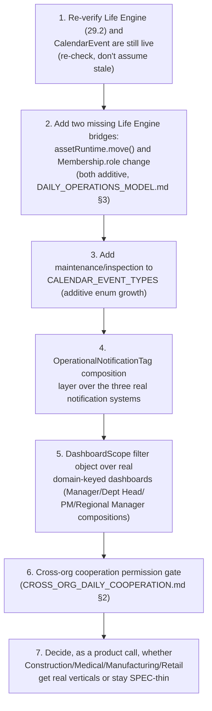

# Sprint CQ-17 Result — Enterprise Operations & Daily Business Life

**Mode:** Architecture Research + UX Research + Operational Architecture + Business Scenario Design.
**No production code was written or modified — `src` was not touched.** Every file this sprint
produced is documentation.

## 1. What this sprint produced

| Document | Covers (brief §) |
|---|---|
| [`DAILY_OPERATIONS_MODEL.md`](./DAILY_OPERATIONS_MODEL.md) | §1 Daily Operations Model, §4 Daily City Life, §9 City-to-Business Synchronization |
| [`COMPANY_OPERATING_MODES.md`](./COMPANY_OPERATING_MODES.md) | §2 Company Operating Modes |
| [`BUSINESS_CALENDAR.md`](./BUSINESS_CALENDAR.md) | §3 Business Calendar |
| [`OPERATIONAL_NOTIFICATIONS.md`](./OPERATIONAL_NOTIFICATIONS.md) | §5 Enterprise Notifications |
| [`OPERATIONAL_DASHBOARDS.md`](./OPERATIONAL_DASHBOARDS.md) | §6 Operational Dashboards |
| [`CROSS_ORG_DAILY_COOPERATION.md`](./CROSS_ORG_DAILY_COOPERATION.md) | §7 Cross-Organization Cooperation |
| [`ENTERPRISE_SCENARIO_LIBRARY.md`](./ENTERPRISE_SCENARIO_LIBRARY.md) | §8 Scenario Library |
| `SPRINT_CQ_17_RESULT.md` | §10 Implementation Package + this summary |

Also updated: `docs/ARCHITECTURE_MAP.md` §13 (notification-vocabulary collision + calendar correction).

## 2. Architecture summary — the third consecutive "not a greenfield brief" finding

Following CQ-16's discovery that Spatial Runtime already implements the Territory Model, this sprint
found the same pattern one layer up: **`docs/LIFE_ENGINE.md` (Sprint 29.2) already implements almost
exactly the brief's Daily Operations Model, Daily City Life, and City-to-Business Synchronization
sections.** A real 26-value `LifeEventKind` covers start/end of workday, office entry/exit, meetings,
movement, deliveries, and business visits; every one of these already publishes to the real shared
EventBus as both `life_engine_update` and `city_update` — the exact synchronization mechanism brief §9
asks for is not proposed here, it is cited with file:line precision.

Two secondary discoveries matched this pattern: a real, substantial unified **Business Calendar**
(`database/models/calendar.py`'s `CalendarEvent`, previously uncited in this engagement) and real
per-domain **Operational Dashboards** (`applications/enterprise_hub/command_center/dashboards/`,
organized by business domain rather than org-chart role — the brief's actual gap).

## 3. New collision found: three notification vocabularies

Mirroring CQ-16's Digital Twin and CQ-15's Command Center findings, this sprint surfaced a third
significant naming/vocabulary collision: legacy per-vertical `NOTIFICATION_CATEGORIES`, the unified
`NOTIFICATION_CENTER.md`/`NOTIFICATION_CHANNELS.md` system, and the frontend's own `NotificationKind`
taxonomy are three real, independently-authored systems that don't map cleanly onto each other or onto
any of the brief's seven operational categories. Recorded in `ARCHITECTURE_MAP.md` §13 with a
composition recommendation, not a resolution.

## 4. The honest finding: Scenario Library is unevenly grounded, and says so

Of the brief's eight business scenarios, three are strongly real (Logistics, IT Company — the
platform's own reference org, Crypto Exchange) and one is real-but-narrow (Professional Services, legal
only). The other four (Construction, Medical Clinic, Manufacturing, Retail) have only generic,
uniform capability-seed scaffolding confirmed this sprint to carry no differentiated business logic —
`ENTERPRISE_SCENARIO_LIBRARY.md` states this plainly per scenario rather than presenting all eight as
equally real.

## 5. Sequence diagrams, state machines, UX concepts (deliverable index)

- **Sequence diagram**: `DAILY_OPERATIONS_MODEL.md` §3 (Life Engine → EventBus → City, the real
  synchronization path).
- **Flow diagrams**: `CROSS_ORG_DAILY_COOPERATION.md` §2 (permission-enforcement point for
  already-permissive shared project/meeting data).
- **UX concepts**: `OPERATIONAL_DASHBOARDS.md` §2–3 (role-scoped views over real domain dashboards).

## 6. Permission models (consolidated)

No new permission engine. `CROSS_ORG_DAILY_COOPERATION.md` §2 is this sprint's one genuinely new
composition: enforcing the real `SpatialPermissionScope`/`Visibility` composition
(`DIGITAL_TWIN_STANDARDS.md` §3, CQ-16) at the point a partner-org citizen is added to a project or
meeting — closing a real gap where the data model permits cross-org membership with no enforcement
check today, rather than adding a fourth access vocabulary.

## 7. API recommendations

- **Do not add a new "daily operations" API** — extend the real, live `/api/enterprise-life/v1`
  (Sprint 29.2).
- **Do not add a fourth notification taxonomy** — compose the three real ones per
  `OPERATIONAL_NOTIFICATIONS.md` §3.
- **Add `"maintenance"`/`"inspection"` to `CALENDAR_EVENT_TYPES`** — additive enum growth on the real,
  existing calendar system, not a new calendar API.
- **Bridge `assetRuntime`/`Membership.role` changes into Life Engine** (`DAILY_OPERATIONS_MODEL.md` §3)
  — two missing `publishLifeEvent()` call sites, not new endpoints.

## 8. Architecture Map update

`ARCHITECTURE_MAP.md` §13 is extended with the notification-vocabulary collision and the Business
Calendar correction — see the edit applied alongside this document.

## 9. Cursor implementation roadmap

## 10. Risks

1. **The Life Engine/City synchronization path is easy to over-build** — every brief §9 example already
   has a real, working path; a future sprint should extend `attachPlatformBridges()`'s existing pattern,
   not design a new sync layer.
2. **Cross-org data permissiveness (§CROSS_ORG_DAILY_COOPERATION.md §2) is a real, currently-unenforced
   gap** — `ProjectParticipant`/`LifeMeeting` accept any citizen id today with no company-boundary
   check; this should be closed deliberately, not discovered in production by a partner seeing data they
   shouldn't.
3. **Four of eight Scenario Library entries are thin by design** — a future sprint should not assume
   Construction/Medical/Manufacturing/Retail have real business logic just because a scenario document
   exists for them.
4. **Three notification vocabularies is the third such collision this engagement has found** (after
   Command Center and Digital Twin) — the pattern itself (independent teams/sprints re-authoring a
   concept under slightly different names) is now well-evidenced enough that a future sprint might
   reasonably audit for a fourth before it's found by accident.

## 11. Validation checklist

- [ ] No second "daily operations"/city-sync engine is created — confirmed via a search for new
      `/api/*-life*` or `/api/*-operations*` routes before merge
- [ ] The two new Life Engine bridge call sites (asset move, role change) publish existing
      `LifeEventKind` values or one additive new one (`citizen_role_changed`) — no restructuring of
      `LifeEvent`'s shape
- [ ] Cross-org project/meeting membership is denied by default until the real Visibility/
      SpatialPermissionScope check passes — tested with an actual partner-org citizen, not assumed from
      the design doc
- [ ] Notification composition tag is additive — no existing `NotificationKind`/`NOTIFICATION_
      CATEGORIES` value is renamed or removed
- [ ] `CalendarEvent`'s new `maintenance`/`inspection` types (if implemented) don't require a schema
      migration beyond the existing free-string `event_type` column
- [ ] Scenario Library scenarios are not cited in product marketing as equally complete — the
      real/SPEC scorecard in `ENTERPRISE_SCENARIO_LIBRARY.md` §0 should gate that claim
