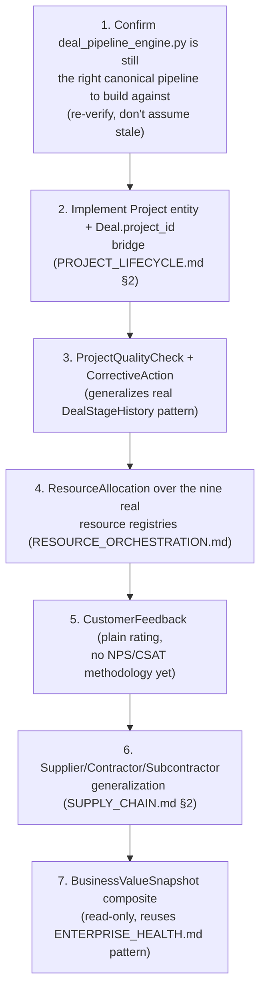

# Sprint CQ-18 Result — Enterprise Value Chain & Project Lifecycle

**Mode:** Architecture Research + Business Process Modeling + Lifecycle Design + Intelligence Design.
**No production code was written or modified — `src` was not touched.** Every file this sprint
produced is documentation.

## 1. What this sprint produced

| Document | Covers (brief §) |
|---|---|
| [`ENTERPRISE_VALUE_CHAIN.md`](./ENTERPRISE_VALUE_CHAIN.md) | §1 Value Chain Model, §8 City Visualization |
| [`PROJECT_LIFECYCLE.md`](./PROJECT_LIFECYCLE.md) | §2 Project Lifecycle, §9 Cross-Module Integration |
| [`RESOURCE_ORCHESTRATION.md`](./RESOURCE_ORCHESTRATION.md) | §3 Resource Orchestration |
| [`CUSTOMER_JOURNEY.md`](./CUSTOMER_JOURNEY.md) | §4 Customer Journey |
| [`SUPPLY_CHAIN.md`](./SUPPLY_CHAIN.md) | §5 Supply Chain |
| [`QUALITY_ASSURANCE_ARCHITECTURE.md`](./QUALITY_ASSURANCE_ARCHITECTURE.md) | §6 Quality Assurance |
| [`BUSINESS_VALUE_METRICS.md`](./BUSINESS_VALUE_METRICS.md) | §7 Business Value Metrics |
| `SPRINT_CQ_18_RESULT.md` | §10 Implementation Package + this summary |

Also updated: `docs/ARCHITECTURE_MAP.md` §13 (largest pipeline collision found to date).

## 2. Architecture summary — the biggest collision this engagement has found, and the biggest real gap

This sprint's research surfaced **at least six independent real staged-pipeline implementations**
(`deals.py`, `deal.py`, `deal_engine_v1.py`, `deal_pipeline_engine.py`, `lead_engine.py`,
`automotive_sales.py`) modeling the same underlying sales-funnel concept — exceeding CQ-15's four-way
Command Center collision and CQ-16's four-way Digital Twin collision. The most mature of the six,
`deal_pipeline_engine.py`'s `DealPipelineStageCode`/`DealStage`, is a genuinely well-built engine: real
tenant-configurable `allowed_next_stages`, real per-stage SLA hours, and a real audit trail
(`DealStageHistory.validation_passed`) that turned out to be the single most useful real primitive in
this sprint — it became the direct model for this sprint's own `ProjectQualityCheck` design
(`QUALITY_ASSURANCE_ARCHITECTURE.md`).

The mirror-image finding: **no real backend `Project` entity exists anywhere in the codebase.** The
sales side of the brief's value chain (Opportunity → Contract) is real and rich; the execution side
(Project → Execution → Delivery) has only the thin frontend `ProjectParticipant` (Sprint 29.2, CQ-17).
`PROJECT_LIFECYCLE.md` proposes the one new entity this sprint's documents introduce — `Project` — as
the missing bridge between a won `Deal` and real execution tracking, deliberately minimal and
composing real entities rather than duplicating them.

## 3. Post-sale value chain: real, but each stage stops at one vertical

Support (`ServiceOrder`, automotive), Maintenance (`ServiceOperation`, automotive), and Renewal
(`CPL_LOYALTY_CALENDAR.md`'s Membership Center, cafe/beauty) are each real and non-trivial — but each
only in one vertical, with no generalized cross-vertical equivalent. This is the same shape of finding
as the sales-side collision, at smaller scale: real capability, fragmented by vertical rather than
unified.

## 4. Sequence diagrams, state machines (deliverable index)

- **State machine**: `PROJECT_LIFECYCLE.md` §3 (the full Idea→Archive lifecycle, gated by real
  Approval Center and the new `ProjectQualityCheck` pattern).
- **Entity diagrams**: `ENTERPRISE_VALUE_CHAIN.md` §1 (the six-way pipeline collision table),
  `RESOURCE_ORCHESTRATION.md` §1–2 (`ResourceAllocation` over nine real resource kinds).
- **Business scenarios**: this sprint's scenarios extend `ENTERPRISE_SCENARIO_LIBRARY.md` (CQ-17)
  rather than repeating it — Construction's real `Supplier`/`Contractor` gap (`SUPPLY_CHAIN.md`) is the
  clearest concrete link back to that library's honestly-thin Construction entry.

## 5. Permission models (consolidated)

No new permission engine. Resource allocation conflicts (`RESOURCE_ORCHESTRATION.md` §3) and
cross-vertical Supplier/Contractor visibility (`SUPPLY_CHAIN.md` §2) both reuse the real
`spatialPermissions`/`AssetPermissionScope`/`Visibility` composition already established in
`DIGITAL_TWIN_STANDARDS.md` (CQ-16).

## 6. API recommendations

- **Build new value-chain work against `deal_pipeline_engine.py`**, not the other five real pipeline
  systems — it is the most mature and the only one with tenant-configurable stages.
- **Do not implement `Project`/`ProjectQualityCheck`/`ResourceAllocation`/`Supplier`/`CustomerFeedback`
  yet** — this sprint specifies shapes only, per its documentation-only constraint; a future
  implementation sprint should confirm each against the live schema before building.
- **Add `Deal.project_id`** (nullable FK) as the single lowest-cost schema change this sprint
  identifies — it is the concrete bridge between the real sales pipeline and the proposed `Project`
  entity.

## 7. Architecture Map update

`ARCHITECTURE_MAP.md` §13 is extended with the six-way pipeline collision and the vertical-scoped
post-sale-value-chain finding — see the edit applied alongside this document.

## 8. Cursor implementation roadmap

## 9. Risks

1. **Six real pipeline systems is the largest consolidation debt this engagement has found** — a
   future sprint choosing to unify them should expect real migration cost (`deal.py`'s OTC-flavored
   status values, in particular, encode business logic that doesn't map cleanly onto
   `DealPipelineStageCode`).
2. **`Project` is a new entity, not just new documentation** — unlike most of this engagement's
   findings, this one requires an actual schema change before any of `PROJECT_LIFECYCLE.md`'s
   downstream designs (`ProjectQualityCheck`, `ResourceAllocation`) can be implemented.
3. **Post-sale vertical fragmentation (Support/Maintenance/Renewal) should not be generalized
   reflexively** — each real implementation (`ServiceOrder`, CPL Loyalty Center) is tuned to its
   vertical's actual workflow; a naive merge risks losing that fit, same caution
   `CROSS_COMPANY_OPERATIONS.md` (CQ-15) applied to intra-tenant vs. inter-tenant access models.
4. **`CustomerFeedback`/`BusinessValueSnapshot` must not imply a sentiment/ML methodology that isn't
   there** — both are plain counts/averages; marketing or product framing should not oversell them as
   NPS-equivalent without an explicit future decision to adopt that methodology.

## 10. Validation checklist

- [ ] No seventh pipeline/deal system is created — new sales-pipeline work extends
      `deal_pipeline_engine.py` specifically
- [ ] `Project.dealId` links correctly to a real `Deal.id` when present — tested with an actual won
      deal, not assumed from the design doc
- [ ] `ProjectQualityCheck.validationPassed = false` always produces a `CorrectiveAction` before the
      same transition can be re-attempted
- [ ] `ResourceAllocation` conflict detection correctly denies a double-booked building/vehicle —
      tested with two overlapping allocations, not assumed
- [ ] `CustomerFeedback.rating` is never presented as an NPS/CSAT score in any UI copy
- [ ] `Supplier`/`Contractor`/`Subcontractor` visibility correctly composes the real Visibility/
      permission-scope model — a partner-org supplier should not see another partner's terms
