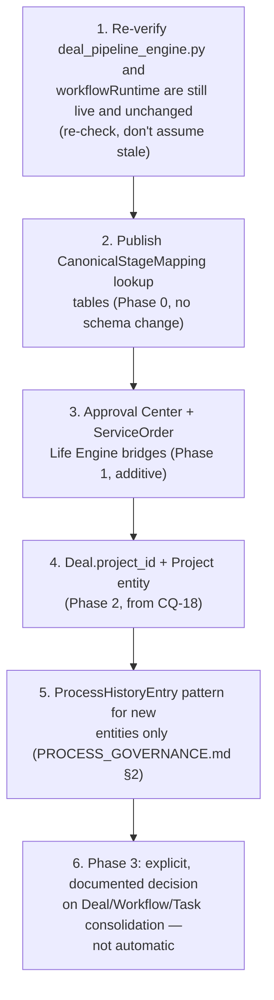

# Sprint CQ-19 Result — Enterprise Process & Workflow Canonical Model

**Mode:** Architecture Research + Canonical Design + Entity Reconciliation + Governance Design.
**No production code was written or modified — `src` was not touched.** Every file this sprint
produced is documentation.

## 1. What this sprint produced

| Document | Covers (brief §) |
|---|---|
| [`CANONICAL_PROCESS_MODEL.md`](./CANONICAL_PROCESS_MODEL.md) | §1 Canonical Process Model, §2 Process Abstraction, §7 City Visualization |
| [`PROCESS_STATE_MACHINE.md`](./PROCESS_STATE_MACHINE.md) | §3 Process State Machine |
| [`ENTITY_RECONCILIATION.md`](./ENTITY_RECONCILIATION.md) | §4 Entity Reconciliation |
| [`CROSS_VERTICAL_EXTENSIONS.md`](./CROSS_VERTICAL_EXTENSIONS.md) | §5 Cross-Vertical Extensions |
| [`PROCESS_EVENT_MODEL.md`](./PROCESS_EVENT_MODEL.md) | §6 Event Model |
| [`PROCESS_GOVERNANCE.md`](./PROCESS_GOVERNANCE.md) | §8 Governance |
| `SPRINT_CQ_19_RESULT.md` | §9 Implementation Package + Migration Strategy + this summary |

Also updated: `docs/ARCHITECTURE_MAP.md` §13 (extended the real workflow-engine entry with a seventh,
frontend system; added the canonical-model entry with two new sub-collisions).

## 2. Architecture summary — a labeling layer over eleven real systems, not a twelfth

This sprint is the direct synthesis of everything CG-7 through CQ-18 catalogued: **six real deal/
pipeline systems** (CQ-18) and **six real backend workflow engines plus one newly-confirmed real
frontend workflow engine** (`workflowRuntime`, disconnected from all six backend ones) — eleven
independent real staged-process implementations in total, none unified. This sprint's answer is
deliberately not a twelfth system: `CanonicalStage`/`ProcessState`/`CanonicalProcessEvent` are lookup
vocabularies every real system's own status column maps onto additively. No real table is renamed, no
real engine is replaced.

Two further collisions surfaced while building the reconciliation table:

- **Tasks**: at least three independent real task concepts — a generic `tasks.Task` (real, but
  disconnected from `Deal` and only weakly linked to a project via a non-FK column), `DealTask`
  (deal-scoped), and the frontend `ProjectParticipant.assignments` (plain strings, not a task entity).
- **History/Versioning**: confirmed via a full read of `database/models/mixins.py` that no generic
  history or versioning mixin exists anywhere — every entity reinvents its own audit table.

## 3. The one architecturally unique real pattern: `DealStage.allowed_next_stages`

Of everything reconciled this sprint, `deal_pipeline_engine.py`'s tenant-configurable transition table
stands out: it is the **only** real tenant-configurable stage/transition mechanism in the entire
platform — none of the six backend workflow engines has an equivalent. This sprint recommends
generalizing that specific pattern (not any workflow engine's) if the canonical process model ever
needs configurable per-tenant transitions.

## 4. Sequence diagrams, state machines (deliverable index)

- **State machine**: `PROCESS_STATE_MACHINE.md` §3 (the canonical nine-state machine, gated by the
  real Approval Center).
- **Entity diagrams**: `ENTITY_RECONCILIATION.md` (the full deal/task/workflow reconciliation tables).
- **Flow diagram**: `PROCESS_GOVERNANCE.md` §3 (ownership/permission/visibility composition, reusing
  CQ-16's real pattern unchanged).

## 5. Permission models (consolidated)

No new permission engine. `PROCESS_GOVERNANCE.md` composes the same real `SpatialPermissionScope`/
`AssetPermissionScope`/`Visibility` vocabulary `DIGITAL_TWIN_STANDARDS.md` (CQ-16) already established —
this sprint adds no fourth vocabulary.

## 6. API recommendations

- **No new canonical-process API** — `CanonicalStage`/`ProcessState` are read-projections computed
  from existing real systems' own APIs, not a new service.
- **Do not build a fourth task concept** — reconcile `tasks.Task`/`DealTask`/`ProjectParticipant.
  assignments` deliberately in a future sprint (`ENTITY_RECONCILIATION.md` §2), don't add a fifth.
- **Bridge the Approval Center and `ServiceOrder` into the Life Engine event stream** — two concrete,
  additive `publishLifeEvent()` call sites (`PROCESS_EVENT_MODEL.md` §1), same pattern as
  `DAILY_OPERATIONS_MODEL.md`'s (CQ-17) already-identified missing bridges.

## 7. Migration Strategy (brief §9)

This sprint's canonical model is designed to be adopted **incrementally, per real system, without a
cutover event**:

1. **Phase 0 (no schema change)**: Publish `CanonicalStageMapping` lookup tables for all six deal
   systems and the recommended canonical `deal_pipeline_engine.py` — pure documentation/config, no
   code change. Any reporting tool can start reading canonical stages immediately.
2. **Phase 1 (additive only)**: Add `Deal.project_id` (the single concrete recommendation carried over
   from CQ-18), the two missing Life Engine bridges (`PROCESS_EVENT_MODEL.md` §1), and the
   `"process_created"`/`"stage_changed"` `LifeEventKind` values. All additive, no existing behavior
   changes.
3. **Phase 2 (new entities, not migrations)**: Implement `Project`, `ProjectQualityCheck`,
   `ResourceAllocation` (already specified in CQ-18) as genuinely new tables — these don't migrate
   anything, they fill the confirmed gap between sales and execution.
4. **Phase 3 (deliberate, not automatic)**: Only after Phases 0-2 are live and observed, a future
   sprint should explicitly decide whether to consolidate the six deal systems, the seven workflow
   engines, or the three task concepts — each such decision gets its own `RESULT.md` "Architectural
   decisions" section, per `CLAUDE.md`'s standing requirement, not a silent merge.

No phase requires taking any real system offline; the canonical model is additive at every step.

## 8. Cursor implementation roadmap

## 9. Risks

1. **The eleven-system count itself may already be stale by the time this is implemented** — this
   engagement has repeatedly found Cursor shipping real changes concurrently; Phase 0's lookup tables
   should be re-verified against the live schema before publishing, not copied from this document
   blindly.
2. **`tasks.Task.project_id` being a non-FK column is a silent data-integrity risk today**, independent
   of this sprint's canonical model — flagged because it was found in the course of this research, not
   because this sprint proposes fixing it.
3. **Phase 3 consolidation decisions are easy to rush** — six deal systems and seven workflow engines
   each encode real, vertical-tuned business logic; a schedule-driven merge risks the same kind of loss
   `CROSS_COMPANY_OPERATIONS.md` (CQ-15) warned against for intra/inter-tenant access models.
4. **The canonical model must not become an eighth/ninth system in practice** — if a future
   implementation adds business logic directly to `CanonicalStage`/`ProcessState` rather than keeping
   them as pure read-projections, this sprint's entire "labeling layer, not a new engine" premise is
   violated.

## 10. Validation checklist

- [ ] No new deal, workflow, or task engine is created — confirmed via a search for new
      `/api/*-pipeline*`/`/api/*-workflow*`/`/api/*-task*` routes before merge
- [ ] `CanonicalStageMapping` rows are lookup data only — no real status/stage column is renamed
- [ ] The two new Life Engine bridges (Approval, Support) publish additive `LifeEventKind` values, not
      a restructured `LifeEvent` shape
- [ ] `Deal.project_id` is nullable and does not require backfilling existing deals
- [ ] Phase 3 consolidation (if pursued) produces its own `RESULT.md` "Architectural decisions"
      section before any real table is merged or dropped
- [ ] `CanonicalStage`/`ProcessState` remain pure read-projections — no business logic is added
      directly to them
