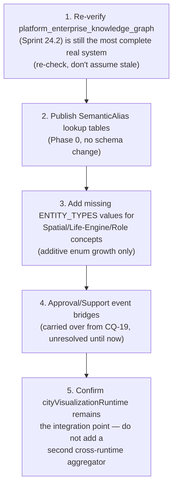

# Sprint CQ-20 Result — Enterprise Unified Semantic Model

**Mode:** Architecture Research + Ontology Design + Governance Design. **No production code was
written or modified — `src` was not touched.** One pre-existing real doc was extended (not
overwritten); every other file this sprint produced is new documentation.

## 1. What this sprint produced

| Document | Covers (brief §) |
|---|---|
| [`ENTERPRISE_ONTOLOGY.md`](./ENTERPRISE_ONTOLOGY.md) | §1 Enterprise Ontology — **extended a real, pre-existing Sprint 19.2 stub**, not overwritten |
| [`RELATIONSHIP_MODEL.md`](./RELATIONSHIP_MODEL.md) | §2 Relationship Model |
| [`SEMANTIC_DICTIONARY.md`](./SEMANTIC_DICTIONARY.md) | §3 Semantic Dictionary, §6 City Semantics |
| [`CROSS_SYSTEM_SEMANTIC_MAPPING.md`](./CROSS_SYSTEM_SEMANTIC_MAPPING.md) | §4 Cross-System Mapping |
| [`EVENT_VOCABULARY.md`](./EVENT_VOCABULARY.md) | §5 Event Vocabulary |
| [`SEMANTIC_VERSIONING.md`](./SEMANTIC_VERSIONING.md) | §7 Versioning |
| `SPRINT_CQ_20_RESULT.md` | §8 Implementation Package + this summary |

Also updated: `docs/ARCHITECTURE_MAP.md` §13 (the four-system knowledge-graph collision).

## 2. Architecture summary — this exact mission has been attempted at least four times already

This sprint's central finding, surfacing within the first hour of research: `docs/ENTERPRISE_
ONTOLOGY.md` already existed as a real, pre-existing stub (Sprint 19.2, `5.3.2-enterprise`,
`/api/enterprise-kg/v1`) — read and extended rather than overwritten, per this engagement's standing
practice. That stub belongs to the first of **four real, sequential, self-aware "unify the enterprise
vocabulary" systems**: Sprint 12.0's `KNOWLEDGE_GRAPH.md`, Sprint 19.2's `UNIFIED_KNOWLEDGE_GRAPH.md`,
Sprint 20.3's `ENTERPRISE_KNOWLEDGE_PLATFORM.md` (which explicitly renamed its own package because
`knowledge/` was "reserved" by Sprint 19.2), and Sprint 24.2's `ENTERPRISE_KNOWLEDGE_GRAPH.md` (which
explicitly self-describes as "Additive to legacy `/api/enterprise-kg/v1` and `/api/enterprise-ekp/v1`").
Each later system announced itself as the unifying layer and chose addition over consolidation of the
one before it. **This sprint's own deliverable follows that same real precedent deliberately**: a
fifth documentation layer, never a fifth system.

## 3. The real canonical vocabulary already exists, mostly

`platform_enterprise_knowledge_graph.ENTITY_TYPES` (21 values) and `.RELATION_TYPES` (14 values,
Sprint 24.2) are recommended as the canonical entity/relation vocabulary. Of the brief's 19 requested
entity kinds, **8 already exist verbatim** (Asset, Project, Task, Workflow, Contract, Event, Document,
AI Agent); 3 exist under a different real name (Organization/company, Citizen/employee, Meeting/
appointment); 8 are entirely absent because they belong to other real subsystems (Spatial Runtime's
Building/District/Territory, Life Engine's Vehicle, the Citizen/Role model's Department/Role/Partner,
Automation) that the knowledge graph has never ingested. Of the brief's 10 relationship verbs, 4 match
verbatim (`owns`, `belongs_to`, `assigned_to`, `depends_on`); the other 6 each have a real, more
specific home in a different subsystem (Spatial containment, Membership, Territorial Governance roles,
Collaborative Sessions, Ownership percentage edges) that would lose information if flattened into a
generic relation.

## 4. New finding: `cityVisualization` is the real integration point this brief was implicitly asking for

`src/web/src/runtime/cityVisualization/` (Sprint 29.5, previously uncited in this engagement) is the
closest real thing to "one semantic language shared by every subsystem" — not at the naming level, but
at the integration level: this one real runtime already reads from all eight other real runtimes
(Spatial, Life Engine, Digital Citizen, Business Network, Asset, Workflow, Automation, Command). Its
own real `VisualizationLayerId`/`CityVisEventName` became this sprint's grounding for City Semantics
and half of the Event Vocabulary findings.

## 5. Small but concrete inconsistencies found and resolved as aliases, not fixes

- `AssetEventName` never uses "Deleted" — it uses `AssetRetired`, consistent with this engagement's
  "nothing disappears" principle. Recommended: never introduce a `Deleted` suffix anywhere.
- `CityVisEventName` uses `MeetingFinished` where every other real vocabulary uses `Completed` —
  recommended as a permanent alias pair, not a rename.
- Real `ENTITY_TYPES` already names `"project"`/`"task"`/`"workflow"`/`"contract"` as entities even
  though CQ-18/19 confirmed several of these have no single real backing table yet — the ontology
  anticipated these concepts before the data model caught up.

## 6. Sequence diagrams, API naming (deliverable index)

- **Reconciliation table**: `CROSS_SYSTEM_SEMANTIC_MAPPING.md` §2 (ten brief-named systems mapped onto
  eleven real runtime packages, one confirmed to not exist by that name).
- **API naming recommendation**: do not add a fifth `/api/enterprise-*kg*` prefix — extend the real
  Sprint 24.2 `/api/enterprise-ekg/v1` for any new canonical-vocabulary endpoint.

## 7. Migration Strategy (brief §8)

Reuses `SPRINT_CQ_19_RESULT.md`'s four-phase pattern exactly, applied to vocabulary instead of process
stages: Phase 0 publish `SemanticAlias` lookup tables (no schema change); Phase 1 add the additive
entity/relation/event values this sprint identified as missing (`"citizen"` alias, `Deleted`-avoidance
convention, etc.); Phase 2 is not applicable this sprint (no new entities proposed, only vocabulary);
Phase 3 remains an explicit, human-decided, documented choice — specifically, whether to ever
consolidate the four real knowledge-graph systems, which this sprint deliberately does not attempt.

## 8. Cursor implementation roadmap

## 9. Risks

1. **The four-system knowledge-graph collision is the most sensitive one this engagement has found**,
   because a careless "unification" implementation here would repeat the exact mistake Sprint 20.3/24.2
   each explicitly avoided — a future sprint should re-read this sprint's docs before touching any of
   the four systems, not just this summary.
2. **`ENTITY_TYPES`/`RELATION_TYPES` already anticipate entities with no real backing table** (Project,
   Contract) — a future implementation should not assume the ontology entry means the table exists.
3. **The `cityVisualization` runtime is a single point of integration for eight other real runtimes** —
   any change to it has unusually wide blast radius; this sprint recommends treating it with the same
   care CQ-15 gave the Command Center collision.
4. **Aliases must not silently become deprecations** — `SemanticAlias.deprecatedSince` should stay
   unset unless a future sprint makes an explicit, documented decision, per `SEMANTIC_VERSIONING.md` §2.

## 10. Validation checklist

- [ ] No fifth knowledge-graph/ontology system is created — confirmed via a search for new
      `/api/enterprise-*kg*`/`/api/enterprise-*ontology*` routes before merge
- [ ] `ENTERPRISE_ONTOLOGY.md`'s original Sprint 19.2 stub content is still present verbatim after any
      future edit to that file
- [ ] No real `ENTITY_TYPES`/`RELATION_TYPES` value is renamed — only additive growth
- [ ] `SemanticAlias` rows default to no `deprecatedSince` — permanent alias is the default, not a
      staging step toward removal
- [ ] `cityVisualizationRuntime.ts` remains the one real cross-runtime integration point — no second
      aggregator is introduced
- [ ] `AssetEventName`-style "Deleted" avoidance is respected in any new event vocabulary added
