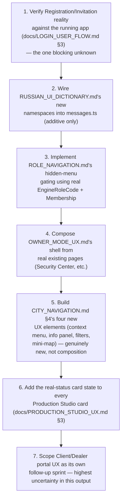

# Sprint CQ-30.1 Result — Enterprise UX, Navigation & Information Architecture

**Mode:** UX Architecture Research + Design. **No production code was written or modified — `src` was
not touched.** One pre-existing real doc (`CITY_NAVIGATION.md`, CG-9) was extended, not overwritten;
every other file this sprint produced is new documentation.

## 1. What this sprint produced

| Document | Covers (brief §) |
|---|---|
| [`UX_ARCHITECTURE.md`](./UX_ARCHITECTURE.md) | §1 Global Information Architecture, §7 AI Experience |
| [`UI_NAVIGATION.md`](./UI_NAVIGATION.md) | Navigation interaction detail beyond real `ENTERPRISE_NAVIGATION.md` |
| [`ROLE_NAVIGATION.md`](./ROLE_NAVIGATION.md) | §2 User Roles |
| [`OWNER_MODE_UX.md`](./OWNER_MODE_UX.md) | §3 Owner Mode |
| [`CITY_NAVIGATION.md`](./CITY_NAVIGATION.md) | §4 City Navigation — **extended the real CG-9 doc**, not overwritten |
| [`RUSSIAN_UI_DICTIONARY.md`](./RUSSIAN_UI_DICTIONARY.md) | §5 Russian Localization |
| [`LOGIN_USER_FLOW.md`](./LOGIN_USER_FLOW.md) | §6 Authentication Flow |
| [`DESIGN_SYSTEM.md`](./DESIGN_SYSTEM.md) | §9 Design System |
| [`PRODUCTION_STUDIO_UX.md`](./PRODUCTION_STUDIO_UX.md) | §8 Production Studio UX |
| `SPRINT_CQ_30_1_RESULT.md` | §10 wrap-up |

## 2. Architecture summary — the Beta's real UX foundation is much more complete than the brief implied

This sprint's central finding, consistent with this engagement's recurring pattern: most of what the
brief asks for as new design already exists as real, shipped code. A real, mature design system
(`v9.0.1`), a real i18n store with working Russian translations, nineteen real auth pages including
real MFA, a real 17-studio Production Center shell, and a real `EngineRoleCode` that matches 7 of the
brief's 11 roles by name — none of this needed inventing. The actual UX-architecture work this sprint
did was composition, gap-flagging, and — critically — **Russian terminology discipline**, since no
prior sprint had produced a canonical dictionary before now.

## 3. The three genuine gaps found, ranked by Beta-blocking severity

1. **No real Registration or Invitation page** (`docs/LOGIN_USER_FLOW.md` §3) — without one of these
   two, no new user can join a Beta organization through the UI at all. This is the single most
   Beta-blocking finding in this sprint's entire output and should be verified against the running app
   before any other recommendation here is acted on.
2. **Client and Dealer roles require genuinely new UX** (`docs/ROLE_NAVIGATION.md` §3) — every other
   role composes real, already-designed pieces; these two don't.
3. **Google Sign-In is entirely unbuilt** (`docs/LOGIN_USER_FLOW.md` §1) — a real provider-integration
   gap, not a UX design gap.

## 4. A new naming-vocabulary finding: a third role system

`docs/ROLE_NAVIGATION.md` found frontend `roleManager.ts`'s real `Role` type (`Platform Owner`/`System
Admin`/`Organization Owner`/`Project Lead`/`Custom Analyst`) is a third, independent role vocabulary
alongside backend `EngineRoleCode` and this brief's 11 roles — the same shape of finding as `TD-52`'s
three permission-scope vocabularies, flagged rather than merged, per this engagement's standing
discipline.

## 5. Russian localization — extends, does not replace

`docs/RUSSIAN_UI_DICTIONARY.md` extends the real, already-shipped `messages.ts` key-namespace
convention (`app.*`/`nav.*`/`auth.*`/`dash.*`/`common.*`) with six new namespaces (`org.*`/`role.*`/
`owner.*`/`city.*`/`production.*`, plus `auth.*` extensions) — every new term is checked against
`docs/SEMANTIC_DICTIONARY.md`'s (CQ-20) preferred-English-term rulings so the Russian dictionary
doesn't introduce a second Russian word for a concept CQ-20 already picked one English term for.

## 6. The Production Studio's honesty requirement

`docs/PRODUCTION_STUDIO_UX.md` §3 makes a specific, Beta-critical UX recommendation directly connected
to `docs/TECH_DEBT.md` TD-45/TD-46 and `docs/ARCHITECTURE_SMELLS.md`'s "readiness flags" finding
(CQ-30): every studio card must visibly communicate that generation is not yet real, as part of the
card itself, not a buried disclaimer. This is the sharpest point of contact this sprint found between
UX design and this engagement's ongoing architecture-honesty discipline.

## 7. Cursor implementation roadmap

## 8. Risks

1. **The Registration/Invitation gap could block the entire Beta launch** if neither turns out to be
   real — this should be the first thing confirmed, not assumed resolved by this sprint's documentation.
2. **The Production Studio's "looks functional" risk compounds if Beta ships before the honesty-labeling
   recommendation (§6) is implemented** — a Beta user encountering a non-functional "Generate" button
   with no real-status indicator is a worse first impression than the studio not being in Beta at all.
3. **Client/Dealer UX is the least-grounded output of this sprint** — treat `docs/ROLE_NAVIGATION.md`'s
   entries for these two roles as a starting sketch, not a build-ready spec.

## 9. Validation checklist

- [ ] Registration or Invitation confirmed real (or built) before Beta launch — `docs/LOGIN_USER_
      FLOW.md` §3
- [ ] No Russian dictionary term duplicates a concept `docs/SEMANTIC_DICTIONARY.md` already assigned
      a different preferred English term to
- [ ] Every Production Studio card shows a real generation-status indicator before Beta ships
- [ ] Hidden menu items are absent, not disabled, for every role in `docs/ROLE_NAVIGATION.md`
- [ ] `docs/CITY_NAVIGATION.md` §4's four new elements (context menu, info panel, filters, mini-map)
      compose only real existing entity data — no new City data model introduced
- [ ] The frontend `roleManager.ts` three-way role-vocabulary finding is not silently resolved by a
      future sprint without an explicit documented decision
