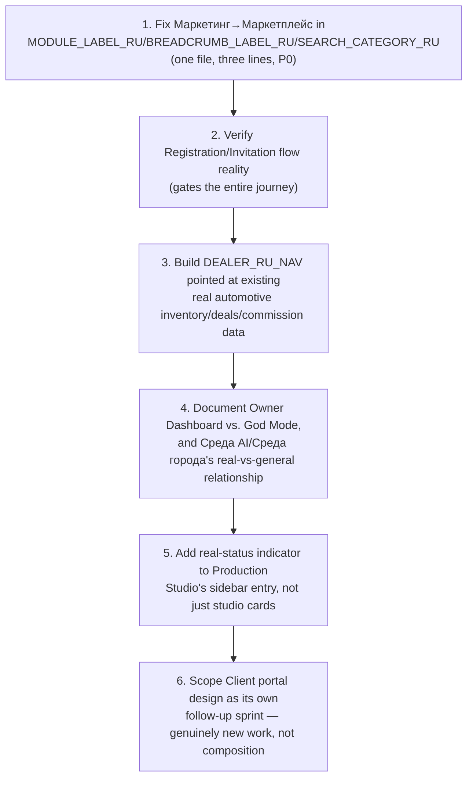

# Sprint CQ-30.7 Result — Enterprise Product Review

**Mode:** Chief Product Officer / Enterprise UX Architect / SaaS Platform Designer review, performed
while Cursor implements Sprint 30.7 in parallel. Documentation only, `src` not modified, no
implementation.

## 1. What this review produced

| Document | Covers |
|---|---|
| [`UX_AUDIT.md`](./UX_AUDIT.md) | Entire navigation review, screen-by-screen findings — **the headline bug** |
| [`NAVIGATION_REVIEW.md`](./NAVIGATION_REVIEW.md) | IA, sidebar, search, quick actions, command palette, breadcrumbs |
| [`OWNER_EXPERIENCE.md`](./OWNER_EXPERIENCE.md) | Owner Mode, compared against Admin Mode |
| [`CLIENT_EXPERIENCE.md`](./CLIENT_EXPERIENCE.md) | Client Mode |
| [`DEALER_EXPERIENCE.md`](./DEALER_EXPERIENCE.md) | Dealer Mode |
| [`RUSSIAN_LOCALIZATION_REVIEW.md`](./RUSSIAN_LOCALIZATION_REVIEW.md) | Wording recommendations |
| [`BETA_USER_JOURNEY.md`](./BETA_USER_JOURNEY.md) | End-to-end first-customer journey |
| [`FIRST_TIME_USER.md`](./FIRST_TIME_USER.md) | Direct answer to the brief's findability question |
| [`TOP_100_UX_IMPROVEMENTS.md`](./TOP_100_UX_IMPROVEMENTS.md) | Ranked action list |
| `SPRINT_CQ_30_7_PRODUCT_REVIEW.md` | This wrap-up |

## 2. Headline finding: a real, systemic, three-surface terminology bug

The real, live `src/web/src/navigation/enterpriseRuNav.ts` (Sprint 30.2/30.7) maps the internal
`marketplace` module id to **"Маркетинг" (Marketing)** in its breadcrumb, search-category, and
module-title dictionaries — while the sidebar's own dedicated entry correctly shows **"Маркетплейс"
(Marketplace)**. A user who navigates via sidebar sees the correct name; the same user searching for
the module, or reading the breadcrumb once inside it, sees the wrong one. This directly and concretely
answers the brief's own evaluation question ("can they find Marketplace?") with a precise, evidenced
"yes via one path, actively misleading via two others" — and it's a one-file, three-line fix.

## 3. This review is grounded in real, current implementation — not prior SPEC

Unlike most of this engagement's prior sprints, this review's central evidence source
(`enterpriseRuNav.ts`) is real, shipped, production code, not this engagement's own earlier
speculative design work. Two of CQ-30.1's own UX documents (`UI_NAVIGATION.md`, `CITY_NAVIGATION.md`)
were superseded by this real Sprint 30.2/30.4 implementation between sprints — this review builds on
the real result, not the superseded SPEC, and flags one piece of drift found in the process
(`docs/UI_NAVIGATION.md`'s own prose undercounting the real 23-item sidebar by 6 items).

## 4. Owner/Admin are mature; Client/Dealer are the real gaps

Owner has a real, curated 13-item navigation array. Admin reasonably reuses the general sidebar with
hidden items. Client and Dealer both have real role-switcher entries and **no dedicated navigation
array at all** — Client because the underlying portal experience was never designed past a real data
foundation; Dealer despite having the richest real backend of the two (real `AutomotiveDealerSource`,
real commission tracking). This asymmetry is this review's second-most-important finding:
**Dealer is the platform's best-positioned "quick win" persona** — the hard part (real data) is done,
only the navigation surface is missing.

## 5. Recommendation: sequence Beta's first cohort around what's actually ready

Given the findings above, `docs/BETA_USER_JOURNEY.md` recommends Beta's first cohort be internal-role
users (Owner/Admin/Manager/Employee) at partner companies, deferring real external Client/Dealer access
until their respective gaps close. This is not a weakness to hide — it's an honest, achievable scope
that lets Beta launch on the real strength of the product (which is substantial) without either
under-designed persona group having a confusing first experience.

## 6. Cursor implementation roadmap

## 7. Risks

1. The Маркетинг/Маркетплейс fix is trivial but easy to miss precisely because it's small — recommend
   it be tracked as its own tiny, explicit ticket rather than folded into a larger navigation-polish
   task where it could get lost.
2. If Dealer's nav is built quickly per §4's recommendation but Client's is not, Beta messaging should
   be explicit about which external personas are and aren't supported yet — mismatched expectations
   here would be worse than the current honest gap.
3. This review's evidence is a snapshot of `enterpriseRuNav.ts` as it stood during this pass — Sprint
   30.7 is actively landing; re-verify against the finished implementation before treating any
   "unconfirmed" item in this review's output as settled.

## 8. Validation checklist

- [ ] `MODULE_LABEL_RU`/`BREADCRUMB_LABEL_RU`/`SEARCH_CATEGORY_RU`'s `marketplace` entries all read
      "Маркетплейс"
- [ ] The `marketing` sidebar entry either gets its own real route or is removed
- [ ] Registration/Invitation flow confirmed real (or built) before Beta launch
- [ ] `docs/UI_NAVIGATION.md`'s prose sidebar count updated to match the real 23-item array
- [ ] Dealer role has a real navigation surface before any automotive-vertical Beta cohort is invited
- [ ] Beta launch communications are explicit about which roles (Owner/Admin/Manager/Employee vs.
      Client/Dealer) are fully supported at launch

## Related documents

Every document listed in §1; `docs/TECH_DEBT.md`/`docs/TOP_50_IMPROVEMENTS.md` (CQ-30.6, the
architecture-focused predecessor this review complements from the product/UX angle).
