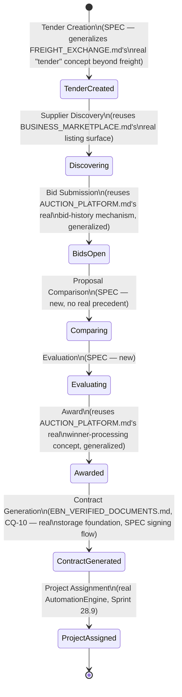

# Enterprise City — Tenders & Procurement

**Sprint:** CQ-13 — Architecture Research + Product Research. Documentation only, `src` not modified.

**Do not duplicate:** `FREIGHT_EXCHANGE.md` and `AUCTION_PLATFORM.md` are both real, pre-existing
systems with genuine tender/bid/auction mechanics — cited and generalized, not re-implemented.

## 0. Real, narrowly-scoped precedents already exist

| Real system | Real capability | Scope |
|---|---|---|
| `FREIGHT_EXCHANGE.md` (Sprint 15.6, `applications/port_enterprise/freight_marketplace/`, `/api/port-freight/v1`) | Spot + contract freight, **tender and bid management**, auction platform, price negotiation, freight booking | Freight/logistics only |
| `AUCTION_PLATFORM.md` (`/api/seller-ai/v1/auctions`) | Live/timed auctions, reserve price, automatic/proxy bidding, bid history, analytics, winner processing | Auto-marketplace seller tooling |

**Neither is a general, cross-vertical enterprise procurement system** — both are real, working, but
scoped to one vertical each. This document's contribution is the same shape as `BUSINESS_MARKETPLACE.md`
§2: generalize the real pattern rather than build a fifth (counting the two above plus whatever the
brief's eight stages would otherwise become) parallel implementation.

## 1. The brief's eight stages, mapped onto the real pattern



## 2. Entity model (SPEC, generalizing the real freight-tender shape)

```ts
interface Tender {
  id: string;
  issuerCompanyId: string;       // real BusinessProfile.id (Sprint 29.0)
  category: string;               // generalizes FREIGHT_EXCHANGE.md's real freight-specific categorization
  requirementsDocRef?: string;     // real services/storage (EBN_VERIFIED_DOCUMENTS.md §0, CQ-10)
  status: "open" | "evaluating" | "awarded" | "cancelled";
  visibility: "public" | "network_only" | "partners_only"; // real Visibility enum, CQ-10
}

interface Bid {
  id: string;
  tenderId: string;
  bidderCompanyId: string;        // real BusinessProfile.id
  amount?: number;                 // generalizes AUCTION_PLATFORM.md's real bid-amount concept
  proposalDocRef?: string;         // real services/storage
  submittedAt: string;
}
```

Every field traces to either a real cross-cutting entity (`BusinessProfile`, `Visibility`, real
storage) or a direct generalization of `FREIGHT_EXCHANGE.md`/`AUCTION_PLATFORM.md`'s already-real bid
shape — no field was invented without a real analog somewhere in this survey.

## 3. Proposal Comparison and Evaluation — the two genuinely new stages

Neither `FREIGHT_EXCHANGE.md` nor `AUCTION_PLATFORM.md` needs a multi-bid *comparison* stage (freight
tenders and auctions both resolve to a single winning bid via price/time, not structured evaluation
criteria). **SPEC, new**: an `EvaluationCriteria[]` array on `Tender` (e.g. price, delivery time, real
`BusinessProfile.trust_level` weighting), scored per `Bid`, surfaced as a comparison table — the one
piece of net-new UX/logic this document proposes, everything else being reuse or generalization.

## 4. Award → Contract → Project — the real handoff chain

Award triggers a real `VerifiedDocument` (`EBN_VERIFIED_DOCUMENTS.md`, CQ-10) linking the winning
`Bid`'s issuer and bidder companies — the same "documents prove real partnership" rule
`EBN_VERIFIED_DOCUMENTS.md` §2 already established, now with Tender/Bid as the triggering context
instead of a general partnership request. Once signed, Project Assignment creates a real
`AutomationEngine` (Sprint 28.9) task scoped to both companies — no new project-tracking system.

## 5. Non-goals

- No new bid/auction mechanism — §2's entities generalize the two real ones that already exist.
- No consolidation of `FREIGHT_EXCHANGE.md`/`AUCTION_PLATFORM.md` into this new general system is
  performed — both remain real, vertical-scoped systems; this document adds a third, general-purpose
  layer above them, flagged as a future duplication risk worth revisiting, not resolved here.
- No scoring algorithm is specified for Evaluation (§3) beyond naming the criteria concept.

## Related documents

`FREIGHT_EXCHANGE.md`/`AUCTION_PLATFORM.md` (real precedents), `BUSINESS_MARKETPLACE.md` (Supplier
Discovery's real listing surface), `EBN_VERIFIED_DOCUMENTS.md` (CQ-10, Contract Generation),
`ENTERPRISE_BUSINESS_NETWORK.md`/real `BusinessProfile` (Sprint 29.0), `AUTOMATION_ENGINE.md` (Sprint
28.9, Project Assignment).
