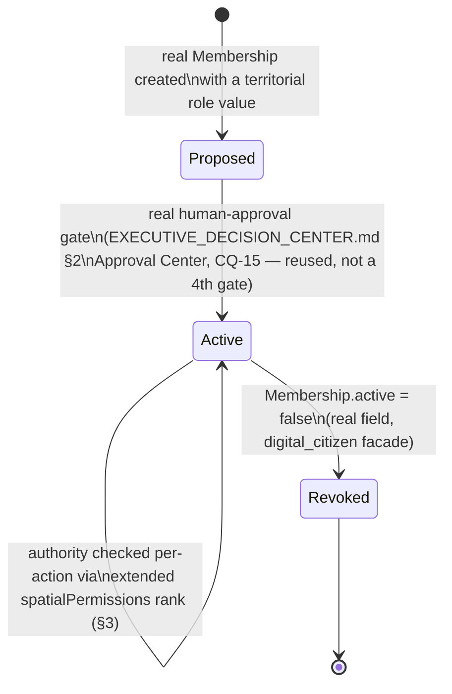

# Regional Digital Twin — Territorial Governance

**Sprint:** CQ-16 — Architecture Research + Governance Design. Documentation only, `src` not modified.

**Do not duplicate:** `spatialPermissions.SpatialPermissionScope` (real, Sprint 29.4 — `public < citizen
< company < assigned < enterprise_admin`, `spatialPermissions.ts`) is the real permission-rank
precedent this document extends, not replaces. `CROSS_COMPANY_OPERATIONS.md` §2 (CQ-15) already
reconciled two real, structurally different access models (`multi_company` intra-tenant ownership vs.
`Relationship` inter-tenant partnership) — this document's Business Association/Economic Cluster design
reuses that same discriminator pattern rather than inventing a third access model.

## 1. The gap this document is honest about

Unlike person-identity (CQ-12, where 4 of the brief's 18 roles already existed verbatim in real
`EngineRoleCode`), **none of this brief's six territorial governance titles exist in any real role
table.** `database/models/role.py`'s `EngineRoleCode` (`OWNER/ADMIN/MANAGER/ACCOUNTANT/LAWYER/PARTNER/
OPERATOR/VIEWER`) is organization-scoped, not territory-scoped — an `ADMIN` is an admin of a company,
never of a district. This is a genuine design gap, not a naming collision to resolve.

## 2. Per-role mapping (brief's six)

| Brief role | Design | Real foundation reused |
|---|---|---|
| Regional Administrator | A `Membership.role` value (`"regional_administrator"`) whose scope is a `SpatialEntity` of `kind: "region"` rather than a `BusinessProfile`/org | Real `Membership.role: string` (free string, not enum — `digital_citizen/facade.py:45`); real `region` entity kind (`spatialTypes.ts`) |
| City Administrator | Same mechanism, scoped to `kind: "city"` | Same |
| District Manager | Same mechanism, scoped to `kind: "district"` | Same; real `SpatialDistrictKind` gives the manager's district a real type (business/industrial/logistics/etc.) |
| Business Association | **Not a person-role** — a named grouping of `BusinessProfile`s anchored to a district, with elected/assigned officer `Membership`s | Real `BusinessProfile` (Sprint 29.0); grouping reuses the edge-kind-discriminator pattern `OwnershipEdge` established (`EBN_BUSINESS_GRAPH.md` §2) — a new edge kind, `"association_member"`, not a new entity type |
| Economic Cluster | Same grouping mechanism as Business Association, discriminated by edge kind `"cluster_member"` — a cluster is a set of companies sharing a `SpatialDistrictKind` (e.g. every company in a Logistics Hub) plus explicitly-added members | Same real `OwnershipEdge`-pattern reuse; cluster membership is queryable today with zero new storage by filtering `BusinessProfile.headquartersBuildingId` → spatial district `districtKind` |
| Infrastructure Operator | A `Membership.role` scoped to an infrastructure entity (road segment, utility, port), not a business or spatial-hierarchy entity | Cross-references `docs/SMART_INFRASTRUCTURE.md` (this sprint) for what an infrastructure entity actually is |

## 3. Scope-ranked governance (SPEC, extends real `spatialPermissions`)

```ts
// SPEC — additive to the real SpatialPermissionScope rank (spatialPermissions.ts), not a replacement.
// Territorial roles sit strictly above "company" and below "enterprise_admin": a City Administrator
// can act across every company/district within their city, but does not get platform-wide admin.
type TerritorialScope = "district_manager" | "city_administrator" | "regional_administrator";

// Extended rank table — same shape as the real RANK object, three new levels inserted:
// public(0) < citizen(1) < company(2) < assigned(3) < district_manager(4)
//   < city_administrator(5) < regional_administrator(6) < enterprise_admin(7)
```

**Design constraint carried over from `spatialPermissions.canAccess()`'s real logic**: a governance
role's authority is scoped by the `SpatialEntity` it's attached to, checked via the real
`spatialRegistry.ancestors()`/`.children()` walk (`spatialRegistry.ts:87-103`) — a District Manager's
`Membership` names a `district` entity id, and authority extends to that entity's real children
(buildings, POIs) but not to sibling districts. This reuses real tree-walk code; it does not add a new
scoping mechanism.

## 4. Governance lifecycle (SPEC)



## Non-goals

- No new role table, enum store, or RBAC engine — territorial roles are `Membership.role` string
  values, exactly like every other real role in the platform today.
- No fourth approval mechanism for granting territorial authority — reuses the same Approval Center
  composition `EXECUTIVE_DECISION_CENTER.md` §2 (CQ-15) already established over three real gates.
- No new grouping/edge-type engine for Business Association or Economic Cluster — both reuse the real
  `OwnershipEdge` discriminator pattern, adding edge *kinds*, not a new relationship system.

## Related documents

`docs/CROSS_COMPANY_OPERATIONS.md` (CQ-15, the access-model reconciliation this document extends),
`docs/EBN_BUSINESS_GRAPH.md` §2 (CQ-10, `OwnershipEdge` pattern reused for clusters/associations),
`docs/CITIZEN_ORGANIZATION_MEMBERSHIP.md` (CQ-12, real `Membership.role`),
`docs/EXECUTIVE_DECISION_CENTER.md` §2 (CQ-15, the reused Approval Center),
`docs/REGIONAL_DIGITAL_TWIN.md`, `docs/SMART_INFRASTRUCTURE.md` (CQ-16 siblings).
