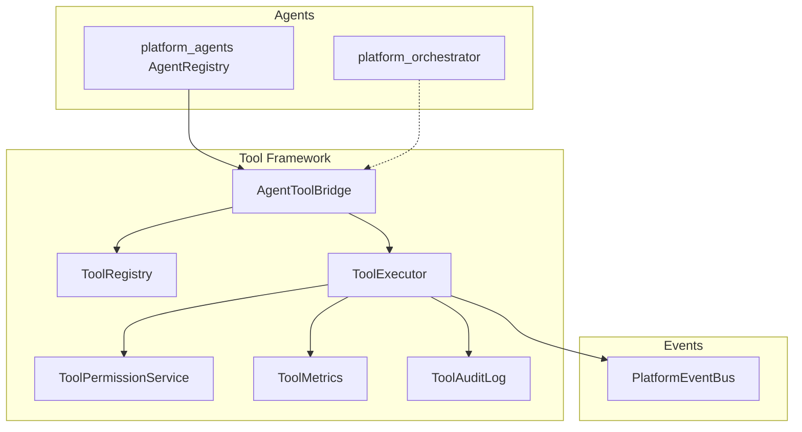

# Platform Tool & Integration Framework

> Sprint 3.3 — universal plugin system for AI agent tool access

## Overview

The Platform Tool & Integration Framework enables every AI agent to **safely use external tools, APIs, and internal platform services**. Tools are registered, permission-controlled, sandboxed, and audited — with full event bus and metrics integration.

**No OpenAI. No direct database access in services. Provider-independent.**

---

## Architecture



---

## Core Components

| Component | Path | Role |
|-----------|------|------|
| `Tool` | `models.py` | Universal tool definition |
| `ToolRegistry` | `registry.py` | register, remove, discover, validate |
| `ToolExecutor` | `executor.py` | Sandboxed async execution |
| `ToolContext` | `models.py` | Injected runtime context |
| `ToolResult` | `models.py` | Structured execution result |
| `ToolPermission` | `models.py` | READ, WRITE, EXECUTE, ADMIN |
| `ToolCategory` | `models.py` | Tool classification |
| `AgentToolBridge` | `agent_bridge.py` | Agent Registry integration |

---

## Tool Categories

| Category | Use Case |
|----------|----------|
| INTERNAL | Platform-internal operations |
| REST_API | External REST endpoints |
| DATABASE | Data access (via repositories) |
| TELEGRAM | Bot notifications & actions |
| FILESYSTEM | File operations |
| EMAIL | Email sending |
| HTTP | Generic HTTP requests |
| SEARCH | Search services |
| CALENDAR | Scheduling |
| CRM | CRM integrations |
| PLUGIN | Future plugin tools |

---

## Permissions

| Permission | Level |
|------------|-------|
| READ | Read-only access |
| WRITE | Modify external state |
| EXECUTE | Run tool handler |
| ADMIN | Full tool access |

**Scoping:**
- Per-agent permissions via `ToolPermissionService.grant_agent_permission()`
- Per-user permissions via `grant_user_permission()`
- Agent tool whitelist via `declare_agent_tools()`

---

## Registration API

```python
from platform_tools import tool_registry, register_builtin_tools, ToolCategory, ToolPermission

register_builtin_tools(tool_registry)

# Register custom tool
async def my_handler(ctx, payload):
    return {"result": payload.get("query")}

tool_registry.register_handler(
    "my_tool",
    "My Tool",
    "Does something useful",
    ToolCategory.INTERNAL,
    my_handler,
    required_permissions=[ToolPermission.EXECUTE],
)

# Discover plugin tools
tool_registry.add_discoverer(my_plugin_discoverer)
tool_registry.discover_tools()

# Remove
tool_registry.remove_tool("my_tool")
```

---

## Execution

```python
from platform_tools import tool_executor, ToolContext

ctx = ToolContext(agent_id="auto_agent", user_id="u1", permissions=["execute"])
result = await tool_executor.execute("crm_lookup", {"entity_id": "123"}, context=ctx)

# Concurrent execution
results = await tool_executor.execute_concurrent([
    ("internal_echo", {"a": 1}),
    ("search_query", {"query": "cars"}),
], context=ctx)

# Cancel
tool_executor.cancel(result.execution_id)

# Progress
progress = tool_executor.get_progress(result.execution_id)
```

---

## Sandboxing

| Control | Default |
|---------|---------|
| Execution timeout | 30s |
| Memory limit | 256 MB (config) |
| Error isolation | Failures don't crash engine |
| Retry policy | 2 retries, exponential backoff |
| Audit logging | All executions logged |
| Concurrency limit | 10 parallel executions |

---

## Agent Registry Integration

```python
from platform_tools import agent_tool_bridge

# Agent declares supported tools
agent_tool_bridge.declare_agent_tools("auto_agent", [
    "internal_echo", "crm_lookup", "http_get", "search_query",
])

# Execute on behalf of agent
result = await agent_tool_bridge.execute_for_agent(
    "auto_agent", "crm_lookup", {"entity_id": "vin_123"}, user_id="u1"
)

# Orchestrator tool access descriptor
access = agent_tool_bridge.tool_access_for_orchestrator("auto_agent")
# → { "agent_id", "available_tools", "tool_definitions" }
```

---

## Events

Published via `events.publisher.publish`:

| Event | When |
|-------|------|
| `ToolStartedEvent` | Execution begins |
| `ToolCompletedEvent` | Success |
| `ToolFailedEvent` | Failure after retries |

---

## Metrics

```python
from platform_tools import tool_metrics

summary = tool_metrics.summary()
# executions, success_rate, error_rate, avg_execution_time_ms, by_tool
```

---

## Built-in Tools

| Tool ID | Category | Description |
|---------|----------|-------------|
| `internal_echo` | INTERNAL | Echo payload (testing) |
| `http_get` | HTTP | HTTP GET (stub) |
| `rest_api_call` | REST_API | REST call (stub) |
| `crm_lookup` | CRM | CRM entity lookup (stub) |
| `telegram_notify` | TELEGRAM | Send notification (stub) |
| `search_query` | SEARCH | Search (stub) |
| `calendar_create` | CALENDAR | Create event (stub) |

Stubs prepare the platform for Telegram, CRM, ERP, Port, Auto, and Agro integrations without external dependencies.

---

## Plugin Architecture

```
platform_tools/
├── registry.py          # Tool registration & discovery
├── executor.py          # Sandboxed execution
├── permissions.py       # Access control
├── agent_bridge.py      # Agent integration
├── tools/builtin.py     # Built-in stubs
└── tool_events.py       # Event bus events

Future plugin drop-in:
platform_plugins/my_tool_plugin/
├── plugin.json
└── tools.py             # Returns list[Tool] for discoverer
```

---

## Developer Guide

### 1. Create a tool handler

```python
async def port_tracking_handler(ctx: ToolContext, payload: dict) -> dict:
    shipment_id = payload["shipment_id"]
    return {"status": "in_transit", "shipment_id": shipment_id}
```

### 2. Register

```python
tool_registry.register_handler(
    "port_tracking",
    "Port Tracking",
    "Track shipment status",
    ToolCategory.REST_API,
    port_tracking_handler,
    required_permissions=[ToolPermission.READ],
)
```

### 3. Assign to agent

```python
agent_tool_bridge.declare_agent_tools("port_agent", ["port_tracking"])
```

### 4. Execute

```python
result = await agent_tool_bridge.execute_for_agent(
    "port_agent", "port_tracking", {"shipment_id": "SH-001"}
)
```

---

## Compatibility

| Layer | Package | Status |
|-------|---------|--------|
| Agent Registry | `platform_agents/` | Integrated via bridge |
| Orchestrator | `platform_orchestrator/` | Tool access descriptor |
| Workflow Engine | `platform_workflow/` | Independent |
| Domain Plugins | `plugins/manifest.yaml` | Unchanged |
| Sprint 1–3.2 | All packages | Unmodified |

---

## Tool Examples

### CRM lookup (Auto vertical)

```python
result = await agent_tool_bridge.execute_for_agent(
    "auto_agent", "crm_lookup", {"entity_id": "lead_42"}
)
```

### Telegram notification

```python
result = await tool_executor.execute(
    "telegram_notify",
    {"chat_id": "12345", "message": "New lead assigned"},
    context=ToolContext(agent_id="auto_agent", permissions=["write", "execute"]),
)
```

### Concurrent search + CRM

```python
results = await tool_executor.execute_concurrent([
    ("search_query", {"query": "Toyota Camry"}),
    ("crm_lookup", {"entity_id": "lead_99"}),
], context=ToolContext(permissions=["read", "execute"]))
```
