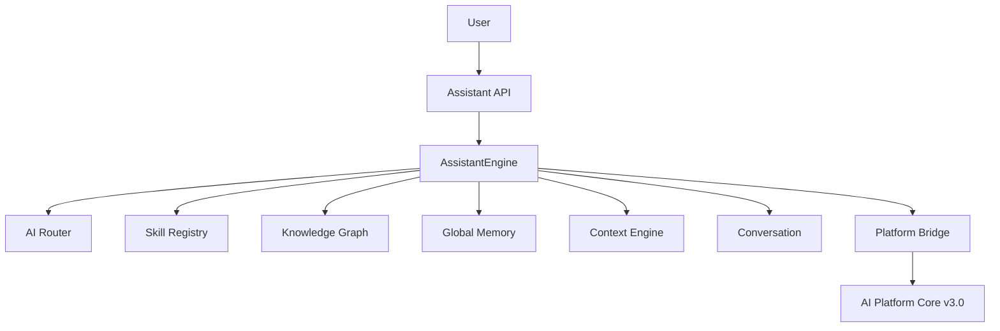

# Unified AI Assistant & Global Knowledge (Sprint 7.3)

> One intelligent assistant across the AI Ecosystem — orchestration, global memory, and a unified conversational interface on **AI Platform Core v3.0**.

## Release Summary

| Field | Value |
|-------|-------|
| Ecosystem Version | **1.3.0-alpha** |
| Assistant Layer | **1.0** |
| Global Knowledge | **1.0** |
| Platform Dependency | **AI Platform Core v3.0** |
| Sprint | **7.3** |

---

## Architecture



Package: `ecosystem/assistant/`

| Module | Role |
|--------|------|
| `engine.py` | Unified conversational interface, planning, orchestration |
| `global_memory/` | Cross-application persistent memory |
| `knowledge_graph/` | Shared graph, semantic search, sync |
| `conversation/` | Multi-session, summaries, translation, voice-ready |
| `routing/` | Intent detection and multi-target routing |
| `context/` | Global / app / user / org / conversation / task context |
| `skills/` | Skill registry and execution |
| `prompts/` | Prompt templates |

---

## Assistant Guide

```python
from ecosystem import ecosystem

result = await ecosystem.engine.assistant.invoke(
    user_id,
    "Find electric SUVs under 40k",
    application_id="auto_marketplace",
    locale="en",
)
# result: reply, intent, routing, skills_executed, plan, knowledge_hits, conversation_id

orchestrated = await ecosystem.engine.assistant.orchestrate(
    user_id,
    "Qualify lead and draft offer",
    agents=["sales-agent"],
)
```

Supports: NLU-style intent detection, task planning/decomposition, multi-agent orchestration, response generation, conversation history.

---

## Knowledge Guide

```python
kg = ecosystem.engine.assistant.knowledge

node = await kg.upsert_node("EV incentives", "Federal tax credit details", application_id="auto_marketplace", tags=["ev"])
hits = kg.semantic_search("electric vehicle tax", application_id="auto_marketplace")
edge = kg.link(node.node_id, other_id, relation="related_to")
await kg.synchronize("auto_marketplace", [{"label": "Warranty", "content": "3 year warranty"}])
```

Global memory:

```python
await ecosystem.engine.assistant.memory.remember(user_id, "Prefers EVs", application_id="auto_marketplace")
memories = ecosystem.engine.assistant.memory.recall(user_id, query="EV")
```

---

## Context Guide

```python
ctx = ecosystem.engine.assistant.context
ctx.update(user_id, user_context={"locale": "en"}, application_context={"application_id": "auto_marketplace"})
bundle = ctx.assemble(user_id)
await ctx.restore(user_id, conversation_id)
```

Layers: global, application, user, organization, conversation, task.

---

## Skills & Routing

```python
skills = ecosystem.engine.assistant.skills
skills.register("my_skill", skill_type=SkillType.TOOL, description="...", handler_key="my_skill")
await skills.execute(skill.skill_id, user_id, {"query": "..."})

decision = await ecosystem.engine.assistant.router.route(user_id, "search vehicles", application_id="auto_marketplace")
```

Routing targets: application, agent, tool, workflow, fallback.

---

## Conversation

```python
conv = await ecosystem.engine.assistant.conversations.create(user_id, voice_ready=True)
ecosystem.engine.assistant.conversations.append_turn(conv.conversation_id, "user", "Hello")
ecosystem.engine.assistant.conversations.summarize(conv.conversation_id)
ecosystem.engine.assistant.conversations.translate("hello", target_locale="ru")
```

---

## API Reference

| API | Endpoints |
|-----|-----------|
| Assistant | `POST /api/ecosystem/v1/assistant/invoke`, `/orchestrate`, `GET /assistant/metrics`, `GET /assistant/memory` |
| Knowledge | `POST /knowledge`, `GET /knowledge/search`, `POST /knowledge/link`, `POST /knowledge/sync` |
| Conversation | `POST/GET /conversations`, `GET /conversations/{id}`, `POST .../summarize`, `POST .../restore` |
| Skills | `GET/POST /skills`, `POST /skills/execute` |
| Context | `GET/POST /context` |

---

## Events

| Event | When |
|-------|------|
| `AssistantInvoked` | User message accepted |
| `IntentDetected` | Intent classified |
| `SkillExecuted` | Skill finished |
| `KnowledgeUpdated` | Knowledge node created/updated |
| `ConversationCreated` | New conversation |
| `ContextRestored` | Context restored from conversation |
| `AgentRouted` | Routed to an agent |
| `TaskCompleted` | Task plan completed |

---

## Developer Guide

```python
from ecosystem import ecosystem

assistant = ecosystem.engine.assistant
await assistant.knowledge.upsert_node("Deal pipeline", "Stages: lead→won", application_id="auto_marketplace")
reply = await assistant.invoke("user-1", "Explain the deal pipeline", application_id="auto_marketplace")
```

**AI Platform Core is not modified** — uses `ecosystem/integrations/platform_bridge.py`.

---

## Tests

```bash
pytest tests/test_unified_assistant.py -q
```

---

## Expected Result

- Sprint 7.3 completed
- Unified AI Assistant ready
- Global Knowledge ready
- Context Engine ready
- Skill System ready
