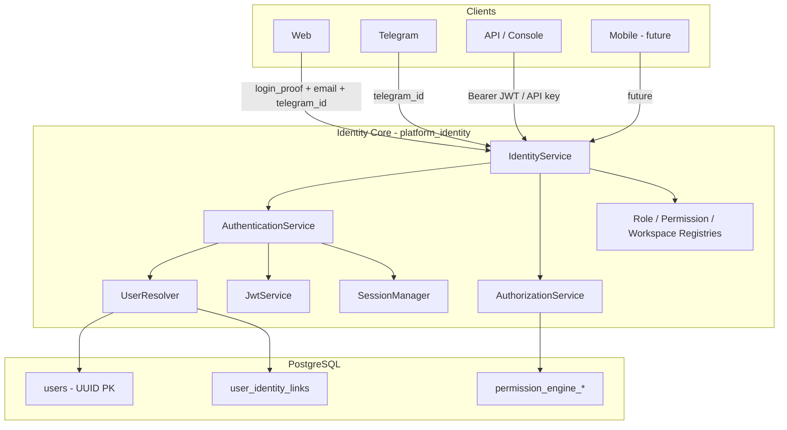
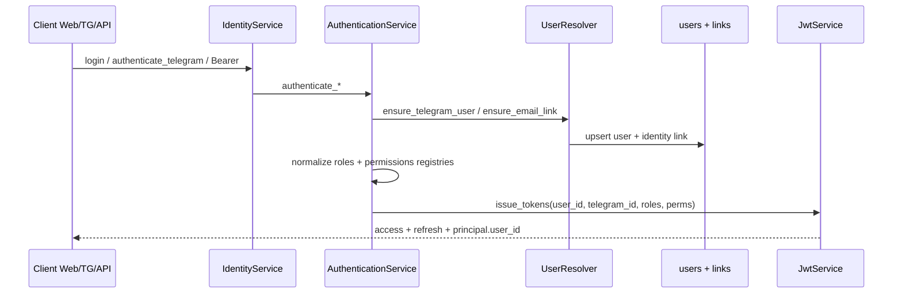
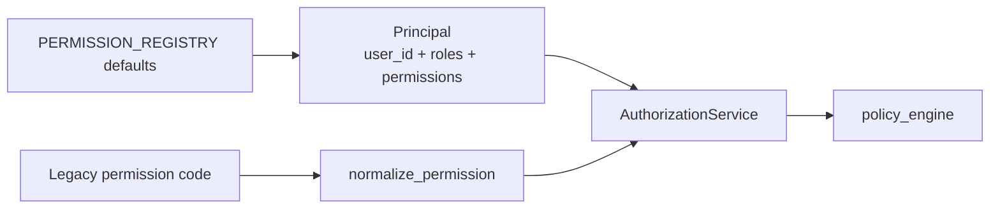

# Sprint 34.2A — Unified Identity, Authentication & Authorization Core

**Status:** Implemented (foundation)  
**Date:** 2026-08-02  
**Scope:** Backend / Identity Core — no UI redesign, no business-logic rewrite  
**Prior:** [UNIFIED_PLATFORM_34_1.md](./UNIFIED_PLATFORM_34_1.md)

---

## Success criteria

| Criterion | Status |
|-----------|--------|
| One canonical User model (`users` + identity links) | ✓ |
| One Identity Core (`platform_identity`) | ✓ |
| One authentication layer (all clients → IdentityService) | ✓ |
| One authorization engine + permission registry | ✓ |
| One role registry (aliases → canonical) | ✓ |
| Web + Telegram through same identity facade | ✓ |
| Existing login contracts preserved | ✓ |
| Foundation for 34.2B (menu catalog) | ✓ |

---

## 1. Identity Architecture Diagram

---

## 2. Authentication Flow Diagram

**Providers (all through Identity Core):**

| Provider | Entry | Notes |
|----------|-------|-------|
| Telegram | `authenticate_telegram` / bot `ensure_user` | Real `telegram_id` → `users` + link |
| Web JWT | `login_proof` + `telegram_id` + **email** | Links email ↔ user; JWT carries `user_id` |
| Telegram Login Widget | `telegram_init_data` | Same facade |
| API key | `X-API-Key` / Bearer key | Service principal |
| OAuth | Stub registered on AuthenticationService | Future Google/etc. |
| Mobile / Desktop | AuthMethod enum ready | Same IdentityService |

---

## 3. Authorization Flow Diagram

Telegram handlers continue to call `has_legacy_permission(telegram_id, code)` → IdentityService → canonical + legacy maps. No parallel permission engines added.

---

## 4. Migration Map

| Step | Artifact |
|------|----------|
| Schema | `migrations/versions/g0a123456789_unified_identity_foundation_v1.py` |
| Columns on `users` | email, phone, display_name, avatar_url, status, preferences, last_login_at, updated_at |
| New table | `user_identity_links (provider, external_id) → users.id` |
| Backfill | telegram links for all existing `telegram_id` rows; display_name ← full_name |
| Runtime | Soft-fail user resolve if DB unavailable (unit tests / degraded mode) |

**Apply:** `alembic upgrade head` (revision `g0a123456789`).

---

## 5. Role Registry

Canonical codes: `owner`, `ceo`, `administrator`, `manager`, `employee`, `operator`, `partner`, `dealer`, `client`, `guest`

Aliases (examples): `OWNER`/`SUPER_ADMIN` → `owner`; `AUTO_MANAGER` → `manager`; `CUSTOMER` → `client`

Source: `platform_identity/registries/role_registry.py`

---

## 6. Permission Registry

Canonical codes include: `owner.full`, `crm.read`, `crm.write`, `erp.read`, `erp.write`, `knowledge.read`, `knowledge.write`, `analytics.view`, `documents.manage`, `ai.use`, `automation.run`, `platform.config.read`, `platform.config.write`

Legacy aliases: `leads.view` → `crm.read`, `admin.access` → `owner.full`, etc.

Source: `platform_identity/registries/permission_registry.py`

Durable grants remain in permission_engine tables; registry is the vocabulary + defaults.

---

## 7. Workspace Registry

`company_core`, `crypto_otc`, `drone`, `agro`, `cafe_beauty`, `auto`, `legal`, `construction`, `manufacturing`, `medical`

Source: `platform_identity/registries/workspace_registry.py`  
Stored on user as `users.verticals` (normalized on read). Switching workspace does not create a new identity.

---

## 8. Legacy Compatibility Report

| Surface | Compatibility |
|---------|----------------|
| Web `POST /management/identity/login` | Same path; now accepts optional `email` / `display_name` |
| Web `telegramIdForEmail` | Still used as bridge telegram_id for demo/owner mapping; email is linked on login so account is not email-orphaned |
| JWT claims | Additive `user_id`; `telegram_id` retained |
| Telegram `has_permission` | Unchanged call sites → IdentityService |
| Principal.principal_id | Prefer `user:{uuid}` when resolved; fallback `telegram:{id}` |
| ISAM (Enterprise Hub) | Still available as parallel Web path; Identity Core is platform JWT SoR — ISAM fold-in remains 34.2+ follow-up |
| TenantUserRole telegram int FK | Deferred (34.1 A6) — not required for Identity Core login |

**No existing users deleted.** Migration only adds columns + links.

---

## 9. Files changed

### New

- `platform_identity/registries/role_registry.py`
- `platform_identity/registries/permission_registry.py`
- `platform_identity/registries/workspace_registry.py`
- `platform_identity/registries/__init__.py`
- `platform_identity/identity_links.py`
- `platform_identity/user_resolver.py`
- `database/models/user_identity_link.py`
- `migrations/versions/g0a123456789_unified_identity_foundation_v1.py`
- `tests/test_identity_34_2a.py`
- `docs/UNIFIED_IDENTITY_34_2A.md`

### Modified

- `database/models/users.py`
- `database/migration_models.py`
- `platform_identity/models.py` (Principal / SessionRecord / AuthMethod)
- `platform_identity/authentication.py`
- `platform_identity/jwt_service.py`
- `platform_identity/identity_service.py`
- `repositories/user_repository.py`
- `src/web/src/auth/identityApi.ts` (pass email on IAM login; prefer `user_id`)

---

## 10. Migration safety report

| Risk | Mitigation |
|------|------------|
| Migration fails on empty DB | Additive columns nullable / defaults |
| Duplicate email on backfill | No email backfill — only telegram links |
| Unit tests without Postgres | `ensure_telegram_user` soft-fails; auth still returns Principal |
| Breaking JWT clients | Additive `user_id` claim only |
| Synthetic telegram_id collision | Email link binds Web login to same user row when telegram_id matches; Owner uses configured OWNER telegram id |
| Downgrade | Migration provides `downgrade()` dropping links + new columns |

---

## 11. Verification checklist (manual / staging)

1. Run Alembic upgrade to `g0a123456789`.  
2. Telegram user `/start` → row in `users` + `user_identity_links` provider=`telegram`.  
3. Web platform JWT login with email → link provider=`email` on same user when telegram_id matches Owner/demo.  
4. JWT access token contains `user_id` and `telegram_id`.  
5. `identity_service.status()` reports `sprint: 34.2A`, canonical roles/permissions/workspaces.  
6. Existing Telegram permission checks still pass for Owner.  

Automated: `pytest tests/test_identity_34_2a.py tests/test_identity.py -q`

---

## 12. Next — Sprint 34.2B

Unified **Menu Catalog** consuming Role + Permission + Workspace registries from Identity Core (one catalog, many renderers).
