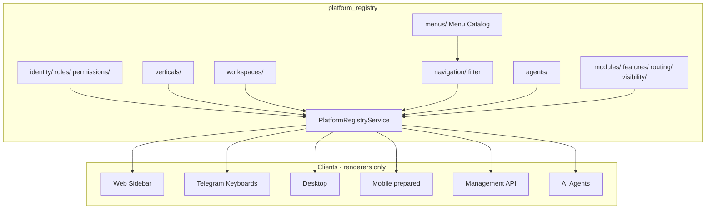

# Sprint 34.2B — Unified Platform Registry & Universal Menu Catalog

**Status:** Implemented  
**Date:** 2026-08-02  
**Depends on:** Sprint 34.2A Identity Core  
**Principle:** One Platform · Many Clients · One Registry

---

## Architecture



Identity roles/permissions are **re-exported** from `platform_identity/registries` (34.2A) — not copied.

---

## Registry structure

```
platform_registry/
  identity/          # re-export 34.2A
  roles/             # Platform Owner / Company Owner titles
  permissions/       # crm.* calendar.* studio.* agent.* …
  verticals/         # Crypto, Drone, Agro, …
  workspaces/        # CRM, ERP, Calendar, Tasks, …
  menus/             # UNIFIED MENU CATALOG
  navigation/        # filter + group for clients
  agents/            # AI agent registry
  features/          # feature flags
  modules/           # module projection
  routing/           # routes from menu
  visibility/        # web|telegram|desktop|mobile|api|voice|ai
  clients/           # telegram_adapter, web_adapter
  service.py
  router.py          # GET /management/v1/platform-registry*
```

---

## Permission model

- Authorization vocabulary lives in Identity Core + Platform Registry extensions.
- Roles reference **permissions only** — never menus.
- Telegram and Web validate the same permission codes (`crm.read`, `owner.full_access`, …).
- Menu items declare `required_permissions` / `required_roles`; `navigation.filter_menu` enforces them per client.

---

## Navigation model

1. **Menu Catalog** (`menus/MENU_CATALOG`) is the only definition of nav items.  
2. **Web** Sidebar → `groupsForMode` → `groupsFromPlatformRegistry` (TS projection of catalog).  
3. **Telegram** `owner_main_menu` → tries `build_owner_keyboard_from_registry`, falls back to legacy keyboard (handlers keep working).  
4. **Desktop / Mobile** use the same `navigation_for(client=…)` API (Mobile UI not built).  
5. **API** exposes full snapshot + filtered navigation.

### Menu item schema

`id`, `title`, `icon`, `route`, `telegram_command`, `required_permissions`, `required_roles`, `required_workspace`, `required_vertical`, `client_visibility`, `feature_flags`, `children`, `group`, `simple`, `owner_only`

---

## Migration strategy

| Step | Approach |
|------|----------|
| 1 | Introduce `platform_registry` as SoR |
| 2 | Web Sidebar consumes TS catalog projection (no route changes) |
| 3 | Telegram prefers registry keyboard; **legacy fallback** preserves button texts |
| 4 | Management API publishes registry |
| 5 | Later sprints: delete legacy `menuEngine` / flatten `enterpriseRuNav` once unused |

**No breaking API/route changes.** Existing Web routes and Telegram handlers remain.

---

## Backward compatibility

| Surface | Behavior |
|---------|----------|
| Web routes | Unchanged |
| `INTELLIGENT_NAV_GROUPS` | Kept for resolution/tests; Sidebar prefers registry |
| Telegram `owner_main_menu` | Registry first, legacy fallback |
| Identity registries | Unchanged; re-exported |
| ISAM / JWT | Unchanged (34.2A) |

---

## Future Mobile / Desktop

- `ClientId.MOBILE` / `DESKTOP` already in visibility.
- Construction / Medical verticals visible on web/desktop/mobile/api (not Telegram until buttons exist).
- Clients call `platform_registry.navigation_for(client="mobile", roles=[…])` — zero duplicated menu trees.

---

## API

| Method | Path |
|--------|------|
| GET | `/management/v1/platform-registry` |
| GET | `/management/v1/platform-registry/navigation?client=web&roles=owner` |
| GET | `/management/v1/platform-registry/menus` |
| GET | `/management/v1/platform-registry/verticals` |
| GET | `/management/v1/platform-registry/agents` |

Legacy prefix: `/management/platform-registry*`.

---

## Verification report

Automated: `tests/test_platform_registry_34_2b.py`

| Check | Result |
|-------|--------|
| One registry snapshot | ✓ |
| Roles / permissions / verticals / workspaces / agents | ✓ |
| Navigation per client × role | ✓ |
| Web & Telegram share CRM route | ✓ |
| Owner items hidden for Client | ✓ |
| Telegram adapter builds rows | ✓ |

Manual checklist:

1. Web Simple Mode — workspace/business/ai from catalog.  
2. Web Owner Mode — owner group present.  
3. Telegram Owner — menu still opens (registry or legacy).  
4. `GET /management/v1/platform-registry` returns `sprint: 34.2B`.

---

## Files changed (primary)

### New

- `platform_registry/**` (package)
- `src/web/src/platform-registry/menuCatalog.ts`
- `src/web/src/platform-registry/index.ts`
- `tests/test_platform_registry_34_2b.py`
- `docs/UNIFIED_PLATFORM_REGISTRY_34_2B.md`

### Modified

- `platform_management/management_router.py` — register routes  
- `keyboards.py` — registry-first owner menu  
- `src/web/src/ux-revolution/intelligentNavGroups.ts` — `groupsForMode` → catalog  

---

## Success criteria

| Criterion | Status |
|-----------|--------|
| Exactly one Platform Registry | ✓ `platform_registry` |
| Exactly one Menu Catalog | ✓ `menus/MENU_CATALOG` |
| One Role / Permission / Workspace registry | ✓ (+ Identity Core) |
| Web/Telegram/Desktop/Mobile/API as clients | ✓ (Mobile prepared) |
| No duplicated business logic in clients | ✓ renderers only |
| Backward compatible | ✓ |

**Next:** deepen Telegram handler routing from `telegram_command` → catalog; retire legacy keyboards once parity is proven.
