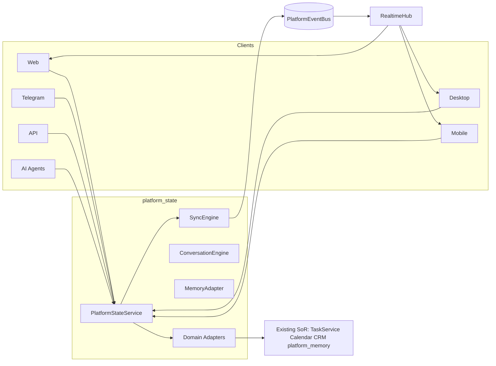

# Sprint 34.2C — Unified Platform State

**Status:** Implemented  
**Date:** 2026-08-02  
**Depends on:** 34.2A Identity Core · 34.2B Platform Registry  
**Principle:** One Platform · One Runtime · One Data Model · One Sync Layer

---

## Goal

Transform ADOS from several connected applications into **one platform** with:

- one runtime (`PlatformStateService`)
- one data model (entity slices + optimistic versioning)
- one synchronization layer (`SyncEngine` + canonical `PlatformEventBus`)

This is **not** a UI redesign and **not** a business-logic rewrite. Existing modules keep working; unification happens through **adapters**.

---

## Architecture



---

## Package layout

```
platform_state/
  service.py           # PlatformStateService facade
  sync_engine.py       # publish / subscribe / delta cursors
  events.py            # PlatformStateChangedEvent + typed aliases
  models.py            # EntityMeta, slices, snapshot
  conversation.py      # ONE Conversation entity
  memory_store.py      # ONE memory (user / workspace / conversation)
  conflict.py          # compatibility re-export → conflict_engine
  conflict_engine.py   # 34.2D ConflictResolutionEngine
  audit.py             # thin hot buffer + AuditService bridge
  audit_timeline.py    # entity history from Event Store
  version_engine.py    # 34.2D VersionEngine (TD-54)
  event_store.py       # durable JSONL event log
  replay.py / transaction.py / telemetry.py / self_healing.py / cache.py
  enterprise.py        # 34.2D EnterpriseRuntime facade
  realtime_handler.py  # EventBus → RealtimeHub fan-out
  clients.py           # telegram/web/desktop/mobile/api/ai adapters
  adapters/domain.py   # Task Calendar CRM Files Notifications wrappers
  router.py            # GET/POST /management/v1/platform-state*
```

Extended by Sprint 34.2D — see `docs/ENTERPRISE_RUNTIME_34_2D.md`. Stabilized Sprint 35.0.

---

## State slices (single source of truth facade)

| Slice | Backing |
|-------|---------|
| users / sessions | platform_identity |
| crm | CRM adapter + mirror (leads/deals/contacts) |
| tasks | `services.tasks.TaskService` |
| calendar | `services.calendar_service.CalendarService` |
| notifications | unified notification store (+ NotificationCenterV1 bridge) |
| files / documents | unified file store |
| conversations | ConversationEngine |
| memory | MemoryAdapter (+ platform_memory bridge path) |
| agents / workspaces | platform_registry |
| analytics / activity / favorites | platform_state projections |

Every entity carries:

- `version`
- `updated_at`
- `updated_by`
- `source_client`

---

## API

| Method | Path | Purpose |
|--------|------|---------|
| GET | `/management/v1/platform-state` | status |
| GET | `/management/v1/platform-state/snapshot` | full or filtered slices |
| GET | `/management/v1/platform-state/delta?since=` | offline reconnect deltas |
| POST | `/management/v1/platform-state/cursor` | register client cursor |
| POST | `/management/v1/platform-state/mutate` | unified write ops |

Legacy dual prefix: `/management/platform-state*`.

Mutate ops: `task.create`, `task.complete`, `calendar.create`, `notification.create`, `conversation.ensure`, `conversation.append`, `memory.store`, `file.upload`, `crm.lead.upsert`, `workspace.change`.

---

## Compatibility

- Existing Telegram handlers, Web routes, and Task/Calendar/CRM services are **unchanged**.
- Adapters call existing services when DB is available; tests use `skip_db=True` local ids.
- **No new Event Bus SoR** — publishes only to `events.event_bus.PlatformEventBus` (policy 32.3).
- AI agents must read/write via `PlatformState` / `ai_runtime` — never sibling modules for side effects.

---

## Success criteria

| Criterion | Status |
|-----------|--------|
| One platform state facade | ✅ `platform_state` |
| Cross-client sync | ✅ SyncEngine + RealtimeHub |
| One conversation | ✅ ConversationEngine |
| One AI memory | ✅ MemoryAdapter scopes |
| One CRM / calendar / tasks / notifications / files | ✅ adapters |
| Offline delta | ✅ `delta_since` |
| Conflict resolver | ✅ optimistic versioning |
| Audit | ✅ platform_state_audit |
| Tests | ✅ `tests/test_platform_state_34_2c.py` |
| Docs | ✅ STATE / SYNC / EVENT / RUNTIME |

---

## Migration report

1. Introduced `platform_state` as the cross-client runtime facade.
2. Wired management routes + EventBus realtime handlers at boot.
3. Added `RealtimeChannel.PLATFORM_STATE` for live fan-out.
4. Client runtimes (`telegram_runtime`, `web_runtime`, …) share identical adapters.
5. No breaking API removals; dual-prefix management routes preserved.

See also: [SYNC_ENGINE.md](./SYNC_ENGINE.md) · [EVENT_BUS.md](./EVENT_BUS.md) · [CROSS_CLIENT_RUNTIME.md](./CROSS_CLIENT_RUNTIME.md)
