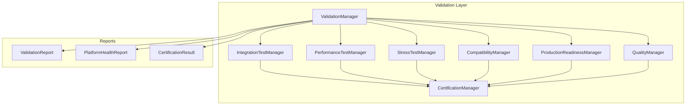

# Platform Validation & Production Readiness Layer

> Sprint 5.5 — complete platform validation, QA, and Production Ready certification

## Overview

The Platform Validation & Production Readiness Layer provides **comprehensive quality assurance** for the complete AI Platform Core v3.0. It validates integrations, performance, stress tolerance, compatibility, production readiness, and issues certification.

**No modifications to Sprint 1–5.4 architecture.** Integration is via bridges only.

---

## Architecture



---

## Core Components

| Component | Role |
|-----------|------|
| `ValidationManager` | Unified validation and certification entry point |
| `IntegrationTestManager` | Validates all platform modules and bridges |
| `PerformanceTestManager` | Throughput and scalability benchmarks |
| `StressTestManager` | High concurrency and load scenarios |
| `CompatibilityManager` | Module, API, plugin, config, version compatibility |
| `ProductionReadinessManager` | Startup, security, health, deployment, recovery checks |
| `QualityManager` | Architecture validation, static analysis, regression |
| `CertificationManager` | Production Ready certification |
| `ValidationReport` | Structured validation results |
| `PlatformHealthReport` | Overall platform health and readiness level |

---

## Integration Validation

Validates via import and bridge checks:

- Event Bus
- Agent Registry
- Memory Engine
- Workflow Engine
- Tool Framework
- Security Layer
- Observability Layer
- Reliability Layer
- Configuration Layer
- Collaboration Layer
- Learning Layer
- Orchestrator
- Reasoning, Planning, Decision engines

```python
from platform_validation import validation_manager

report = await validation_manager.validate_integrations()
```

---

## Performance Testing

Benchmarks:

| Benchmark | Target |
|-----------|--------|
| `event_processing` | Event bus throughput |
| `memory_performance` | Memory engine ops |
| `agent_throughput` | Agent registry listing |
| `tool_execution` | Tool registry listing |
| `workflow_throughput` | Workflow metrics |

```python
report = await validation_manager.validate_performance()
```

---

## Stress Testing

Scenarios:

- High concurrency event publishing
- Multiple agent registry access
- Large memory dataset simulation
- Thousands of workflow task ops
- Recovery under stress (reliability layer)

```python
report = await validation_manager.validate_stress()
```

---

## Compatibility

- Module presence in `platform_manifest.json`
- API route definitions
- Plugin SDK version
- Configuration layer compatibility
- Platform version metadata

---

## Production Readiness Checklist

| Check | Description |
|-------|-------------|
| Startup | Configuration center loaded |
| Dependencies | Component version validation |
| Configuration | Production profile load |
| Security | Security layer initialized |
| Health | Health manager available |
| Deployment | Deployment manager ready |
| Backup | Checkpoint manager ready |
| Recovery | Reliability engine ready |

```python
report = await validation_manager.validate_production_readiness()
health = validation_manager.build_health_report()
```

---

## Quality Assurance

- Architecture governance score (via `platform_architecture`)
- Static analysis file counts
- Test module coverage proxy
- Optional governance regression pytest

---

## Certification

Full platform certification bridges `platform_certification` checks with validation reports:

```python
result = await validation_manager.certify_platform()
print(result.certified)          # True when Production Ready
print(result.platform_status)    # "Production Ready"
print(result.platform_version)   # "3.0.0"
```

---

## Reports

```python
summary = validation_manager.readiness_report()
```

Returns:

- **Platform validation** — full validation report
- **Certification** — certification result
- **Health** — platform health report
- **Metrics** — validation metrics summary

Individual reports: `validation_manager.get_report("integration")`

---

## Production Checklist

- [ ] Run `validate_platform()` — all suites pass or warn only
- [ ] Run `certify_platform()` — certified = True
- [ ] Verify `platform_status` = "Production Ready"
- [ ] Verify `platform_version` = "3.0.0"
- [ ] Review architecture score ≥ 90
- [ ] Confirm security and reliability checks pass
- [ ] Confirm deployment and configuration validation pass

---

## Deployment Checklist

- [ ] Activate production environment profile
- [ ] Run deployment via Configuration Layer
- [ ] Run production readiness validation
- [ ] Verify health report readiness level
- [ ] Run stress tests in staging
- [ ] Issue certification before go-live

---

## Developer Guide

### Quick start

```python
from platform_validation import validation_manager

# Full validation
report = await validation_manager.validate_platform()

# Production certification
cert = await validation_manager.certify_platform(include_stress=False)

# Metrics
print(validation_manager.metrics_summary())
```

### Events

| Event | When |
|-------|------|
| `PlatformValidatedEvent` | Full validation completed |
| `ProductionReadyEvent` | Platform certified Production Ready |

---

## Manifest

Sprint 5.5 updates `platform_manifest.json`:

```json
{
  "platform_version": "3.0.0",
  "platform_status": "Production Ready",
  "validation_layer": "1.0"
}
```

---

## Tests

```bash
pytest tests/test_validation_layer.py -q
```

---

## AI Platform Core v3.0

Sprint 5.5 completes the AI Platform Core. The platform is validated, certified, and ready for application development.
