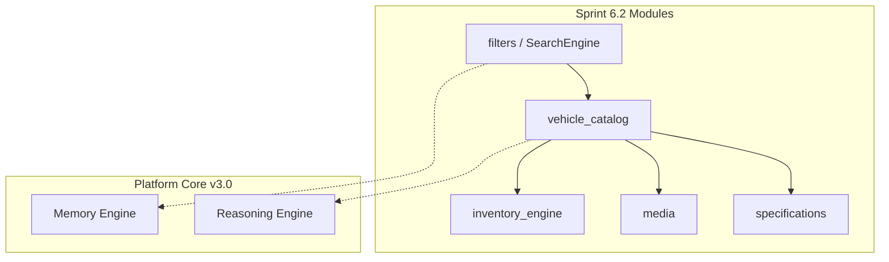

# Vehicle Catalog & Inventory Engine

> Sprint 6.2 — enterprise vehicle catalog and inventory on AI Platform Core v3.0

## Overview

Sprint 6.2 extends the Auto Marketplace with a complete **Vehicle Catalog**, **Inventory Engine**, **Media** subsystem, **Specifications** domain, and **Search Engine** with AI semantic search.

**AI Platform Core is not modified** — integration via existing platform bridges only.

---

## Architecture



---

## Modules

| Module | Path | Role |
|--------|------|------|
| `vehicle_catalog/` | Catalog CRUD, bulk ops, VIN validation, duplicates | 
| `inventory_engine/` | Stock, warehouse, dealer inventory, lifecycle |
| `media/` | Photos, videos, 360, documents, optimization |
| `specifications/` | Brand, model, trim, engine, colors, features |
| `filters/` | Search criteria and SearchEngine |

---

## Domain Models

### Specifications
`VehicleBrand`, `VehicleModel`, `VehicleGeneration`, `VehicleTrim`, `VehicleEngine`, `Transmission`, `DriveType`, `FuelType`, `VehicleColor`, `VehicleCondition`, `VehicleLocation`, `VehicleFeature`, `VehicleOption`

### Catalog
`CatalogVehicle` — full vehicle aggregate with specs, media refs, tags, quality score

### Inventory Status
`InventoryVehicleStatus`: `draft`, `incoming`, `available`, `listed`, `reserved`, `sold`, `outgoing`, `archived`

### Media
`VehicleMedia` with types: `photo`, `video`, `360_image`, `document`

---

## Catalog Operations

```python
from applications.auto_marketplace import auto_marketplace
from applications.auto_marketplace.vehicle_catalog.models import CatalogVehicle

vehicle = CatalogVehicle(vin="1HGCM82633A004352", brand="Honda", model="Accord", year=2021, price=24000)
created = await auto_marketplace.vehicle_catalog.create(vehicle)

await auto_marketplace.vehicle_catalog.bulk_import([vehicle1, vehicle2])
await auto_marketplace.vehicle_catalog.archive(vehicle_id)
await auto_marketplace.vehicle_catalog.restore(vehicle_id)
dupes = auto_marketplace.vehicle_catalog.duplicate_check(vehicle_id)
```

### VIN Validation
ISO 3779 format + check digit validation via `vehicle_catalog/vin_validator.py`.

### Duplicate Detection
VIN match and fingerprint match (brand, model, year, mileage, dealer).

---

## Inventory Guide

```python
await auto_marketplace.inventory_engine.mark_incoming(vehicle_id, warehouse_id="wh1")
await auto_marketplace.inventory_engine.mark_available(vehicle_id)
await auto_marketplace.inventory_engine.mark_listed(vehicle_id)
await auto_marketplace.inventory_engine.reserve(vehicle_id, reservation_id="r1", customer_id="c1")
await auto_marketplace.inventory_engine.mark_sold(vehicle_id, deal_id="d1", final_price=44000)
await auto_marketplace.inventory_engine.mark_outgoing(vehicle_id)

auto_marketplace.inventory_engine.availability(dealer_id="d1")
auto_marketplace.inventory_engine.dealer_inventory(dealer_id)
auto_marketplace.inventory_engine.warehouse_inventory(warehouse_id)
```

---

## Search Guide

```python
from applications.auto_marketplace.filters.criteria import VehicleSearchCriteria
from applications.auto_marketplace.specifications.models import FuelType

criteria = VehicleSearchCriteria(
    brand="Tesla",
    fuel_type=FuelType.ELECTRIC,
    price_max=50000,
    city="Berlin",
    semantic=True,
    query="family electric SUV",
)
results = await auto_marketplace.search_engine.search(criteria)
```

Supports: VIN, brand, model, year, mileage, price, fuel, transmission, location, dealer, tags, AI semantic search.

---

## Media

```python
from applications.auto_marketplace.media.models import MediaType, VehicleMedia

media = await auto_marketplace.media.upload(
    VehicleMedia(vehicle_id=vid, url="https://cdn/photo.jpg", media_type=MediaType.PHOTO)
)
await auto_marketplace.media.reorder(vehicle_id, [media_id_2, media_id_1])
auto_marketplace.media.optimize(media_id)
```

---

## AI Integration

| Hook | Description |
|------|-------------|
| Recommendations | Similar vehicles via search engine |
| Duplicate detection | Reasoning engine + rule-based fallback |
| Auto categorization | electric, new_arrival, low_mileage, standard |
| Automatic tagging | category, certified, budget tags |
| Quality scoring | 0–100 based on media, description, features |
| Price estimation | PricingService integration |

---

## Events

| Event | When |
|-------|------|
| `VehicleAddedEvent` | Vehicle created |
| `VehicleUpdatedEvent` | Vehicle updated |
| `VehicleReservedEvent` | Inventory reserved |
| `VehicleSoldEvent` | Vehicle sold |
| `InventoryChangedEvent` | Stock change |
| `MediaUploadedEvent` | Media uploaded |

---

## API Endpoints

### Catalog — `/api/auto/v1/catalog`

| Method | Path | Action |
|--------|------|--------|
| GET | `/vehicles` | List catalog vehicles |
| POST | `/vehicles` | Create vehicle |
| GET | `/vehicles/{id}` | Get vehicle |
| PATCH | `/vehicles/{id}` | Update vehicle |
| POST | `/vehicles/{id}/archive` | Archive |
| POST | `/vehicles/{id}/restore` | Restore |
| POST | `/vehicles/bulk/import` | Bulk import |
| POST | `/vehicles/bulk/update` | Bulk update |
| POST | `/vin/validate` | Validate VIN |
| GET | `/vehicles/{id}/duplicates` | Duplicate check |
| GET | `/catalog/search` | Advanced search |

### Inventory — `/api/auto/v1/inventory`

| Method | Path | Action |
|--------|------|--------|
| GET | `/availability` | Stock availability |
| GET | `/dealers/{id}` | Dealer inventory |
| POST | `/vehicles/{id}/reserve` | Reserve |
| POST | `/vehicles/{id}/sold` | Mark sold |
| POST | `/vehicles/{id}/incoming` | Mark incoming |

### Media — `/api/auto/v1/vehicles/{id}/media`

| Method | Path | Action |
|--------|------|--------|
| GET | `/vehicles/{id}/media` | List media |
| POST | `/vehicles/{id}/media` | Upload |
| POST | `/vehicles/{id}/media/reorder` | Reorder |
| POST | `/media/{id}/optimize` | Optimize |

---

## Manifest

`applications/auto_marketplace/manifest.json`:

```json
{
  "application_version": "1.1.0-alpha"
}
```

---

## Tests

```bash
pytest tests/test_vehicle_catalog.py tests/test_auto_marketplace.py -q
```

---

## Developer Guide

Sprint 6.1 legacy endpoints (`/api/auto/v1/vehicles`) remain for backward compatibility. New catalog features use `/api/auto/v1/catalog/*`.

Access services via `auto_marketplace.vehicle_catalog`, `auto_marketplace.inventory_engine`, `auto_marketplace.media`, `auto_marketplace.search_engine`.
