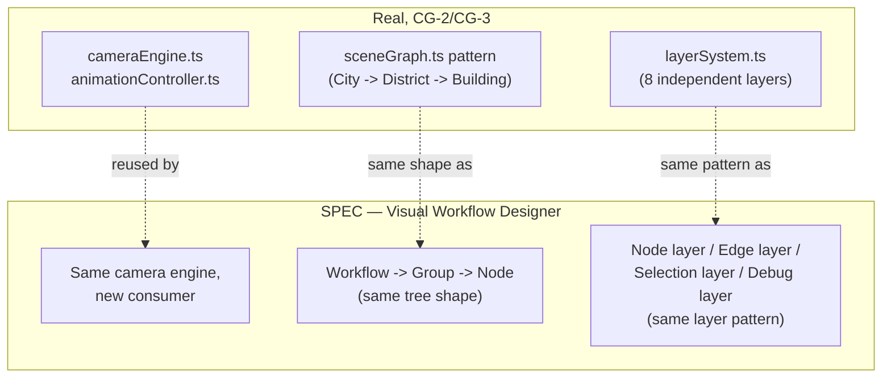
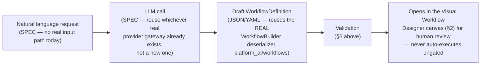

# Enterprise Automation — Visual Workflow Designer

**Sprint:** CG-7 — Architecture Research + Product Research. Documentation only, `src/` not modified.

**Do not duplicate:** `AUTOMATION_ENGINE.md` §2 specifies the node/edge/condition/loop data model this
document's editor would author. This document is the UX/editor layer on top of that model, per the
brief's §6 (canvas, zoom, groups, subflows, variables, history, undo, validation).

## 1. What exists today (verified) — no visual editor exists anywhere

Direct inspection of `src/web/src/enterprise-workflow/WorkflowAutomationPanels.tsx` (the one real
frontend surface with "workflow" in its name) found zero canvas, SVG graph, node/edge rendering, or
drag interaction — it is a plain card/list dashboard over `deriveWorkflowAutomation()`'s simulated
data (`AUTOMATION_ENGINE.md` §0). `src/kernel/workflow/` (TS, ADOS kernel ecosystem) has a real
`WorkflowValidator` class but, per `ARCHITECTURE_MAP.md` §15 item 2, the entire TS kernel ecosystem has
no runtime connection to the Python backend or to `src/web` — so even if it has editor-adjacent logic,
nothing in `src/web` can reach it today. **Every item in this document is SPEC.**

## 2. Canvas + zoom (SPEC — with a strong, real, in-repo precedent to reuse)

This platform already has a real, proven, tested pan/zoom/camera engine, built for a different
surface: Enterprise City's Graphics Engine (`CITY_GRAPHICS_ENGINE.md`, `CITY_CAMERA.md` — Sprint CG-2/
CG-3). `cameraEngine.ts`'s real, shipped primitives — `clampViewport`, `animateViewport`,
`focusBuilding`-equivalent "focus node," `zoomBy`, pan-delta application, all driven by
`requestAnimationFrame` via `animationController.ts` — solve exactly the "canvas + zoom" requirement
here, for a conceptually identical problem (positioning discrete elements in 2D space, panning and
zooming smoothly between them).

**SPEC recommendation**: the Visual Workflow Designer's canvas should be built as a **second consumer**
of the CG-2 Graphics Engine, not a new canvas implementation. Concretely: a node graph is structurally
the same shape as City's scene graph (`sceneGraph.ts` — City→District→Building; here it would be
Workflow→Group→Node, see §3), and a workflow node's `x`/`y` position is the same kind of percentage-
space coordinate a `CityBuilding` already has. This is the single highest-leverage reuse opportunity in
this entire sprint's research — a fully real, tested, documented engine already exists for "pan/zoom
around discrete positioned elements," and it was built generically enough (CG-2's own design goal,
stated in its own docs, was "reusable by every City screen") to extend to a non-City screen.

## 3. Groups and subflows (SPEC)

Proposed as an extra level in the same scene-graph shape §2 reuses: `Workflow → Group → Node`, where a
**Group** is a purely visual/organizational container (collapsible, per CG-2's real `LayerState`-style
enable/disable pattern) and a **Subflow** is a Group whose nodes reference a *separately stored*
`Workflow` definition (i.e., a subflow is "call another real workflow," not a new execution primitive —
`AUTOMATION_ENGINE.md` §2's node model already supports this: a subflow node's `actionId` simply
resolves to "invoke `workflow_engine.execute_workflow(other_id)`" rather than a single action).

## 4. Variables (SPEC)

No real variable/expression-binding concept was found anywhere in `platform_workflow`'s model
(`Workflow`/`WorkflowStep`/`ExecutionContext` carry no named-variable map). Proposed shape: a flat
`Dict[str, Any]` on the real `ExecutionContext` (already exists, currently carries only
`tenant_id`/`user_id`/`session_id`/`permissions`) — additive, not a new context object — with node
inputs referencing `{{variable_name}}`-style interpolation, resolved at execution time by
`platform_workflow`'s real step-execution path.

## 5. History and undo (SPEC)

No real precedent found in `platform_workflow` (no version history — `AUTOMATION_ENGINE.md` §1's gap
list already names this) or in any editor (none exists). **SPEC**: editor-level undo/redo is a pure
frontend concern (a command-pattern stack over graph edits, standard practice, no backend dependency)
and should be built independently of workflow **version** history (`WORKFLOW_RUNTIME.md` §5's
Versioning row, a backend/persistence concern) — these two "history" concepts should not be conflated
into one mechanism.

## 6. Validation (SPEC, with one real precedent to check before building)

`src/kernel/workflow/`'s real `WorkflowValidator` (TS, ADOS kernel ecosystem) exists but is unreachable
from `src/web` (`ARCHITECTURE_MAP.md` §15 item 2) — **flagged as a verification item, not assumed
reusable**: before writing a new validator, a future implementation sprint should read
`WorkflowValidator.ts` to check whether its validation rules (cycle detection? required-field checks?)
are portable logic that could be ported into whatever language the canonical engine (`AUTOMATION_ENGINE.md`
§1) ends up in, even though the TS kernel itself can't be imported directly. Minimum real-world
validation this document recommends regardless: cycle detection (real, already implemented twice —
`platform_workflow`'s `_order_steps` and `src/execution`'s `DependencyResolver.topological` both
detect unresolvable cycles today, `WORKFLOW_RUNTIME.md` §1) and required-field/action-exists checks
against `ACTION_LIBRARY.md`'s registry.

## 7. AI Workflow Builder (brief §8 — natural language → workflow)

**Confirmed absent** — no natural-language/LLM-to-workflow generation capability exists anywhere in
this codebase. The one file whose name suggested otherwise, `platform_ai/workflows/workflow_builder.py`'s
`WorkflowBuilder` (consumed by `platform_workflows`, the plural package `AUTOMATION_ENGINE.md` §1
found *less* evidenced than `platform_workflow`), only **parses JSON/YAML/dict into a
`WorkflowDefinition`** — a deserializer, not a generator. No LLM call, no natural-language input path,
was found in `applications/platform_builder/ai_builder/` either (only `catalogs.py`/`registry.py`/
`wizard.py`, none of which perform generation).

**SPEC — the additive path**, given the canonical engine (`AUTOMATION_ENGINE.md` §1) and real action
taxonomy (`ACTION_LIBRARY.md`) already exist as structured targets:

The one genuinely real piece this diagram reuses is the **deserializer** — an LLM only needs to
produce the same JSON/YAML shape `WorkflowBuilder` already parses; nothing about the parsing step is
new. The generation step itself (natural language → that JSON/YAML) has no real precedent anywhere in
this survey and is the one truly net-new component in this entire six-document Bible — flagged
explicitly as such rather than dressed up as an extension of something real.

## 8. Non-goals

- No new canvas/rendering engine — §2's entire point is reusing CG-2 instead of building one.
- No new undo/history data model beyond a standard frontend command stack (§5).
- No claim that `src/kernel/workflow/`'s validator is usable as-is — flagged for verification, not
  assumed.
- §7's AI generation step is explicitly named as net-new, not something this document pretends to
  ground in an existing system it doesn't have.

## Related documents

`CITY_GRAPHICS_ENGINE.md`/`CITY_CAMERA.md`/`CITY_RENDER_PIPELINE.md` (the real engine this document
proposes reusing), `AUTOMATION_ENGINE.md` §2 (the node/edge model this editor authors),
`ARCHITECTURE_MAP.md` §15 item 2 (the TS-kernel isolation constraint governing §6).
