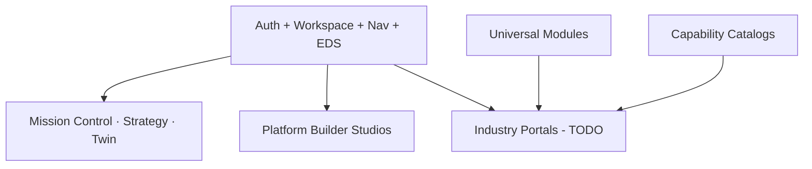

# Web Readiness Audit — Sprint 30.2

## Ready pages (present in `src/web`)

| Area | Routes / modules | Status |
|------|------------------|--------|
| Auth / Identity Center | `/login`, MFA, orgs, users, roles, permissions, sessions, security, profile… | **Ready (UI)** |
| Workspace | `/workspace` | **Ready** |
| Navigation | `/navigation` | **Ready** |
| Command Center (global) | `/command-center` | **Ready** |
| AI OS | `/ai-os` | **Partial** |
| Organization Brain | `/organization-brain` | **Partial** |
| Vertical Federation / Release | present | **Partial** |
| Platform Builder hubs | `/platform-builder/*` (~29 pages + studios) | **Ready (builder)** |
| Design System | `design-system/` | **Ready** |

## Missing pages (for industry production web)

| Portal / page | Status |
|---------------|--------|
| Automotive Customer Portal | Missing |
| Dealer / Employee Portal | Missing |
| Owner Dashboard (industry) | Missing (PB Owner Dashboard is universal module catalog only) |
| Agriculture Trader / Farmer / Buyer portals | Missing |
| Beauty salon / client journey web app | Missing |
| Cafe / restaurant web | Missing |
| Crypto / Bidex operator web | Missing |
| Legal client portal web | Missing |
| Drone operator / fleet web | Missing |

## Shared assets to reuse (do not rebuild)

- Enterprise Design System  
- Auth layouts & Identity Center  
- Workspace shell  
- Navigation managers / menuEngine  
- Platform Builder layout (`PlatformBuilderLayout`)  
- Mission Control + Strategy + Twin pages as executive surfaces  

## Forms / Dashboards

| Need | Approach |
|------|----------|
| Industry forms | Compose from EDS + universal modules |
| Executive dashboards | Reuse Mission Control / Strategy / Twin Intelligence |
| Operational dashboards | Workspace + Command Center |

## Navigation readiness

- PB menu items registered for hubs through Business Ecosystem  
- Risk: global Command Center vs PB Command Center OS — label clearly  
- Soft routes without `App.tsx` entries must be fixed before pilot  

## Web readiness verdict

| Criterion | Verdict |
|-----------|---------|
| Enterprise shell | **Ready to extend** |
| Builder / executive tools | **Ready** |
| Industry customer portals | **Not ready** |
| E2E auth | **Not ready** |
| Frontend test coverage | **Insufficient** |

## Diagram

