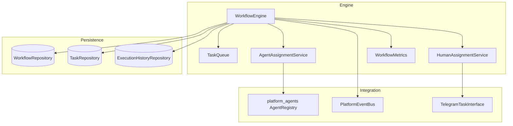
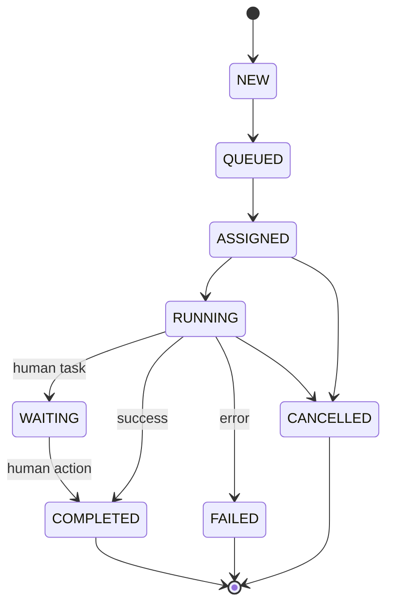

# Platform Workflow & Task Engine

> Sprint 3.2 — enterprise workflow execution for AI agents and humans

## Overview

The Platform Workflow & Task Engine orchestrates multi-step workflows where **AI agents** and **human users** collaborate. Tasks are automatically routed, queued, tracked, and completed with full lifecycle management, event integration, and persistence.

**Separate from `platform_workflows/`** (Sprint 1–2 YAML runtime) — this engine is the Sprint 3.2 task-centric layer.

---

## Architecture



---

## Task Lifecycle



| Status | Description |
|--------|-------------|
| NEW | Task created |
| QUEUED | In priority queue |
| ASSIGNED | Agent or human assigned |
| RUNNING | Executing |
| WAITING | Awaiting human action |
| COMPLETED | Successfully finished |
| FAILED | Error or exhausted retries |
| CANCELLED | Workflow cancelled |

---

## Core Models

| Model | Purpose |
|-------|---------|
| `Task` | Single unit of work |
| `Workflow` | Multi-step process |
| `WorkflowStep` | Step definition with capability/role |
| `TaskResult` | Execution outcome |
| `ExecutionContext` | User, session, tenant, Telegram context |

### Enums

- **TaskStatus:** NEW, QUEUED, ASSIGNED, RUNNING, WAITING, COMPLETED, FAILED, CANCELLED
- **TaskPriority:** URGENT (1), HIGH (2), NORMAL (3), LOW (4)
- **TaskType:** AGENT, HUMAN, SYSTEM, HYBRID
- **HumanRole:** MANAGER, ADMINISTRATOR, OPERATOR, OWNER

---

## Workflow Engine API

```python
from platform_workflow import (
    WorkflowEngine, WorkflowStep, TaskType, HumanRole, ExecutionContext, workflow_engine,
)

engine = workflow_engine

# Create
wf = await engine.create_workflow(
    "Auto Purchase Flow",
    steps=[
        WorkflowStep(step_id="find", name="Find vehicle", capability="buy_car", task_type=TaskType.AGENT),
        WorkflowStep(step_id="approve", name="Manager approval", task_type=TaskType.HUMAN, human_role=HumanRole.MANAGER),
        WorkflowStep(step_id="contract", name="Legal review", capability="legal_contract", task_type=TaskType.AGENT, depends_on=["approve"]),
    ],
    context=ExecutionContext(user_id="u1", telegram_user_id="12345"),
)

# Execute
result = await engine.execute_workflow(wf.workflow_id)

# Human task completion
status = await engine.get_workflow_status(wf.workflow_id)
await engine.complete_human_task(task_id, {"approved": True})
await engine.continue_workflow(wf.workflow_id)

# Control
await engine.pause_workflow(wf.workflow_id)
await engine.resume_workflow(wf.workflow_id)
await engine.cancel_workflow(wf.workflow_id)
await engine.retry_workflow(wf.workflow_id)
```

PascalCase aliases: `CreateWorkflow`, `ExecuteWorkflow`, `PauseWorkflow`, etc.

---

## Task Queue

| Feature | Support |
|---------|---------|
| Priority queue | Lower number = higher priority |
| FIFO | Within same priority level |
| Retry | Exponential backoff requeue |
| Delayed execution | `enqueue_delayed(task, seconds)` |
| Scheduled execution | `enqueue_scheduled(task, timestamp)` |

---

## Agent Assignment

Tasks with `task_type=AGENT` are assigned via `platform_agents.AgentRegistry`:

1. Find agents by capability
2. Select highest priority enabled agent
3. Fallback to alternate capabilities if configured

---

## Human Tasks

Human tasks assign to roles: **Manager**, **Administrator**, **Operator**, **Owner**.

- Task enters `WAITING` status
- Notification sent via `HumanAssignmentService`
- Telegram notification via `TelegramTaskInterface` (if `telegram_user_id` set)
- Complete via `complete_human_task()` then `continue_workflow()`

---

## Events

Published via `events.publisher.publish`:

| Event | When |
|-------|------|
| `TaskCreatedEvent` | Task created |
| `TaskAssignedEvent` | Agent/human assigned |
| `TaskStartedEvent` | Execution begins |
| `TaskCompletedEvent` | Task succeeds |
| `TaskFailedEvent` | Task fails |
| `WorkflowCompletedEvent` | All steps done |
| `WorkflowFailedEvent` | Workflow fails |

---

## Telegram Interface

Contract-only (no UI in engine):

```python
class TelegramTaskInterface(ABC):
    async def send_task_notification(telegram_user_id, task_id, message) -> bool
    async def approve_task(telegram_user_id, task_id) -> dict
    async def reject_task(telegram_user_id, task_id, reason="") -> dict
    async def complete_task(telegram_user_id, task_id, output=None) -> dict
    async def request_clarification(telegram_user_id, task_id, question) -> dict
```

Implement in bot handlers layer.

---

## Persistence

Abstract repositories (no SQL in engine):

| Repository | Methods |
|------------|---------|
| `WorkflowRepository` | save, get, update, list |
| `TaskRepository` | save, get, update, list_for_workflow |
| `ExecutionHistoryRepository` | record, history_for_workflow/task |

Default: `InMemory*` implementations — swappable with PostgreSQL adapters via existing `repositories/` layer.

---

## Metrics

`WorkflowMetrics` tracks:

- Execution time
- Success / failure rate
- Average completion time
- Queue peak length
- Agent utilization

---

## Workflow Examples

### Agent-only workflow

```python
wf = await engine.create_workflow("Quick buy", [
    WorkflowStep(step_id="s1", name="Purchase", capability="buy_car"),
])
await engine.execute_workflow(wf.workflow_id)  # → COMPLETED
```

### Human + agent hybrid

```python
wf = await engine.create_workflow("Approval flow", [
    WorkflowStep(step_id="s1", name="Draft", capability="legal_contract"),
    WorkflowStep(step_id="s2", name="Review", task_type=TaskType.HUMAN, human_role=HumanRole.MANAGER, depends_on=["s1"]),
])
await engine.execute_workflow(wf.workflow_id)  # → RUNNING (waiting for human)
# ... human completes via Telegram ...
await engine.complete_human_task(task_id, {"approved": True})
await engine.continue_workflow(wf.workflow_id)  # → COMPLETED
```

---

## Developer Guide

1. Define steps with capabilities (agents) or roles (humans)
2. Use `depends_on` for step ordering
3. Register agents via `platform_agents` before execution
4. Subscribe to workflow events for side effects
5. Implement `TelegramTaskInterface` in bot handlers for human tasks
6. Swap persistence repos for production PostgreSQL

---

## Compatibility

| Layer | Package | Status |
|-------|---------|--------|
| Sprint 1–2 YAML workflows | `platform_workflows/` | Unchanged |
| Agent registry | `platform_agents/` | Used for assignment |
| Orchestrator | `platform_orchestrator/` | Independent |
| Domain plugins | `plugins/manifest.yaml` | Unchanged |
