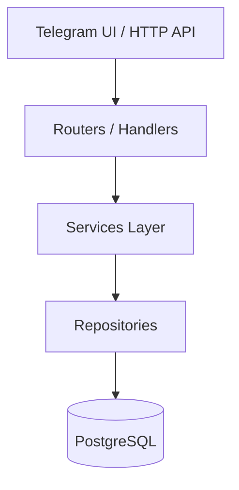

# Architecture — service layer and PostgreSQL-only production

## Target architecture

## Layers

| Layer | Location | Responsibility |
|-------|----------|----------------|
| Routers | `routers/`, `*_handlers.py` | Parse Telegram updates, render UI |
| Services | `services/*_service.py` | Business rules, orchestration |
| Repositories | `repositories/*_repository.py` | SQL only |
| Models | `database/models/` | ORM entities |
| Migrations | `migrations/` (Alembic) | Schema evolution |

## Production data policy

- **PostgreSQL** — единственный источник истины (`POSTGRES_ONLY=true` по умолчанию).
- **SQLite** (`memory.db`) — deprecated; критические функции перенаправлены в сервисы.
- **MemoryStorage** — только FSM-состояния aiogram (не users/requests/roles).

## Service layer

| Service | File | Role |
|---------|------|------|
| UserService | `services/user_service.py` | Users, profiles, verticals |
| RequestService | `services/request_service.py` | Unified requests (all verticals) |
| ManagerService | `services/manager_service.py` | Lead routing rules |
| RoleService | `services/role_service.py` | Permissions |
| NotificationService | `services/notification_service.py` | Manager/client alerts |
| MediaService | `services/media_service.py` | File storage |

## Manager routing rules

| Vertical | Auto-assignee | Notes |
|----------|---------------|-------|
| AUTO | Boroda_0003 | `DEFAULT_AUTO_MANAGER_ID` |
| AGRO | Christopher Moltisanti | grain, rapeseed, soy, freight, etc. |
| SUPER_ADMIN | Tony Soprano | Full access, **not** auto-assigned |

## Adding a vertical

1. Add enum/registry entry (`services/system_roles.py`, `src/verticals/`)
2. Extend `RequestService.SUPPORTED_VERTICALS`
3. Add `ManagerService.DEFAULT_ASSIGNEES` if needed
4. Create router under `routers/`
5. **Do not** modify core engines unless necessary

## Migration status

| Component | Status |
|-----------|--------|
| Auto client requests | PostgreSQL via `RequestService` / `AutoClientRequestEngineV1` |
| Agro buy flow (`handlers.py`) | PostgreSQL via `RequestService` |
| User ensure (`entry_point`, onboarding) | PostgreSQL via `UserService` |
| Legacy `handlers.py` admin/AI | Partial — still `from database import` (Phase 2) |

## Rollback

Set `POSTGRES_ONLY=false` in `.env` to re-enable SQLite fallbacks for unmigrated legacy functions.

See also: [services.md](services.md), [database.md](database.md), [verticals.md](verticals.md).
