# Architecture — service layer and PostgreSQL-only production

## Target architecture

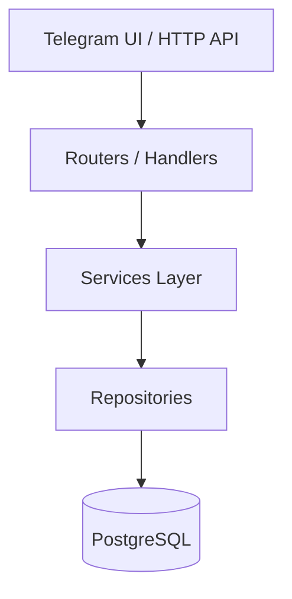

## Layers

| Layer | Location | Responsibility |
|-------|----------|----------------|
| Routers | `routers/`, `*_handlers.py` | Parse Telegram updates, render UI |
| Services | `services/*_service.py` | Business rules, orchestration |
| Repositories | `repositories/*_repository.py` | SQL only |
| Models | `database/models/` | ORM entities |
| Migrations | `migrations/` (Alembic) | Schema evolution |

## Production data policy

- **PostgreSQL** — единственный источник истины (`POSTGRES_ONLY=true` по умолчанию).
- **SQLite** (`memory.db`) — deprecated; критические функции перенаправлены в сервисы.
- **MemoryStorage** — только FSM-состояния aiogram (не users/requests/roles).

## Service layer

| Service | File | Role |
|---------|------|------|
| UserService | `services/user_service.py` | Users, profiles, verticals |
| RequestService | `services/request_service.py` | Unified requests (all verticals) |
| ManagerService | `services/manager_service.py` | Lead routing rules |
| RoleService | `services/role_service.py` | Permissions |
| NotificationService | `services/notification_service.py` | Manager/client alerts |
| MediaService | `services/media_service.py` | File storage |

## Manager routing rules

| Vertical | Auto-assignee | Notes |
|----------|---------------|-------|
| AUTO | Boroda_0003 | `DEFAULT_AUTO_MANAGER_ID` |
| AGRO | Christopher Moltisanti | grain, rapeseed, soy, freight, etc. |
| SUPER_ADMIN | Tony Soprano | Full access, **not** auto-assigned |

## Adding a vertical

1. Add enum/registry entry (`services/system_roles.py`, `src/verticals/`)
2. Extend `RequestService.SUPPORTED_VERTICALS`
3. Add `ManagerService.DEFAULT_ASSIGNEES` if needed
4. Create router under `routers/`
5. **Do not** modify core engines unless necessary

## Migration status

| Component | Status |
|-----------|--------|
| Auto client requests | PostgreSQL via `RequestService` / `AutoClientRequestEngineV1` |
| Agro buy flow (`handlers.py`) | PostgreSQL via `RequestService` |
| User ensure (`entry_point`, onboarding) | PostgreSQL via `UserService` |
| Legacy `handlers.py` admin/AI | Partial — still `from database import` (Phase 2) |

## Rollback

Set `POSTGRES_ONLY=false` in `.env` to re-enable SQLite fallbacks for unmigrated legacy functions.

See also: [services.md](services.md), [database.md](database.md), [verticals.md](verticals.md).

## Platform Memory Engine (Sprint 2.1–2.2)

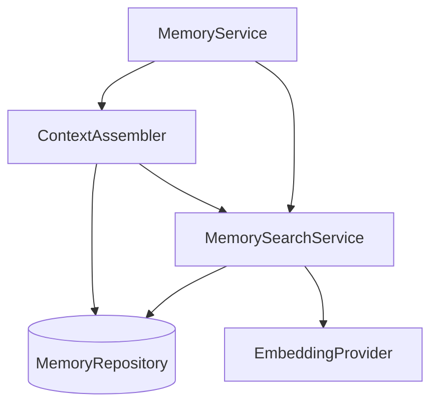

| Component | Path | Role |
|-----------|------|------|
| MemoryEntity | `platform_memory/entities.py` | Universal searchable memory object |
| MemoryRepository | `platform_memory/repositories/memory_repository.py` | Abstract persistence (no SQL in services) |
| InMemoryMemoryRepository | `platform_memory/repositories/in_memory_semantic_repository.py` | Default in-memory backend |
| DummyEmbeddingProvider | `platform_memory/providers/embedding_provider.py` | Deterministic embeddings (no OpenAI) |
| MemorySearchService | `platform_memory/search/memory_search_service.py` | Semantic + keyword search with ranking |
| ContextAssembler | `platform_memory/context_assembler.py` | LLM prompt context builder |

**Context priority:** current conversation → semantic memories → important memories → recent memories → summarized history.

**Future backends:** pgvector, Qdrant, Milvus, Weaviate — implement `MemoryRepository` + `EmbeddingProvider` without changing services.

Full details: [PLATFORM_MEMORY.md](architecture/PLATFORM_MEMORY.md), [SEMANTIC_MEMORY_REPORT.md](architecture/SEMANTIC_MEMORY_REPORT.md).

## Platform Multi-Agent Orchestrator (Sprint 2.3)

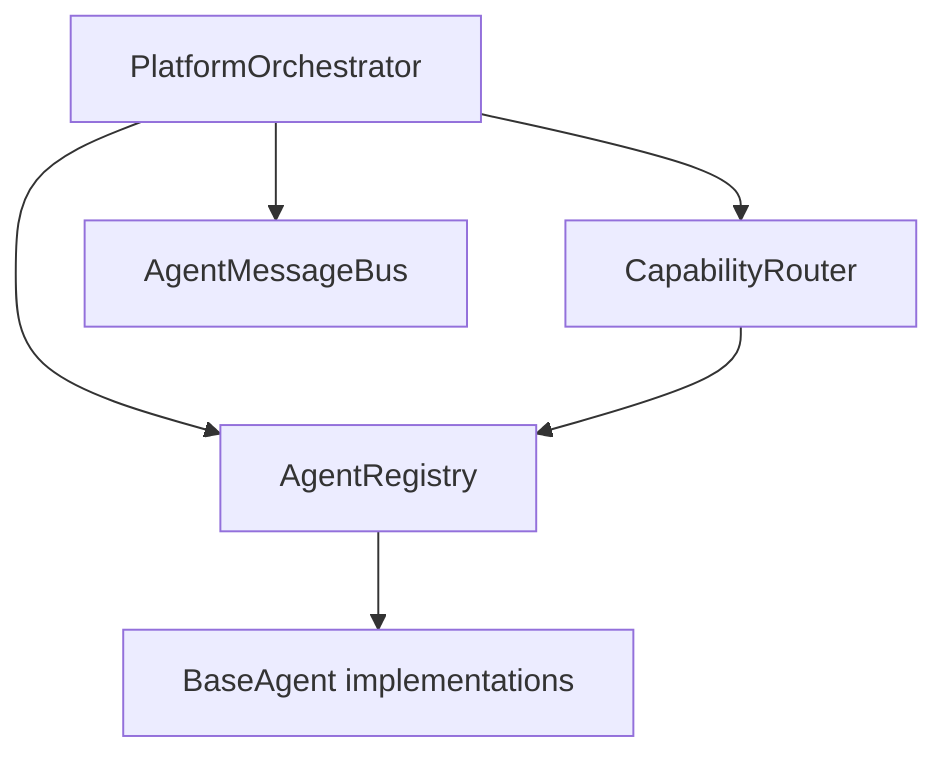

| Component | Path | Role |
|-----------|------|------|
| BaseAgent | `platform_orchestrator/base_agent.py` | Abstract agent contract |
| AgentRegistry | `platform_orchestrator/agent_registry.py` | Agent discovery and lifecycle |
| CapabilityRouter | `platform_orchestrator/capability_routing.py` | Route by capability (not name) |
| PlatformOrchestrator | `platform_orchestrator/orchestrator.py` | Central execution engine |
| AgentMessageBus | `platform_orchestrator/message_bus.py` | Inter-agent messaging |
| Built-in agents | `platform_orchestrator/agents/builtin.py` | 8 vertical agent stubs |

**Routing:** capability-based (e.g. `buy_car` → Auto Agent, `legal_contract` → Legal Agent).

Full details: [ORCHESTRATOR.md](architecture/ORCHESTRATOR.md), [ORCHESTRATOR_REPORT.md](architecture/ORCHESTRATOR_REPORT.md).

## Platform Agent Registry (Sprint 3.1)

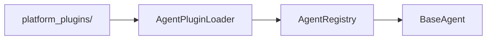

| Component | Path | Role |
|-----------|------|------|
| BaseAgent | `platform_agents/base_agent.py` | Agent contract |
| AgentRegistry | `platform_agents/registry.py` | Register, enable, discover |
| AgentPluginLoader | `platform_agents/plugin_loader.py` | Auto-discovery from `platform_plugins/` |
| Built-in agents | `platform_agents/agents/builtin.py` | 6 demonstration agents |

**Plugin drop-in:** add `platform_plugins/<name>/plugin.json` + `agent.py` — no core changes.

Full details: [AGENT_REGISTRY.md](../AGENT_REGISTRY.md).

## Platform Workflow & Task Engine (Sprint 3.2)

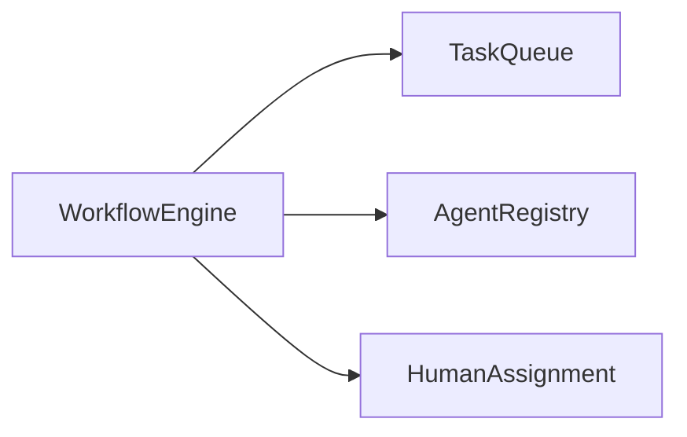

| Component | Path | Role |
|-----------|------|------|
| WorkflowEngine | `platform_workflow/workflow_engine.py` | Create, execute, pause, cancel workflows |
| TaskQueue | `platform_workflow/task_queue.py` | Priority FIFO queue with retry/schedule |
| AgentAssignmentService | `platform_workflow/agent_assignment.py` | Route to agents by capability |
| HumanAssignmentService | `platform_workflow/human_assignment.py` | Assign to Manager/Admin/Operator/Owner |
| TelegramTaskInterface | `platform_workflow/telegram_interface.py` | Bot integration contract |

Full details: [WORKFLOW_ENGINE.md](../WORKFLOW_ENGINE.md).

## Platform Tool Framework (Sprint 3.3)

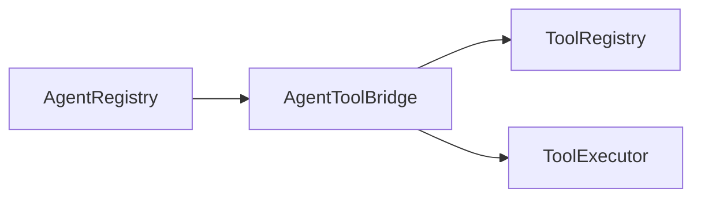

| Component | Path | Role |
|-----------|------|------|
| ToolRegistry | `platform_tools/registry.py` | Register, discover, validate tools |
| ToolExecutor | `platform_tools/executor.py` | Sandboxed async execution |
| AgentToolBridge | `platform_tools/agent_bridge.py` | Agent Registry integration |
| ToolPermissionService | `platform_tools/permissions.py` | Per-agent/user permissions |

Full details: [TOOLS.md](../TOOLS.md).

## Platform Reasoning Engine (Sprint 4.1)

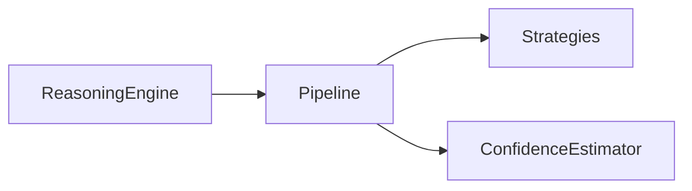

| Component | Path | Role |
|-----------|------|------|
| ReasoningEngine | `platform_reasoning/reasoning_engine.py` | Central reasoning entry |
| ReasoningPipeline | `platform_reasoning/pipeline.py` | 7-phase analysis pipeline |
| Strategies | `platform_reasoning/strategies/` | 6 reasoning strategies |
| ConfidenceEstimator | `platform_reasoning/confidence.py` | Multi-dimensional confidence |

Full details: [REASONING.md](../REASONING.md).

## Platform Planning Engine (Sprint 4.2)

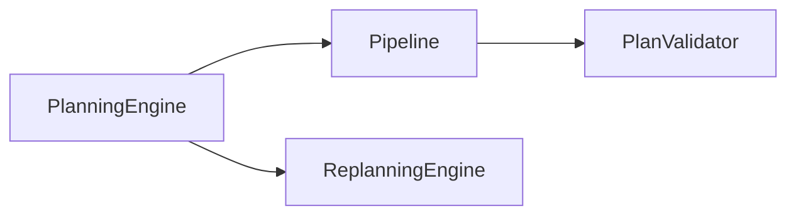

| Component | Path | Role |
|-----------|------|------|
| PlanningEngine | `platform_planning/planning_engine.py` | Goal → execution plan |
| PlanValidator | `platform_planning/validator.py` | Dependency & resource checks |
| ReplanningEngine | `platform_planning/replanning.py` | Adaptive recovery |
| Strategies | `platform_planning/strategies/` | 6 planning strategies |

Full details: [PLANNING.md](../PLANNING.md).

---

## Decision Engine (Sprint 4.3)

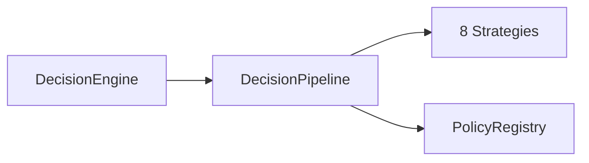

| Component | Path | Role |
|-----------|------|------|
| DecisionEngine | `platform_decision/decision_engine.py` | Candidate evaluation & selection |
| DecisionPipeline | `platform_decision/pipeline.py` | Validate → score → rank → select |
| Policies | `platform_decision/policies.py` | Configurable scoring weights |
| Strategies | `platform_decision/strategies/` | 8 decision strategies |

Full details: [DECISION_ENGINE.md](../DECISION_ENGINE.md).

---

## Learning Engine (Sprint 4.4)

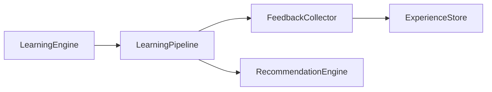

| Component | Path | Role |
|-----------|------|------|
| LearningEngine | `platform_learning/learning_engine.py` | Learning cycle orchestration |
| FeedbackCollector | `platform_learning/feedback_collector.py` | Multi-source feedback ingestion |
| ExperienceStore | `platform_learning/experience_store.py` | Cross-layer execution history |
| PatternAnalyzer | `platform_learning/pattern_analyzer.py` | Success/failure pattern detection |
| RecommendationEngine | `platform_learning/recommendation_engine.py` | Improvement recommendations |

Full details: [LEARNING_ENGINE.md](../LEARNING_ENGINE.md).

---

## Collaboration Engine (Sprint 4.5)

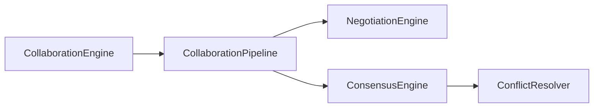

| Component | Path | Role |
|-----------|------|------|
| CollaborationEngine | `platform_collaboration/collaboration_engine.py` | Multi-agent session orchestration |
| NegotiationEngine | `platform_collaboration/negotiation_engine.py` | Task ownership & resource negotiation |
| ConsensusEngine | `platform_collaboration/consensus_engine.py` | Voting & consensus models |
| ConflictResolver | `platform_collaboration/conflict_resolver.py` | Conflict detection & recovery |
| Coordination | `platform_collaboration/coordination.py` | 6 coordination strategies |

Full details: [COLLABORATION.md](../COLLABORATION.md).

---

## Security Layer (Sprint 5.1)

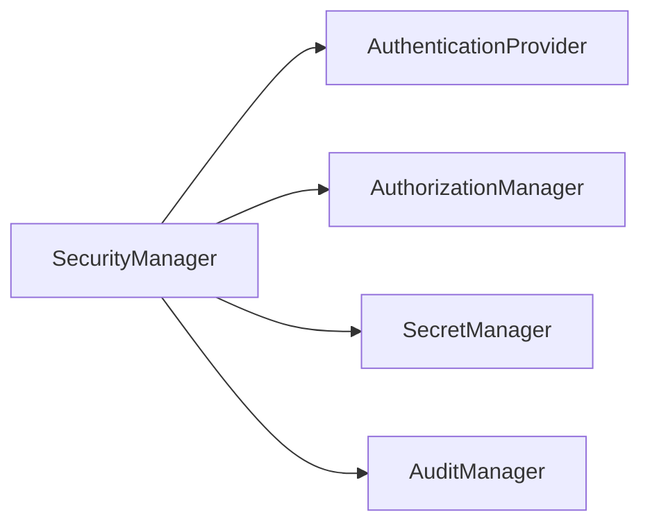

| Component | Path | Role |
|-----------|------|------|
| SecurityManager | `platform_security/security_manager.py` | Unified security entry |
| AuthenticationProvider | `platform_security/authentication.py` | API key, JWT, OAuth, service accounts |
| AuthorizationManager | `platform_security/authorization.py` | RBAC + access policies |
| SecretManager | `platform_security/secrets.py` | Encrypted secrets & rotation |
| AuditManager | `platform_security/audit.py` | Security audit logging |

Full details: [SECURITY.md](../SECURITY.md).

---

## Observability Layer (Sprint 5.2)

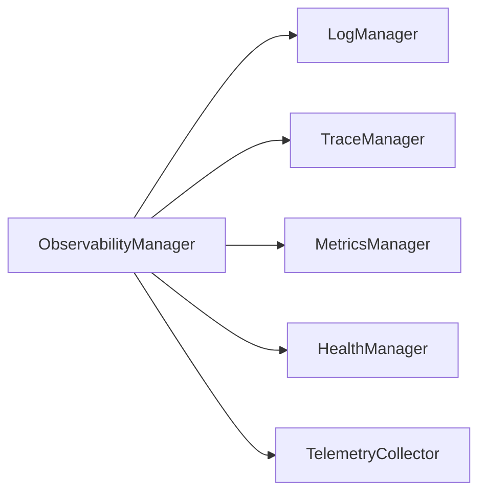

| Component | Path | Role |
|-----------|------|------|
| ObservabilityManager | `platform_observability/observability_manager.py` | Unified observability entry |
| LogManager | `platform_observability/log_manager.py` | Structured JSON logging |
| TraceManager | `platform_observability/trace_manager.py` | Distributed tracing |
| MetricsManager | `platform_observability/metrics_manager.py` | Metrics collection |
| HealthManager | `platform_observability/health_manager.py` | Health monitoring |
| DiagnosticManager | `platform_observability/diagnostic_manager.py` | Diagnostics & reports |
| TelemetryCollector | `platform_observability/telemetry_collector.py` | Telemetry + alert thresholds |

Full details: [OBSERVABILITY.md](../OBSERVABILITY.md).

---

## Reliability Layer (Sprint 5.3)

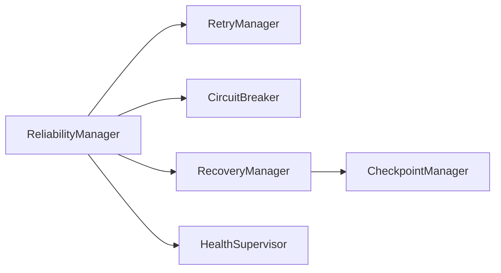

| Component | Path | Role |
|-----------|------|------|
| ReliabilityManager | `platform_reliability/reliability_manager.py` | Unified reliability entry |
| RetryManager | `platform_reliability/retry_manager.py` | Exponential/linear retry |
| CircuitBreaker | `platform_reliability/circuit_breaker.py` | Fault isolation |
| RecoveryManager | `platform_reliability/recovery_manager.py` | Recovery orchestration |
| CheckpointManager | `platform_reliability/checkpoint_manager.py` | Snapshots & restore |
| FailoverManager | `platform_reliability/failover_manager.py` | Agent/tool/workflow failover |
| HealthSupervisor | `platform_reliability/health_supervisor.py` | Continuous health monitoring |

Full details: [RELIABILITY.md](../RELIABILITY.md).

---

## Configuration Layer (Sprint 5.4)

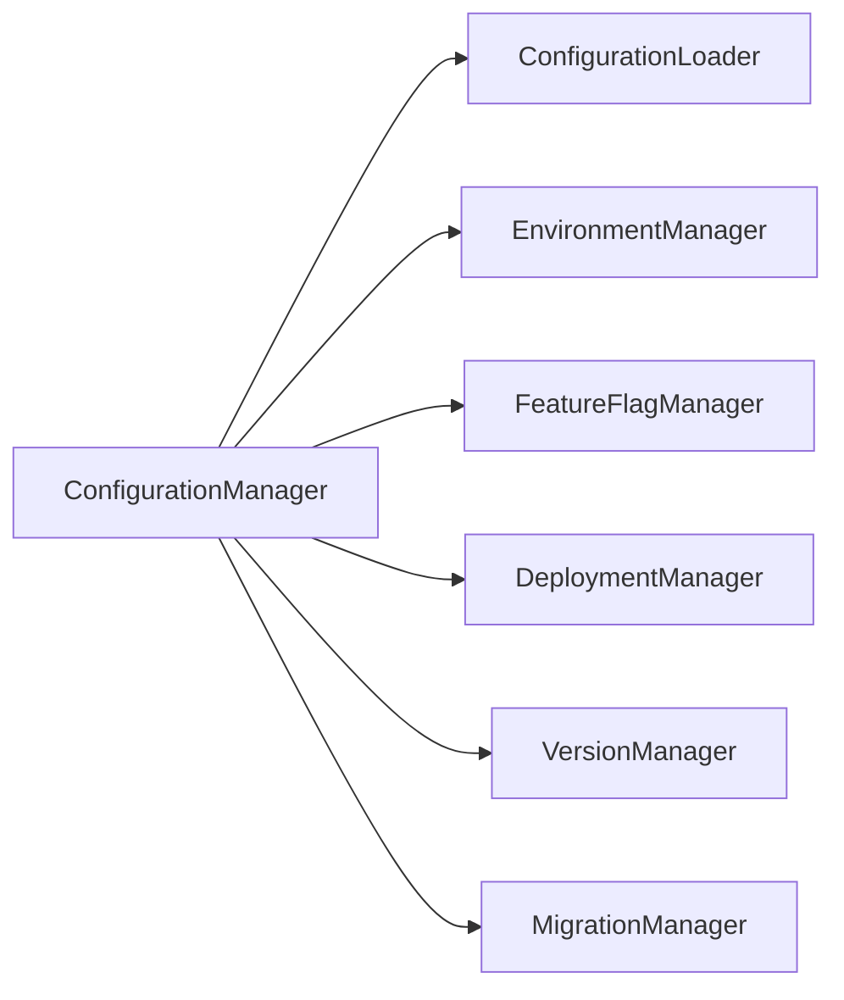

| Component | Path | Role |
|-----------|------|------|
| ConfigurationManager | `platform_configuration/configuration_manager.py` | Unified config & deployment entry |
| ConfigurationLoader | `platform_configuration/configuration_loader.py` | Hierarchical config loading |
| EnvironmentManager | `platform_configuration/environment_manager.py` | Environment profiles |
| FeatureFlagManager | `platform_configuration/feature_flag_manager.py` | Feature toggles & rollout |
| DeploymentManager | `platform_configuration/deployment_manager.py` | Local/Docker deployment |
| VersionManager | `platform_configuration/version_manager.py` | Version & compatibility |
| MigrationManager | `platform_configuration/migration_manager.py` | Schema migrations |

Full details: [CONFIGURATION.md](../CONFIGURATION.md).

---

## Validation Layer (Sprint 5.5)

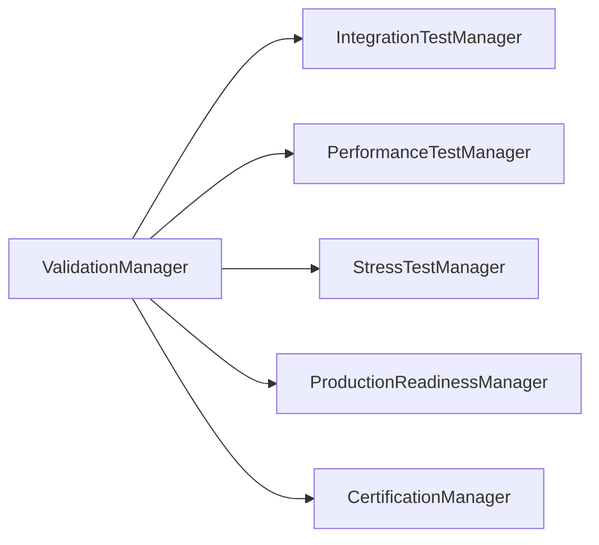

| Component | Path | Role |
|-----------|------|------|
| ValidationManager | `platform_validation/validation_manager.py` | Unified validation entry |
| IntegrationTestManager | `platform_validation/integration_test_manager.py` | Module integration checks |
| PerformanceTestManager | `platform_validation/performance_test_manager.py` | Throughput benchmarks |
| StressTestManager | `platform_validation/stress_test_manager.py` | Load and concurrency tests |
| ProductionReadinessManager | `platform_validation/production_readiness_manager.py` | Production checklist |
| CertificationManager | `platform_validation/certification_manager.py` | Production Ready certification |

Full details: [VALIDATION.md](../VALIDATION.md).

---

## Auto Marketplace Application (Sprint 6.1)

First production application on Platform Core v3.0 — consumes platform via bridges only.

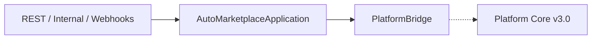

| Module | Path | Role |
|--------|------|------|
| Application | `applications/auto_marketplace/application.py` | Application facade |
| Catalog | `applications/auto_marketplace/catalog/` | Vehicle catalog |
| CRM | `applications/auto_marketplace/crm/` | Leads and deals |
| Platform Bridge | `applications/auto_marketplace/integrations/platform_bridge.py` | AI platform integration |
| REST API | `applications/auto_marketplace/api/` | `/api/auto/v1` |

Full details: [AUTO_MARKETPLACE.md](../AUTO_MARKETPLACE.md).

---

## Vehicle Catalog & Inventory (Sprint 6.2)

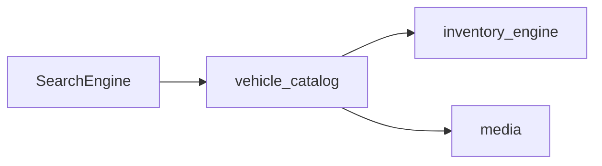

| Module | Path | Role |
|--------|------|------|
| VehicleCatalogService | `applications/auto_marketplace/vehicle_catalog/` | CRUD, bulk, VIN, duplicates |
| InventoryEngine | `applications/auto_marketplace/inventory_engine/` | Stock lifecycle, warehouses |
| MediaService | `applications/auto_marketplace/media/` | Photos, videos, 360, documents |
| SearchEngine | `applications/auto_marketplace/filters/` | Structured + semantic search |

Full details: [VEHICLE_CATALOG.md](../VEHICLE_CATALOG.md).

---

## CRM & Sales Pipeline (Sprint 6.3)

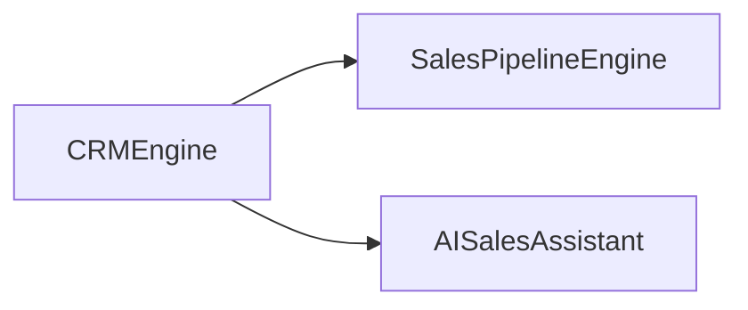

| Module | Path | Role |
|--------|------|------|
| CRMEngine | `applications/auto_marketplace/crm/engine.py` | Unified CRM entry |
| SalesPipelineEngine | `applications/auto_marketplace/sales_pipeline/` | Pipeline & forecasting |
| AISalesAssistant | `applications/auto_marketplace/crm/ai_assistant.py` | AI sales integration |

Full details: [CRM_ENGINE.md](../CRM_ENGINE.md).

---

## AI Sales & Customer Intelligence (Sprint 6.4)

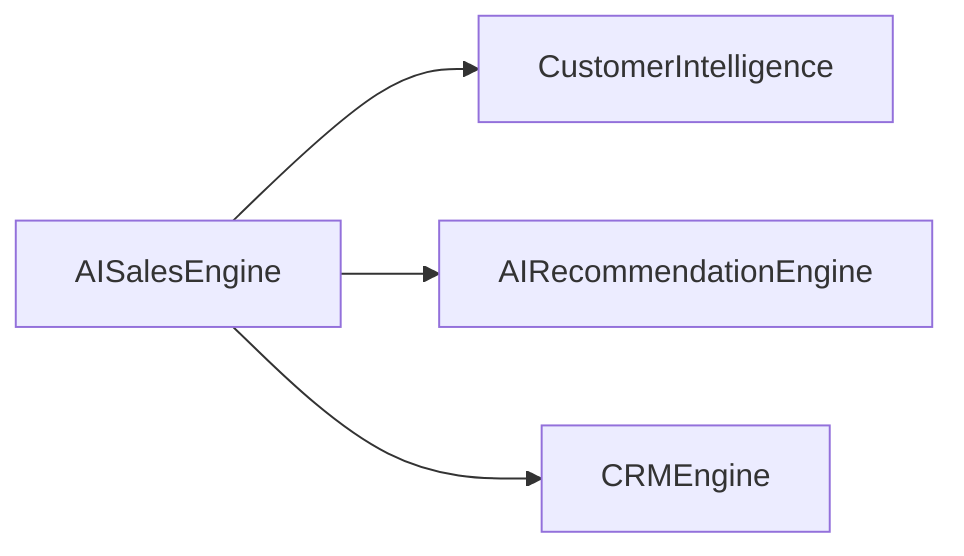

| Module | Path | Role |
|--------|------|------|
| AISalesEngine | `applications/auto_marketplace/ai_sales/engine.py` | Unified AI sales entry |
| CustomerIntelligence | `applications/auto_marketplace/customer_intelligence/` | Profile & intent analysis |
| AIRecommendationEngine | `applications/auto_marketplace/recommendations/` | Vehicle recommendations |

Full details: [AI_SALES.md](../AI_SALES.md).

---

## Documents, Contracts & Finance (Sprint 6.5)

```mermaid
flowchart LR
    FE[FinanceEngine]
    DE[DocumentEngine]
    CS[ContractService]

    FE --> DE
    FE --> CS
```

| Module | Path | Role |
|--------|------|------|
| FinanceEngine | `applications/auto_marketplace/finance/engine.py` | Unified finance entry |
| DocumentEngine | `applications/auto_marketplace/documents/engine.py` | Document management |
| ContractService | `applications/auto_marketplace/contracts/` | Contract lifecycle |

Full details: [FINANCE_ENGINE.md](../FINANCE_ENGINE.md).

---

## Business Intelligence & Executive Dashboard (Sprint 6.6)

```mermaid
flowchart LR
    BE[BIEngine]
    ED[ExecutiveDashboard]
    AE[AnalyticsEngine]

    BE --> ED
    BE --> AE
```

| Module | Path | Role |
|--------|------|------|
| BIEngine | `applications/auto_marketplace/business_intelligence/engine.py` | Unified BI entry |
| ExecutiveDashboard | `applications/auto_marketplace/executive_dashboard/` | Role-based dashboards |
| AnalyticsEngine | `applications/auto_marketplace/analytics/engine.py` | Multi-domain analytics |

Full details: [BUSINESS_INTELLIGENCE.md](../BUSINESS_INTELLIGENCE.md).

---

## Customer Portal, Dealer Portal & Mobile API (Sprint 6.7)

```mermaid
flowchart LR
    PE[PortalEngine]
    CP[CustomerPortal]
    DP[DealerPortal]
    MOB[MobileAPI]

    PE --> CP
    PE --> DP
    PE --> MOB
```

| Module | Path | Role |
|--------|------|------|
| PortalEngine | `applications/auto_marketplace/mobile_api/engine.py` | Unified portal entry |
| CustomerPortal | `applications/auto_marketplace/customer_portal/` | Customer-facing features |
| DealerPortal | `applications/auto_marketplace/dealer_portal/` | Dealer management |
| PartnerAPI | `applications/auto_marketplace/partner_api/` | External integrations |

Full details: [CUSTOMER_PORTAL.md](../CUSTOMER_PORTAL.md).

---

## Production Release (Sprint 6.8)

```mermaid
flowchart LR
    PROD[ProductionEngine]
    QA[QualityAssurance]
    OPS[Operations]

    PROD --> QA
    PROD --> OPS
```

| Module | Path | Role |
|--------|------|------|
| ProductionEngine | `applications/auto_marketplace/release/engine.py` | Validation & go-live |
| QualityAssurance | `applications/auto_marketplace/quality_assurance/` | Validation, performance, security |
| Operations | `applications/auto_marketplace/monitoring/` | Health probes, incident guide |

**Version 2.0.0 — Production Ready**

Full details: [PRODUCTION_RELEASE.md](../PRODUCTION_RELEASE.md).

---

## Unified Ecosystem (Sprint 7.1)

```mermaid
flowchart LR
    Apps[Applications]
    Eco[Ecosystem Layer]
    Bridge[Platform Bridge]
    Core[AI Platform Core v3.0]

    Apps --> Eco
    Eco --> Bridge
    Bridge --> Core
```

| Module | Path | Role |
|--------|------|------|
| EcosystemEngine | `ecosystem/engine.py` | Identity, workspace, navigation facade |
| Identity | `ecosystem/identity/` | SSO, sessions, MFA, devices |
| Organizations | `ecosystem/organizations/` | Org hierarchy, membership |
| Workspace | `ecosystem/workspace/` | Dashboard, search, activity |
| Navigation | `ecosystem/navigation/` | Cross-application navigation |
| Permissions | `ecosystem/permissions/` | System and custom roles |
| UnifiedAssistant | `ecosystem/ai/assistant.py` | AI routing and delegation |

**Ecosystem Version 1.0.0-alpha**

Full details: [ECOSYSTEM.md](../ECOSYSTEM.md).

---

## Cross-Application Communication (Sprint 7.2)

```mermaid
flowchart LR
    Apps[Applications]
    Comm[CommunicationEngine]
    Bus[Event Bus]
    Router[Message Router]
    Registry[Service Registry]

    Apps --> Comm
    Comm --> Bus
    Comm --> Router
    Comm --> Registry
```

| Module | Path | Role |
|--------|------|------|
| CommunicationEngine | `ecosystem/communication/engine.py` | Messaging & event facade |
| EventBus | `ecosystem/communication/event_bus/` | Global domain/app/system/AI/workflow events |
| MessageRouter | `ecosystem/communication/message_router/` | Request/response, pub/sub, command/query, DLQ |
| ServiceRegistry | `ecosystem/communication/service_registry/` | App registration & discovery |
| ApplicationBridge | `ecosystem/communication/application_bridge/` | Context sharing & agent collaboration |
| SyncService | `ecosystem/communication/sync/` | Cross-app synchronization |

**Ecosystem Version 1.1.0-alpha** — communication_layer 1.0, event_bus 1.0

Full details: [COMMUNICATION.md](../COMMUNICATION.md).

---

## Unified AI Assistant (Sprint 7.3)

```mermaid
flowchart LR
    User[User]
    Engine[AssistantEngine]
    Knowledge[Knowledge Graph]
    Skills[Skills]
    Context[Context]

    User --> Engine
    Engine --> Knowledge
    Engine --> Skills
    Engine --> Context
```

| Module | Path | Role |
|--------|------|------|
| AssistantEngine | `ecosystem/assistant/engine.py` | Conversational AI facade |
| GlobalMemory | `ecosystem/assistant/global_memory/` | Cross-app memory |
| KnowledgeGraph | `ecosystem/assistant/knowledge_graph/` | Semantic knowledge |
| ContextEngine | `ecosystem/assistant/context/` | Multi-layer context |
| SkillRegistry | `ecosystem/assistant/skills/` | Dynamic skills |
| AIRouter | `ecosystem/assistant/routing/` | Intent & routing |

**Ecosystem Version 1.2.0-alpha** — assistant_layer 1.0, global_knowledge 1.0

Full details: [UNIFIED_ASSISTANT.md](../UNIFIED_ASSISTANT.md).
