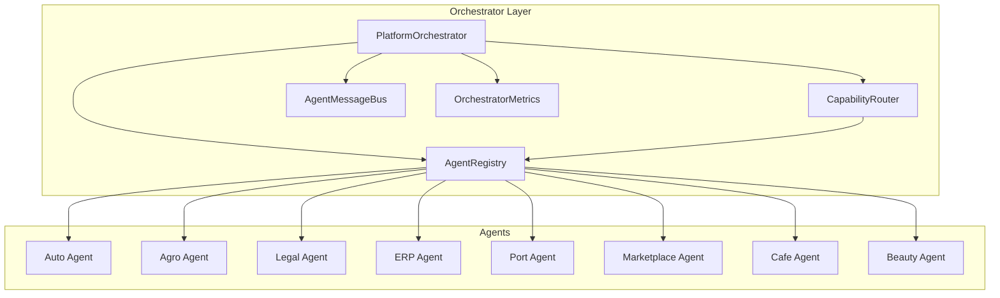
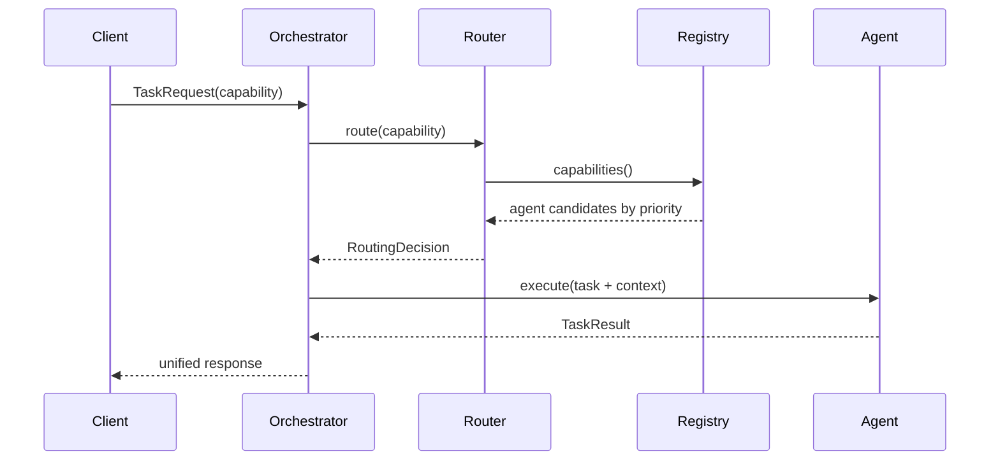

# Platform Multi-Agent Orchestrator

> Sprint 2.3 — central execution layer for all AI agents

## Overview

The Platform Multi-Agent Orchestrator routes tasks to specialized agents by **capability**, not by name. Every future AI module inherits from `BaseAgent` and registers with `AgentRegistry`. The orchestrator handles routing, execution, retries, timeouts, cancellation, inter-agent messaging, and metrics — with no business logic, no Telegram logic, and no SQL.

**No OpenAI. No vector database. Provider-independent.**

---

## Architecture



---

## Routing Flow



---

## Components

| Component | Path | Role |
|-----------|------|------|
| BaseAgent | `base_agent.py` | Abstract agent contract |
| AgentRegistry | `agent_registry.py` | register / unregister / discover |
| CapabilityRouter | `capability_routing.py` | Route by capability |
| PlatformOrchestrator | `orchestrator.py` | Central execution engine |
| AgentMessageBus | `message_bus.py` | Inter-agent messaging |
| OrchestratorMetrics | `metrics.py` | Execution metrics |
| Built-in agents | `agents/builtin.py` | 8 vertical stubs |

---

## Agent Registry

Each agent exposes:

| Field | Type |
|-------|------|
| id | str |
| name | str |
| description | str |
| capabilities | list[str] |
| priority | int |
| version | str |
| status | AgentStatus |

**Methods:** `register()`, `unregister()`, `get()`, `list()`, `capabilities()`, `health()`, `metadata()`

---

## Capability Routing

Routing is driven entirely by registered capabilities — **no hardcoded agent names in the router**.

| Capability | Agent |
|------------|-------|
| buy_car | Auto Agent |
| legal_contract | Legal Agent |
| market_analysis | ERP Agent |
| shipment_tracking | Port Agent |
| grain_trade | Agro Agent |
| create_listing | Marketplace Agent |
| cafe_order | Cafe Agent |
| book_appointment | Beauty Agent |

When multiple agents share a capability, the highest **priority** wins.

---

## Agent Context

Every agent receives injected context — **no global state access**:

```python
AgentContext(
    user_context={...},
    memory_context={...},
    session_context={...},
    platform_context={...},
    permissions=[...],
)
```

---

## Inter-Agent Communication

Agents communicate only through the orchestrator via `AgentMessageBus`:

| Message Type | Purpose |
|--------------|---------|
| request | Request/response between agents |
| response | Reply to a request |
| notification | One-way notification |
| event | Lifecycle and task events |

---

## Failure Recovery

On agent failure the orchestrator:

1. Retries with exponential backoff
2. Attempts fallback capability (if configured)
3. Logs the failure
4. Preserves context in the result
5. Returns a structured `TaskResult` — **no crash propagation**

---

## Configuration

| Parameter | Default |
|-----------|---------|
| default_timeout_seconds | 30.0 |
| max_retries | 3 |
| retry_base_delay_seconds | 0.05 |
| retry_max_delay_seconds | 2.0 |
| enable_fallback | true |
| max_queue_length | 1000 |

---

## Usage

```python
from platform_orchestrator import (
    AgentContext,
    PlatformOrchestrator,
    TaskRequest,
    register_builtin_agents,
    agent_registry,
)

orchestrator = PlatformOrchestrator()
register_builtin_agents(agent_registry)

ctx = AgentContext(user_context={"user_id": "u1"}, permissions=["agent.execute"])
task = TaskRequest(capability="buy_car", payload={"model": "SUV"}, context=ctx)

result = await orchestrator.execute_async(task)
# result.agent_id == "auto_agent"
# result.output["acknowledged"] == True
```

---

## Metrics

`OrchestratorMetrics` tracks:

- Execution time
- Failures and retries
- Routing decisions
- Active agents
- Queue length

---

## Backward Compatibility

- Sprint 1 architecture unchanged
- Sprint 2 memory engine unchanged
- No breaking API changes
- No SQL in orchestrator services
- Existing `platform_ai/` modules remain independent

---

## Future Work

- Persistent agent registry (PostgreSQL)
- Distributed message bus (Redis/NATS)
- Agent load balancing and circuit breakers
- Management API routes at `/management/v1/orchestrator/*`
- Plugin-based agent registration via SDK

See also: [ORCHESTRATOR_REPORT.md](ORCHESTRATOR_REPORT.md)
