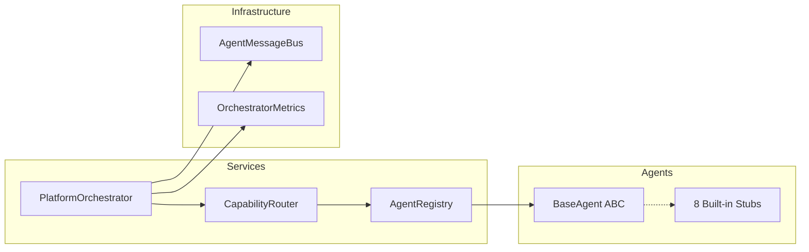

# Sprint 2.3 — Multi-Agent Orchestrator Report

> Generated: 2026-07-19

## Summary

Sprint 2.3 implements the **Platform Multi-Agent Orchestrator** — a provider-independent execution layer that routes tasks to specialized agents by capability. Eight built-in vertical agents are registered out of the box, with full support for sync/async execution, retries, timeouts, cancellation, inter-agent messaging, and metrics.

**No OpenAI. No business logic. No Telegram logic. No SQL.**

---

## Architecture

---

## Components Implemented

### 1. AgentRegistry

- `register()`, `unregister()`, `get()`, `list()`, `capabilities()`, `health()`, `metadata()`
- Priority-based capability index
- Active/inactive status filtering

### 2. BaseAgent

- `initialize()`, `execute()`, `validate()`, `shutdown()`, `health_check()`
- ClassVar metadata pattern (consistent with `AISkill`)

### 3. PlatformOrchestrator

- `execute()` — sync wrapper
- `execute_async()` — async execution
- `cancel()` — task cancellation
- Timeout via `asyncio.wait_for`
- Retries with exponential backoff
- Structured error results (no crash propagation)

### 4. CapabilityRouter

- Routes by registered capabilities only
- Priority-based agent selection
- Fallback capability support
- No hardcoded agent names

### 5. AgentContext

- user_context, memory_context, session_context, platform_context, permissions
- Injected per task — no global state

### 6. AgentMessageBus

- Message types: request, response, notification, event
- Request/response correlation
- Agents communicate only through orchestrator

### 7. OrchestratorMetrics

- execution time, failures, retries, routing decisions, active agents, queue length

### 8. Built-in Agents

| Agent | ID | Sample Capabilities |
|-------|-----|---------------------|
| Auto Agent | auto_agent | buy_car, vin_lookup |
| Agro Agent | agro_agent | grain_trade, crop_analysis |
| Legal Agent | legal_agent | legal_contract, compliance_check |
| ERP Agent | erp_agent | market_analysis, inventory_report |
| Port Agent | port_agent | shipment_tracking, customs_clearance |
| Marketplace Agent | marketplace_agent | create_listing, order_management |
| Cafe Agent | cafe_agent | cafe_order, reservation |
| Beauty Agent | beauty_agent | book_appointment, service_catalog |

---

## Test Results

| Suite | Result |
|-------|--------|
| `tests/test_orchestrator.py` | **27 passed** |
| Full suite (`-m "not slow"`) | **547 passed** |

Coverage areas: registry, routing, orchestrator execution, recovery, timeout, retry, async, cancellation, message bus, metrics, context isolation.

---

## Certification Impact

- New top-level module `platform_orchestrator/` in services layer
- No Repository→Service violations
- No SDK→Database access
- No Sprint 1 or Sprint 2 API changes
- No SQL in orchestrator

---

## Remaining Technical Debt

| Item | Notes |
|------|-------|
| Management API routes | `/management/v1/orchestrator/*` for admin visibility |
| Persistent registry | PostgreSQL-backed agent metadata |
| Distributed message bus | Redis/NATS for multi-process agents |
| Circuit breakers | Per-agent failure isolation |
| Plugin SDK integration | Third-party agent registration |

---

**Sprint 2.3 completed**  
**Multi-Agent Orchestrator ready**  
**Platform Core v1.3.0-alpha**
