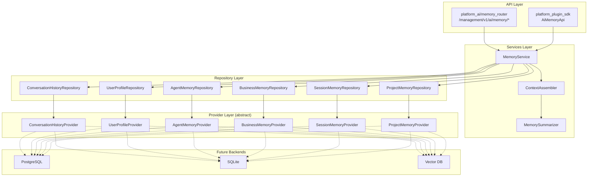

# Platform Memory — Architecture

> Sprint 2.1 · AI Memory & Context Engine

## Purpose

`platform_memory` provides persistent, structured context for every AI agent on the platform. It separates **domain logic** (services), **data access** (repositories), and **storage backends** (providers) so PostgreSQL, SQLite, or vector databases can be plugged in without changing agent code.

## Layer Diagram



## Memory Categories

| Category | Repository | Storage |
|----------|------------|---------|
| Conversation history | `ConversationHistoryRepository` | Dialog turns (role, content, session) |
| User facts | `UserProfileRepository` | Key-value profile attributes |
| Business facts | `BusinessMemoryRepository` | Organization-scoped facts |
| Long-term / agent memory | `AgentMemoryRepository` | Agent-scoped durable memory |
| Session memory | `SessionMemoryRepository` | Ephemeral session state |
| Project memory | `ProjectMemoryRepository` | Project/workspace context |

## Context Assembly

`ContextAssembler` builds prompt context automatically from:

1. Current dialog (+ optional `current_message`)
2. User profile facts
3. Previous conversations (same session/user/agent)
4. Agent long-term memory
5. Business facts (organization)
6. Project memory
7. Session scratch memory

### Token Limits

Configured via `TokenLimits` (`platform_memory/config.py`):

- `max_context_tokens` — total assembled prompt budget
- `max_history_tokens` — conversation section budget
- Per-section limits (profile, business, project, session, agent)
- `summarize_threshold_ratio` — when to trigger extractive summarization

When history exceeds the threshold, `MemorySummarizer` condenses turns (head + tail + summary marker).

## Dependency Injection

```python
providers = build_in_memory_providers()  # or PostgreSQLProviderBundle(...)
service = MemoryService(providers=providers, limits=TokenLimits(...))
```

Repositories receive providers only — **no direct database imports** in services or repositories.

## Events

Published via `PlatformEventBus`:

- `MemoryStoredEvent`
- `ConversationAppendedEvent`
- `ContextAssembledEvent`
- `UserFactStoredEvent`

## Backward Compatibility

- `platform_ai/memory/` knowledge indexing and retrieval remain unchanged.
- `platform_ai/memory/memory_context.py` delegates to `platform_memory.ContextAssembler`.
- `platform_ai/memory/memory_service.build_ai_context()` enriches with knowledge retrieval.

## Sprint 2.2 — Semantic Memory (completed)

See [SEMANTIC_MEMORY_REPORT.md](SEMANTIC_MEMORY_REPORT.md).

| Component | Path |
|-----------|------|
| MemoryEntity | `entities.py` |
| MemoryRepository | `repositories/memory_repository.py` |
| InMemoryMemoryRepository | `repositories/in_memory_semantic_repository.py` |
| DummyEmbeddingProvider | `providers/embedding_provider.py` |
| MemorySearchService | `search/memory_search_service.py` |
| SemanticMemoryConfig | `config.py` |

## Future Work (Sprint 2.3+)

- pgvector / Qdrant / Milvus / Weaviate `MemoryRepository` adapters
- Migration from `database/models/ai_agents.py` `AiAgentMemory` to unified schema
- LLM-backed summarization provider (replace extractive default)
- Background TTL eviction for expired memories

## Certification Impact

- New top-level module `platform_memory/` auto-registers in `platform_manifest.json`
- No Repository→Service violations
- No SDK→Database access
- No changes to Sprint 1 API contracts
