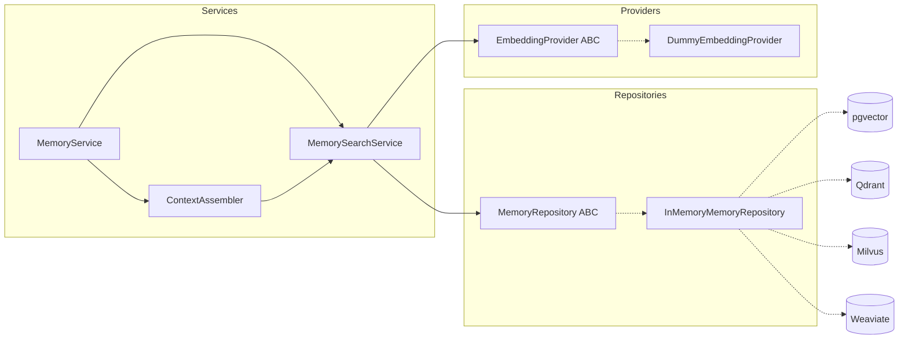

# Sprint 2.2 — Semantic Memory & Knowledge Engine Report

> Generated: 2026-07-19

## Summary

Sprint 2.2 adds **semantic search by meaning** to the Platform Memory Engine. Memory is stored as universal `MemoryEntity` objects with embeddings, searched via `MemorySearchService`, and assembled into LLM prompts by an enhanced `ContextAssembler`.

**No OpenAI. No vector database. Fully provider-independent.**

---

## Architecture



---

## Components Implemented

### 1. MemoryEntity

Universal memory object (`platform_memory/entities.py`):

| Field | Type |
|-------|------|
| id | str |
| owner_id | str \| None |
| agent_id | str \| None |
| session_id | str \| None |
| text | str |
| summary | str \| None |
| embedding | list[float] |
| importance_score | float |
| created_at | str |
| updated_at | str |
| expires_at | str \| None |
| metadata | dict |

### 2. MemoryRepository (abstract)

Methods: `save`, `update`, `delete`, `get`, `search`, `search_by_embedding`, `recent`, `important`, `clear`.

Implementation: `InMemoryMemoryRepository` — swappable with pgvector/Qdrant/Milvus/Weaviate adapters.

### 3. EmbeddingProvider (abstract)

Methods: `embed(text)`, `batch_embed(list[str])`.

Implementation: `DummyEmbeddingProvider` — deterministic SHA256-based vectors, 384 dimensions.

### 4. MemorySearchService

- Semantic search via cosine similarity
- Keyword fallback when semantic hits are empty
- Ranking: `semantic × weight + importance_boost + recency_boost`

### 5. ContextAssembler (enhanced)

LLM context priority:

1. Current conversation
2. Semantic memories
3. Important memories
4. Recent memories
5. Summarized history

### 6. SemanticMemoryConfig

| Parameter | Default |
|-----------|---------|
| max_context_tokens | 4096 |
| max_memories | 20 |
| similarity_threshold | 0.35 |
| importance_weight | 0.3 |
| recency_weight | 0.2 |

---

## API Additions (MemoryService)

```python
await memory_service.remember_semantic(text="...", owner_id="u1", agent_id="a1", importance_score=0.8)
hits = await memory_service.search_semantic("collision coverage", owner_id="u1")
bundle = await memory_service.build_ai_context(query="...", user_id="u1", agent_id="a1")
```

Existing Sprint 2.1 and `platform_ai/memory` APIs remain compatible.

---

## Test Results

| Suite | Result |
|-------|--------|
| `tests/test_semantic_memory.py` | **13 passed** |
| `tests/test_platform_memory.py` | **10 passed** |
| `tests/test_ai_memory.py` | **14 passed** |
| Full suite (`-m "not slow"`) | **520 passed** |

New module coverage: 13 dedicated semantic tests covering entity, repository CRUD, keyword/semantic search, embedding provider, search ranking, context assembly, and service integration.

---

## Remaining Technical Debt

| Item | Notes |
|------|-------|
| PostgreSQL/pgvector adapter | Implement `MemoryRepository` with SQL + vector column |
| External vector DB adapters | Qdrant, Milvus, Weaviate provider packages |
| LLM summarization backend | Replace extractive summarizer for history compression |
| Embedding provider registry | OpenAI/local providers when explicitly enabled |
| Memory TTL eviction worker | `expires_at` checked on read; no background sweeper |
| Unified schema migration | Merge with `AiAgentMemory` ORM table |

---

## Certification Impact

- No Sprint 1 architecture changes
- No API contract changes
- No SDK/repository boundary violations
- `platform_memory` module remains in services layer

---

**Sprint 2.2 completed**  
**Platform Memory Engine ready**
