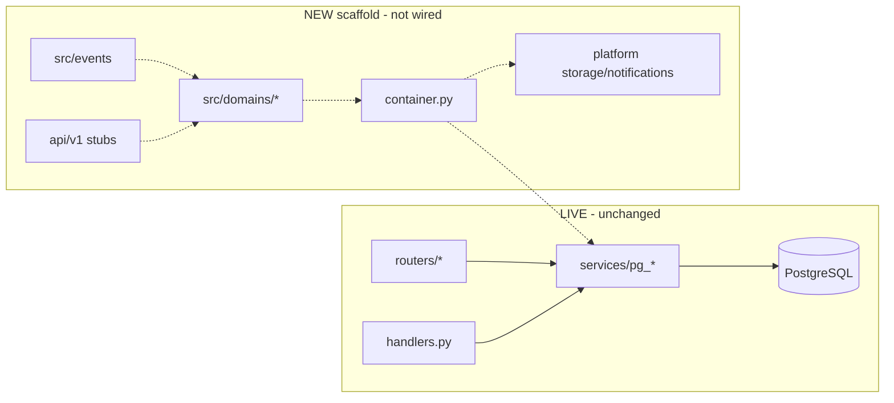

# Night Task Report — Platform Architecture Upgrade

**Date:** 2026-07-15  
**Mode:** Extension-only (strangler scaffold)  
**Constraint compliance:** No FSM / router / lead / manager behavior changes. No deletions.

---

## Created files (summary)

### Domain scaffold (`src/domains/` × 14)

Each domain has: `models/`, `schemas/`, `services/` (+ `facade.py`), `repositories/`, `routers/`, `events/`

Domains: `crm`, `leads`, `automotive`, `inventory`, `payments`, `insurance`, `leasing`, `legal`, `logistics`, `analytics`, `ai_assistant`, `notifications`, `users`, `permissions`

### Platform / DI / events

| Path | Purpose |
|------|---------|
| `container.py` | DI registry (storage, notifications, lazy services) |
| `src/events/__init__.py` | Domain events + `EventDispatcher` |
| `src/events/dispatch.py` | Re-exports |
| `src/platform/notifications/` | NotificationProvider + Telegram/Email/SMS/Push |
| `src/platform/storage/` | StorageProvider + Telegram/Local/S3 |
| `src/platform/permissions/` | Role / Permission / RolePermission dataclasses |
| `src/platform/analytics/` | LeadMetrics / ManagerMetrics / RevenueMetrics + KPI |
| `api/v1/__init__.py` | `/api/v1/{leads,clients,managers,inventory,analytics}` stubs (501) |
| `migrations/versions/f9u123456789_architecture_scaffold_marker.py` | No-op alembic marker |

### Documentation

- `docs/architecture/current_architecture.md` — **BLOCK 1 audit**
- `docs/architecture.md`
- `docs/deployment.md` (append note)
- `docs/database.md`
- `docs/fsm.md`
- `docs/events.md`
- `docs/permissions.md`
- `docs/technical_debt.md` — **BLOCK 11**
- `docs/architecture/night_task_report.md` (this file)

### Tests skeleton

- `tests/unit/` — container, KPI
- `tests/integration/` — API v1 registration
- `tests/e2e/` — marker
- `tests/conftest.py`

---

## Modified files

| File | Change |
|------|--------|
| `docs/deployment.md` | Appended short “Architecture scaffold” note only |

**No** changes to: routers, FSM states, lead engines, manager handlers, business services logic.

---

## Problems found (audit)

1. God files: `handlers.py` (~5k), `keyboards.py` (~2k), `database_legacy.py` (~11k)
2. Cross-router coupling: `auto_client_router` ↔ `auto_hub_router`
3. Duplicate stacks: notifications, storage, events, audit, SLA, RBAC
4. In-memory vertical FSM (`auto_vertical_flow`) unsafe for multi-replica
5. MemoryStorage FSM fallback without Redis
6. Historical SQLAlchemy class-name collisions
7. Root `events.py` blocks a root-level `events/` package → used `src/events/`

Full detail: `docs/technical_debt.md` + `docs/architecture/current_architecture.md`

---

## Architecture diagram



---

## Recommendations — next migration phase

1. **Week 1:** Opt-in wire `get_container().storage()` / notifications behind feature flag (no FSM touch).
2. **Week 1:** Extract shared Auto Client menu helpers to break router cycle.
3. **Week 2:** Dual-emit `LeadCreated` from CRM submit (keep existing bus).
4. **Week 2:** Enable `register_api_v1_routes` delegating to existing engines.
5. **Week 3:** Move one thin domain (`notifications` or `analytics` read path) behind `src/domains/*/services/facade.py`.
6. **Ongoing:** Require Redis for FSM in prod; plan process split (bot / API / worker).

---

## Verification

```bash
PYTHONPATH=. .venv/bin/python -c "from container import get_container; print(get_container().registry.registered_names()[:5])"
PYTHONPATH=. .venv/bin/python -c "from src.events import LeadCreated; print(LeadCreated().event_type)"
PYTHONPATH=. .venv/bin/python -m pytest tests/unit tests/integration -q
```
