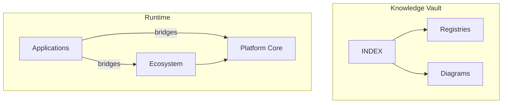

# Architecture Dashboard

## Overview
Visual architecture control panel with Mermaid diagrams for Core, AI, apps, and relationships.

## Architecture

## Components
| Diagram | Page |
|---------|------|
| Platform Core | [[diagrams/architecture/PLATFORM_CORE_DETAIL]] |
| Platform AI | [[diagrams/architecture/PLATFORM_AI]] |
| Memory | [[diagrams/architecture/MEMORY_ENGINE_DETAIL]] |
| Workflow | [[diagrams/architecture/WORKFLOW_ENGINE_DETAIL]] |
| Plugin SDK | [[diagrams/architecture/PLUGIN_SDK_DETAIL]] |
| Auto | [[diagrams/architecture/AUTO_MARKETPLACE_DETAIL]] |
| Port | [[diagrams/architecture/PORT_ERP_DETAIL]] |
| Agro | [[diagrams/architecture/AGRO_MARKETPLACE_DETAIL]] |
| Drone | [[diagrams/architecture/DRONE_PLATFORM_DETAIL]] |
| Legal | [[diagrams/architecture/LEGAL_PLATFORM_DETAIL]] |
| CRM | [[diagrams/architecture/CRM_DETAIL]] |
| Relationships | [[diagrams/architecture/MODULE_RELATIONSHIPS]] |
| Deployment | [[diagrams/flows/DEPLOYMENT]] |
| Knowledge Graph | [[diagrams/mindmaps/KNOWLEDGE_MAP]] |

## Relationships
[[ARCHITECTURE]] · [[diagrams/PLATFORM_GRAPH]] · [[diagrams/APPLICATION_GRAPH]] · [[diagrams/AGENT_GRAPH]] · [[diagrams/DATA_FLOW]]

## Responsibilities
Keep architecture visualization current after each sprint via documentation automation.

## Interfaces
Mermaid in Markdown; Obsidian native rendering.

## REST APIs
[[diagrams/flows/API_COMMUNICATION]]

## Events
Architecture change notes in sprint registry entries.

## Future roadmap
Excalidraw canvases under `knowledge/excalidraw/`.

## References
`docs/architecture.md`

## Related pages
[[Platform Core]] · [[Plugin SDK]] · [[Memory Engine]] · [[Workflow Engine]]
