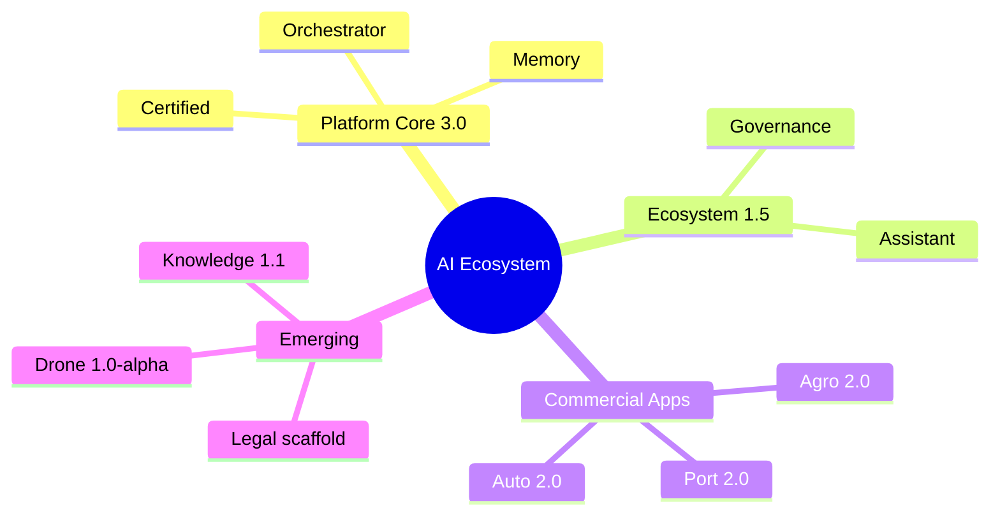

# Executive Dashboard

## Overview
Executive view of platform maturity, commercial releases, and roadmap posture.

## Architecture

## Components
- Maturity: Platform Core **Production Ready**
- Commercial: Agro, Port, Auto at **2.0.0**
- Foundation: Drone **1.0.0-alpha**
- Documentation: Knowledge **1.1** living vault
- Metrics: [[statistics/STATISTICS]]

## Relationships
[[PROJECT_STATUS]] · [[ROADMAP]] · [[releases/RELEASE_NOTES]] · [[SPRINT_PROGRESS]]

## Responsibilities
Communicate completion status and investment focus without engineering noise.

## Interfaces
This dashboard note; exportable to PDF via Obsidian.

## REST APIs
Strategic surfaces listed in [[API_REFERENCE]].

## Events
Release milestones recorded in [[CHANGELOG]].

## Future roadmap
Legal productization; Drone 11.2+; Ecosystem 1.6 — [[ROADMAP]].

## References
`platform_manifest.json`, app manifests.

## Related pages
[[DASHBOARD]] · [[INDEX]] · [[EXECUTIVE_DASHBOARD]]
