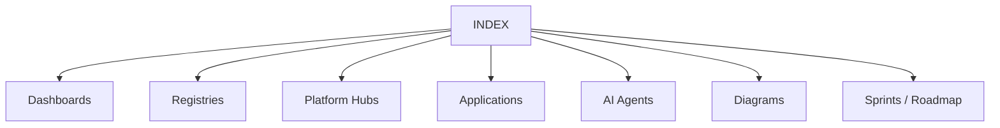

# AI Ecosystem Knowledge — INDEX

**Main entry point** for the Obsidian living documentation system (Sprint **Knowledge 1.1**).

## Overview
This vault documents Platform Core v3.0.0, Ecosystem v1.5.0-alpha, commercial applications (Agro, Port, Auto), Drone Platform foundation, CRM/Legal capabilities, AI agents, APIs, sprints, and architecture diagrams — fully interconnected with `[[wiki links]]`.

## Architecture

## Components

### Dashboards
[[DASHBOARD]] · [[EXECUTIVE_DASHBOARD]] · [[ARCHITECTURE_DASHBOARD]] · [[PROJECT_STATUS]] · [[SPRINT_PROGRESS]]

### Core hubs
[[Platform Core]] · [[Platform AI]] · [[Memory Engine]] · [[Workflow Engine]] · [[Plugin SDK]] · [[AI Agents]] · [[Knowledge Graph]]

### Applications
[[Auto Marketplace]] · [[Agro Marketplace]] · [[Port ERP]] · [[Drone Platform]] · [[CRM]] · [[Legal Platform]]

### Registries
[[registries/SPRINT_REGISTRY]] · [[registries/COMPONENT_REGISTRY]] · [[registries/API_REGISTRY]] · [[registries/MODULE_REGISTRY]] · [[registries/AGENT_REGISTRY]]

### Agents
[[Owner AI]] · [[Manager AI]] · [[Developer AI]] · [[Architect AI]] · [[QA AI]] · [[Finance AI]] · [[Legal AI]] · [[Drone Engineer AI]] · [[Port AI]] · [[Agro AI]] · [[CRM AI]] · [[Marketplace AI]]

### Diagrams
[[diagrams/PLATFORM_GRAPH]] · [[diagrams/AGENT_GRAPH]] · [[diagrams/APPLICATION_GRAPH]] · [[diagrams/DATA_FLOW]] · [[ARCHITECTURE_DASHBOARD]] · [[diagrams/mindmaps/KNOWLEDGE_MAP]]

### Delivery
[[ROADMAP]] · [[PLATFORM_TIMELINE]] · [[CHANGELOG]] · [[releases/RELEASE_NOTES]] · [[statistics/STATISTICS]] · [[sprints/PLATFORM]] · [[sprints/PORT_ERP]] · [[sprints/AUTO_MARKETPLACE]] · [[sprints/DRONE_PLATFORM]]

### System
[[automation/DOCUMENTATION_AUTOMATION]] · [[standards/DOCUMENTATION_STANDARDS]] · [[README]] · [[SECURITY]] · [[DEPLOYMENT]] · [[API_REFERENCE]] · [[ARCHITECTURE]]

## Relationships
Runtime layering: Applications → bridges → [[Knowledge Graph|Ecosystem]] / [[Platform Core]]. Documentation layering: INDEX → dashboards/registries → hubs → deep pages.

## Responsibilities
Act as the single Obsidian home note for navigation, search landing, and graph centrality.

## Interfaces
Open this file as the vault default note. Use graph view with tags `knowledge-1.1`, `dashboard`, `agent`.

## REST APIs
Summary: [[registries/API_REGISTRY]] · detail [[API_REFERENCE]]

## Events
Knowledge regeneration after sprints — [[automation/DOCUMENTATION_AUTOMATION]]

## Future roadmap
[[ROADMAP]] — Drone 11.2+, Ecosystem 1.6, Legal L1.0, Knowledge 1.2

## References
Repository `docs/`, manifests, `knowledge/data/ecosystem_registry.json`

## Related pages
[[DASHBOARD]] · [[EXECUTIVE_DASHBOARD]] · [[PROJECT_STATUS]] · [[SPRINT_PROGRESS]] · [[statistics/STATISTICS]]
