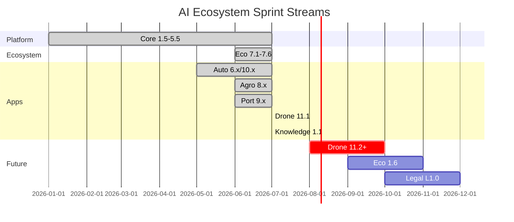

# Sprint Progress

## Overview
Progress board for completed, current, and planned sprints.

## Architecture

## Components
- **Completed:** Platform 1.5–5.5, Eco 7.x, Agro 8.x, Port 9.x, Auto 6.x+10.x, Drone 11.1, Knowledge 1.1
- **Current:** Knowledge 1.1 rollout / adoption in Obsidian
- **Planned:** Drone 11.2+, Ecosystem 1.6, Legal L1.0
- Full table: [[registries/SPRINT_REGISTRY]]

## Relationships
[[PLATFORM_TIMELINE]] · [[sprints/PLATFORM]] · [[sprints/PORT_ERP]] · [[sprints/AUTO_MARKETPLACE]] · [[sprints/DRONE_PLATFORM]]

## Responsibilities
Show percent-complete and dependencies for planning.

## Interfaces
Gantt + registry.

## REST APIs
N/A

## Events
Sprint close → update registry JSON → run generator.

## Future roadmap
[[ROADMAP]]

## References
[[CHANGELOG]]

## Related pages
[[PROJECT_STATUS]] · [[DASHBOARD]] · [[INDEX]]
