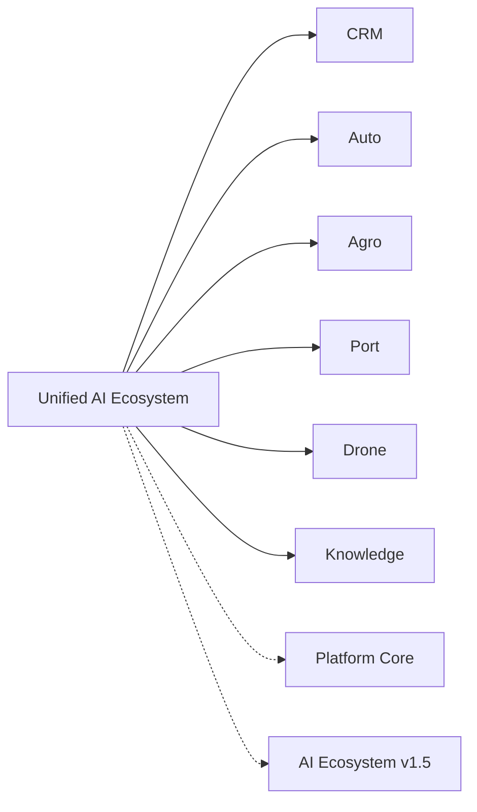

# Unified AI Ecosystem

Sprint **12.0** integration application (`applications/ecosystem/`, version **3.0.0-alpha**).

Connects CRM, Auto, Agro, Port, Drone, Platform Core, and Knowledge without rewriting them.

## Graphs

Links: [[applications/CRM]] [[applications/AUTO_MARKETPLACE]] [[applications/AGRO_MARKETPLACE]] [[applications/PORT_ERP]] [[applications/DRONE_PLATFORM]]

Docs: `docs/AI_ECOSYSTEM.md`
