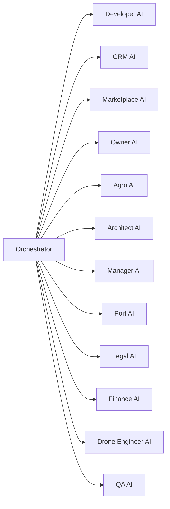

# AI Agent Graph

## Overview
Documented AI agent topology.

## Architecture
Auto-generated architecture visualization (Knowledge 2.2).

## Components

Also see PlantUML twin when present.

## Relationships
[[architecture/README]] · [[ARCHITECTURE_DASHBOARD]] · [[diagrams/automation/README]]

## Responsibilities
Provide enterprise development infrastructure without changing runtime logic.

## Interfaces
Markdown + generators under `knowledge/tools/`.

## REST APIs
N/A — documentation/infrastructure only.

## Events
generated_by_enterprise_infra

## Future roadmap
[[ROADMAP]]

## References
[[automation/ENTERPRISE_INFRASTRUCTURE]]

## Related pages
[[INDEX]] · [[PROJECT_STATUS]] · [[EXECUTIVE_DASHBOARD]]
